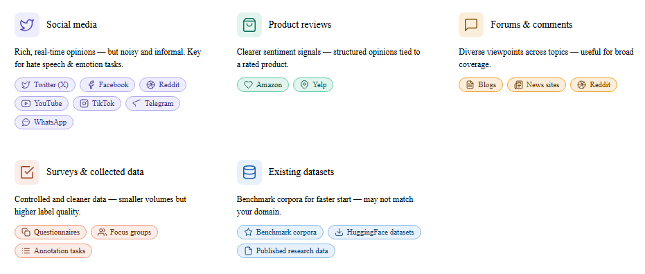

# Data sources

Data source is the place where we get the data (text, audio, image or any of the combinations) to be annotated. The best data source depends on the task, language, domain, and cultural context. Product reviews are often useful for sentiment analysis because they contain explicit evaluative language. Social media posts are especially useful for emotion analysis and hate speech analysis because they capture spontaneous expression, disagreement, and interactional language. Forums, blogs, and comment sections can provide longer and more context-rich texts, while survey responses can be useful when researchers need cleaner data or want to target a specific population.

**Common Data Sources**: Selecting data sources that are relevant, ethical, and representative is essential for building high-quality text classification datasets such as sentiment, emotion, and hate speech datasets. Common sources include social media platforms such as Twitter (X), Facebook, Reddit, YouTube, TikTok, Telegram, and WhatsApp, which provide rich and real-time user opinions but often contain noisy and informal language. Product review platforms such as Amazon typically offer clearer sentiment signals, while forums, blogs, and news comment sections provide diverse viewpoints and discussions. Researchers may also collect data through surveys or controlled studies, which generally produce cleaner but smaller datasets. Additionally, existing benchmark datasets can accelerate research and enable comparison with prior work, although they may not always align with the target domain, language, or cultural context.

:::info[Tips ]
When selecting a source, prefer data that naturally contains the phenomenon of interest. For example, if the goal is to study offensive speech, choose platforms where interpersonal conflict or public debate is common. If the goal is to study sentiment, choose sources where opinions, reviews, and evaluations are frequent.
:::

:::warning[Benchmark datasets]
Benchmark datasets are useful for comparison, but they may not reflect the target language variety, region, or social context. Always check whether the original data distribution matches your intended use case.
:::