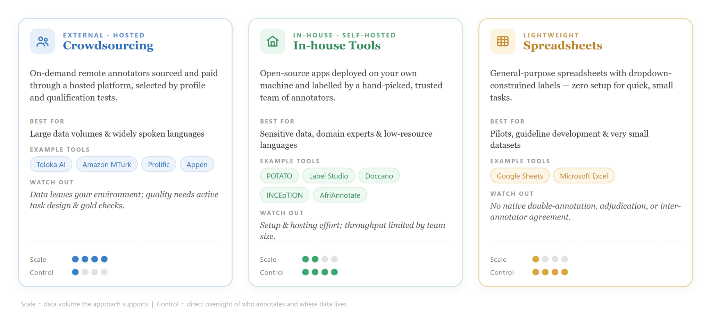

# Annotation Tools

Text classification data can be annotated using a range of tools, from managed crowdsourcing platforms to self-hosted open-source systems. The choice of tool should depend on the task design, dataset size, number of annotators, required turnaround time, and the availability of qualified annotators.

There is no single best tool. When selecting an annotation tool, the right choice depends on several factors:

- Data sensitivity and privacy requirements.
- Size of the dataset and expected annotation volume.
- Number of annotators and required collaboration features.
- Need for quality assurance, audit trails, and reviewer workflows.
- Support for the annotation schema and task type.
- Availability of self-hosting, access control, and export options.
- Cost, ease of setup, and long-term maintainability.

Based on how annotators are sourced and where the data is hosted, annotation tools can be broadly grouped into two categories: crowdsourcing platforms and in-house (self-hosted) tools. The most common options for text classification are described below.

### **5.1. Crowdsourcing Platforms**

Crowdsourcing platforms give you access to a large, on-demand pool of remote annotators who are recruited and paid through the platform. Annotators are typically selected based on profile attributes — language, location, demographics, prior approval rating, or qualification tests — rather than being known to you personally. This makes crowdsourcing well suited to large volumes of data and widely spoken languages, where a broad annotator pool is readily available.

Common platforms include:

- Toloka AI — [https://toloka.ai](https://toloka.ai/)
- Amazon Mechanical Turk (MTurk) — [https://www.mturk.com](https://www.mturk.com/)
- Prolific — [https://www.prolific.com](https://www.prolific.com/)
- Appen — [https://www.appen.com](https://www.appen.com/)
- Label Studio Enterprise — [https://labelstud.io](https://labelstud.io/)

Many of these platforms support multiple data modalities (text, image, audio, video) and increasingly offer AI-assisted features such as pre-labeling, model-in-the-loop suggestions, and automated quality checks.

Trade-offs. Crowdsourcing scales easily and reduces recruitment overhead, but it offers less direct control over annotators and may make it difficult to source native speakers of low-resource languages or specific dialects. It also requires careful task design, qualification filters, and it raises data-privacy considerations because the data is sent to an external platform.

### **5.2. In-House (Self-Hosted) Tools**

In-house tools are typically open-source applications that can be customized, deployed, and hosted on your own machine or server. You create accounts for a hand-picked set of annotators — often colleagues, domain experts, or recruited native speakers — giving you full control over who labels the data and where the data lives. This category is preferred for sensitive data, specialized domains, and low-resource languages, where annotator expertise matters more than raw scale.

Common self-hosted tools include:

- POTATO — Portable Text Annotation Tool — [https://github.com/davidjurgens/potato](https://github.com/davidjurgens/potato)
- Label Studio (open-source edition) — [https://labelstud.io](https://labelstud.io/)
- Doccano — [https://github.com/doccano/doccano](https://github.com/doccano/doccano)
- INCEpTION (the successor to WebAnno) — [https://inception-project.github.io](https://inception-project.github.io/)
- brat — [https://brat.nlplab.org](https://brat.nlplab.org/)

Trade-offs. Self-hosted tools keep data fully under your control and can be tailored to bespoke label schemes and guidelines, but they require setup, hosting, and maintenance effort, and the annotation throughput is limited by the size of your recruited team.

### **5.3. Lightweight Tools for Small Datasets**

For small annotation efforts, a dedicated platform may be unnecessary. Spreadsheets — Google Sheets or Microsoft Excel — are a practical, zero-setup option: one column holds the text, and one or more columns capture the label(s), with data validation or dropdown lists used to constrain inputs to the allowed label set. Spreadsheets are easy to share and require no technical onboarding, which makes them convenient for pilot studies, guideline development, and very small in-house tasks.

However, these tools lack the quality-control and management features; they are not recommended beyond small or exploratory datasets.

### **Choose an annotation tool based on:**
- Data sensitivity and privacy needs.
- Whether self-hosting is required.
- Support for single-label or multi-label schemas.
- Ability to review, adjudicate, and export annotations.
- Collaboration features for multiple annotators.
- Ease of setup and long-term maintenance.

The annotation tool should match the size and sensitivity of the project. For small pilot studies, spreadsheets may be enough. For medium-sized projects that require labeling workflows, Doccano, Label Studio, or INCEpTION are often suitable. For large projects with distributed workers, crowdsourcing platforms can offer scale, but they require stronger quality control and privacy planning.

