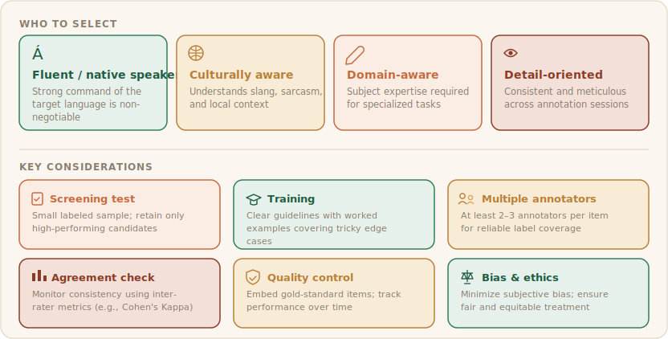
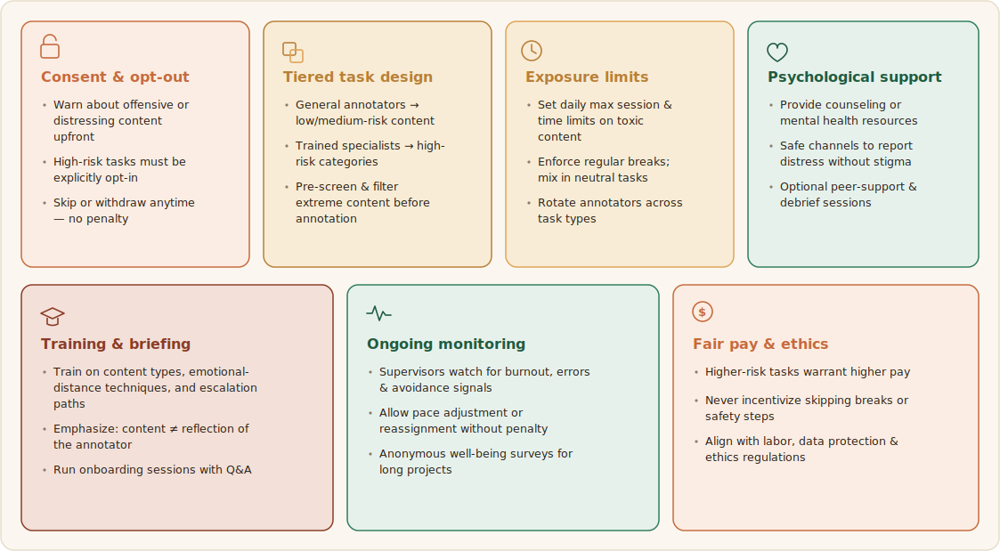
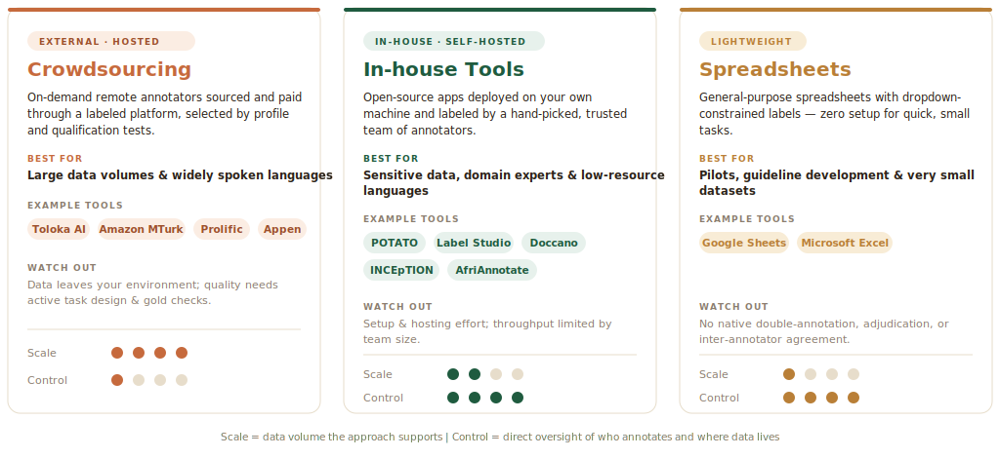

# Annotation

This page covers the human side of building a text-classification dataset: **who** annotates (recruitment and well-being), **with what** (tools), and how to keep labels trustworthy (**agreement** and **quality control**).

## Choosing annotators

Annotator quality is more important than annotator quantity. Recruit annotators who are fluent in the target language, familiar with the cultural context, and, when needed, knowledgeable about the topic domain. For emotion and hate speech tasks, it is especially important that annotators understand informal language, sarcasm, euphemism, and context-dependent expressions.

Effective annotation relies more on the quality and consistency of annotators than on their number. Annotators should be fluent in the target language, familiar with the relevant cultural context, and, when necessary, possess domain-specific knowledge. They should also be detail-oriented and able to apply annotation guidelines consistently to ensure reliable, high-quality labels.



:::info[Tips ]
Use a short qualification round before the main task. The goal is not only to select competent annotators, but also to identify whether the guidelines are clear enough to be applied consistently.
:::

**Before annotation begins, screen annotators for:**
- Language proficiency.
- Domain familiarity.
- Ability to follow instructions carefully.
- Comfort with sensitive or harmful content.
- Availability for training and calibration.

## Annotator safety & well-being

Protecting annotator well-being is essential, particularly when working with harmful, offensive, or emotionally distressing content. Annotators should be informed about potential risks before participation, allowed to opt out of sensitive tasks, and given the freedom to skip items or withdraw without penalty. Exposure to harmful content should be carefully managed through content filtering, workload limits, regular breaks, and task rotation. Projects should provide appropriate training, clear safety protocols, and access to psychological support resources when needed. Continuous monitoring of annotator well-being, respectful communication, protection of privacy, fair compensation, and adherence to ethical and legal standards are also critical for maintaining a safe and sustainable annotation environment.

Protecting annotators through informed consent, controlled exposure, breaks, and support systems improves both well-being and annotation quality.



For any data annotation such as hate speech, we should create a content warning + opt-in (show before any harmful-content task) like below.
:::warning[CONTENT WARNING]
This task contains hate speech, offensive, or distressing material.
• You may skip any item, take breaks at any time, or withdraw with no penalty.
• If you feel distressed, stop and contact the support team.
[ ] I understand and choose to participate in this task.
:::

## Annotation tools

Text classification data can be annotated using a range of tools, from managed crowdsourcing platforms to self-hosted open-source systems. The choice of tool should depend on the task design, dataset size, number of annotators, required turnaround time, and the availability of qualified annotators.

There is no single best tool. When selecting an annotation tool, the right choice depends on several factors:

- Data sensitivity and privacy requirements.
- Size of the dataset and expected annotation volume.
- Number of annotators and required collaboration features.
- Need for quality assurance, audit trails, and reviewer workflows.
- Support for the annotation schema and task type.
- Availability of self-hosting, access control, and export options.
- Cost, ease of setup, and long-term maintainability.

Based on how annotators are sourced and where the data is hosted, annotation tools can be broadly grouped into two categories: crowdsourcing platforms and in-house (self-hosted) tools. The most common options for text classification are described below.

#### Crowdsourcing platforms

Crowdsourcing platforms give you access to a large, on-demand pool of remote annotators who are recruited and paid through the platform. Annotators are typically selected based on profile attributes — language, location, demographics, prior approval rating, or qualification tests — rather than being known to you personally. This makes crowdsourcing well suited to large volumes of data and widely spoken languages, where a broad annotator pool is readily available.

Common platforms include:

- Toloka AI — [https://toloka.ai](https://toloka.ai/)
- Amazon Mechanical Turk (MTurk) — [https://www.mturk.com](https://www.mturk.com/)
- Prolific — [https://www.prolific.com](https://www.prolific.com/)
- Appen — [https://www.appen.com](https://www.appen.com/)
- Label Studio Enterprise — [https://labelstud.io](https://labelstud.io/)

Many of these platforms support multiple data modalities (text, image, audio, video) and increasingly offer AI-assisted features such as pre-labeling, model-in-the-loop suggestions, and automated quality checks.

Trade-offs. Crowdsourcing scales easily and reduces recruitment overhead, but it offers less direct control over annotators and may make it difficult to source native speakers of low-resource languages or specific dialects. It also requires careful task design, qualification filters, and it raises data-privacy considerations because the data is sent to an external platform.

#### In-house (self-hosted) tools

In-house tools are typically open-source applications that can be customized, deployed, and hosted on your own machine or server. You create accounts for a hand-picked set of annotators — often colleagues, domain experts, or recruited native speakers — giving you full control over who labels the data and where the data lives. This category is preferred for sensitive data, specialized domains, and low-resource languages, where annotator expertise matters more than raw scale.

Common self-hosted tools include:

- AfriAnnotate — the playbook's companion annotation tool, built on the Label Studio configuration format — [https://docs.afriannotate.org](https://docs.afriannotate.org)
- POTATO — Portable Text Annotation Tool — [https://github.com/davidjurgens/potato](https://github.com/davidjurgens/potato)
- Label Studio (open-source edition) — [https://labelstud.io](https://labelstud.io/)
- Doccano — [https://github.com/doccano/doccano](https://github.com/doccano/doccano)
- INCEpTION (the successor to WebAnno) — [https://inception-project.github.io](https://inception-project.github.io/)
- brat — [https://brat.nlplab.org](https://brat.nlplab.org/)

Trade-offs. Self-hosted tools keep data fully under your control and can be tailored to bespoke label schemes and guidelines, but they require setup, hosting, and maintenance effort, and the annotation throughput is limited by the size of your recruited team.

#### Lightweight tools for small datasets

For small annotation efforts, a dedicated platform may be unnecessary. Spreadsheets — Google Sheets or Microsoft Excel — are a practical, zero-setup option: one column holds the text, and one or more columns capture the label(s), with data validation or dropdown lists used to constrain inputs to the allowed label set. Spreadsheets are easy to share and require no technical onboarding, which makes them convenient for pilot studies, guideline development, and very small in-house tasks.

However, these tools lack the quality-control and management features; they are not recommended beyond small or exploratory datasets.



The annotation tool should match the size and sensitivity of the project. For small pilot studies, spreadsheets may be enough. For medium-sized projects that require labeling workflows, Doccano, AfriAnnotate, or INCEpTION are often suitable. For large projects with distributed workers, crowdsourcing platforms can offer scale, but they require stronger quality control and privacy planning.

#### A labeling configuration

Whichever self-hosted tool you choose, the labeling task is defined by a small configuration. The examples here use the Label Studio configuration format, an open XML format supported by several tools (AfriAnnotate among them), so the same config is portable. The design points above (constrained inputs, keyboard shortcuts, an explicit skip route) are expressed directly in it. A single-label sentiment task looks like this:

```xml
<View>
  <View style="background:#FBF7F0; border:1px solid #E7DDCB; border-radius:8px; padding:14px 16px; margin-bottom:18px;">
    <Text name="text" value="$text"/>
  </View>
  <Choices name="sentiment" toName="text" choice="single" required="true">
    <Choice value="Positive" hotkey="1"/>
    <Choice value="Neutral"  hotkey="2"/>
    <Choice value="Negative" hotkey="3"/>
  </Choices>
</View>
```

Emotion analysis is usually multi-label, since one sentence can carry several emotions at once, and each emotion present has its own intensity (see [Emotion Analysis](./emotion-analysis.md)). The cleanest way to capture both is one intensity rating per emotion, so each instance gets several single annotations at once. A rating of zero stars means the emotion is absent:

```xml
<View>
  <View style="background:#FBF7F0; border:1px solid #E7DDCB; border-radius:8px; padding:14px 16px; margin-bottom:18px;">
    <Text name="text" value="$text"/>
  </View>
  <Header value="Rate each emotion's intensity — no stars = absent, 1 low, 2 medium, 3 high"/>
  <Header value="Joy"/>
  <Rating name="joy" toName="text" maxRating="3"/>
  <Header value="Sadness"/>
  <Rating name="sadness" toName="text" maxRating="3"/>
  <Header value="Anger"/>
  <Rating name="anger" toName="text" maxRating="3"/>
  <Header value="Fear"/>
  <Rating name="fear" toName="text" maxRating="3"/>
  <Header value="Surprise"/>
  <Rating name="surprise" toName="text" maxRating="3"/>
  <Header value="Disgust"/>
  <Rating name="disgust" toName="text" maxRating="3"/>
</View>
```

The data you import is one JSON object per task, with a `data` field whose keys match the `value="$..."` references in the config:

```json
{"data": {"text": "Na gode sosai, wannan labari ya faranta min rai."}}
{"data": {"text": "Ban gamsu da yadda aka gudanar da zaben ba."}}
```

After annotation, the tool exports each task with the labels attached. For the per-emotion intensity config above, an exported record carries one rating per emotion (zero meaning absent), ready to flow into the agreement script in [Data Quality](../data-quality) or into training:

```json
{
  "data": {"text": "Na gode sosai, wannan labari ya faranta min rai."},
  "annotations": [
    {"completed_by": "annotator_03",
     "result": [
       {"from_name": "joy",   "to_name": "text", "type": "rating", "value": {"rating": 3}},
       {"from_name": "anger", "to_name": "text", "type": "rating", "value": {"rating": 0}}
     ]}
  ]
}
```

In the tool, the task list and per-task annotation progress are managed from the data manager:


## Inter-annotator agreement

Annotation agreement measures the extent to which multiple annotators assign the same labels to the same data instances. In text classification tasks, agreement is one of the most important indicators of dataset quality because it reflects the clarity of the annotation guidelines, the complexity of the task, and the consistency of the annotators. High agreement suggests that the labels are reliable and reproducible, while low agreement may indicate ambiguous definitions, insufficient annotator training, or inherently subjective phenomena.

Annotation agreement should be reported because it provides evidence that the guidelines are understandable and that the labels are reproducible. Agreement values should always be interpreted together with the task difficulty and the degree of subjectivity involved.

#### Why agreement matters

Annotation agreement serves various purposes:

- Evaluates the reliability of the annotated dataset.
- Identifies ambiguities in the annotation guidelines.
- Detects inconsistencies among annotators.
- Provides evidence of dataset quality for publications and benchmark releases.
- Helps determine whether a task is objectively measurable or highly subjective.

Agreement should be calculated and reported for every dataset that involves human annotation if the data is annotated by two and more annotators.

#### Percentage agreement

The simplest measure of agreement is percentage agreement, which calculates the proportion of instances for which annotators assigned the same label.

```
Agreement %= (Number of Agreed instances / Total Number of Instances) * 100
*For example, if two annotators label 1,000 texts and agree on 850 of them:*
Agreement % = (850 / 1000) * 100 = 85%

```

Although easy to understand, percentage agreement does not account for agreement occurring by chance and should not be the only metric reported.

#### Agreement between two annotators

When exactly two annotators label each instance, Cohen's Kappa is the most commonly used agreement metric. Cohen's Kappa adjusts for the amount of agreement that could occur purely by chance.

```
Kappa = (Observed Agreement - Expected Agreement) / (1 - Expected Agreement)
Or
Kappa = (Po - Pe) / (1 - Pe)
Where:
Observed agreement (Po) is the proportion of instances where the annotators actually agreed.
Po​=Total number of items/Number of agreements​
Expected Agreement (Pe) represents the level of agreement that would be expected to occur purely by chance, given the distribution of labels assigned by each annotator. It is calculated by determining the probability that both annotators independently select the same category and then summing these probabilities across all categories.

```

Cohen's Kappa is widely used in sentiment analysis, hate speech detection, topic classification, emotion classification, and many other NLP tasks involving two annotators.

```
from sklearn.metrics import cohen_kappa_score
annotator1 = [0, 1, 1, 0, 2]
annotator2 = [0, 1, 0, 0, 2]
kappa = cohen_kappa_score(annotator1, annotator2)
print(kappa)
```

#### Agreement among three or more annotators

Many NLP datasets use three or more annotators per instance to improve reliability and reduce the influence of individual biases.

When more than two annotators are involved, commonly used agreement measures include:

**Fleiss' Kappa** extends Cohen's Kappa to multiple annotators and is one of the most widely reported agreement measures in NLP datasets. It is appropriate when:

- Three or more annotators label each instance.
- Every instance receives the same number of annotations.

```
Fleiss kappa (k) = P−Pe)/(1-Pe)
Where
p is the mean of the agreement probability over all raters and
Pe is the mean agreement probability over all raters if they were randomly assigned.

```

**Krippendorff's Alpha** is a more flexible agreement measure that:

- Supports any number of annotators.
- Handles missing annotations.
- Works with nominal, ordinal, interval, and ratio labels.
- Is increasingly recommended for modern annotation studies.

For complex annotation projects, Krippendorff's Alpha is often considered the most robust agreement metric.

#### Deciding the final labels

When multiple annotators label the same instance, the final label is usually determined through majority voting.

For example, in three annotators, at least two annotators must agree on a label for it to become the final label. Similarly, with five annotators, at least three annotators must agree on a label for it to become the final label. Using an odd number of annotators (3, 5, or 7) avoids ties and simplifies majority voting.

#### Interpreting agreement scores

Although interpretation varies slightly across fields, the following ranges are commonly used for Kappa-based agreement measures:

```
< 0.00 Poor Agreement
0.00 - 0.20 Slight Agreement
0.21 - 0.40 Fair Agreement
0.41 - 0.60 Moderate Agreement
0.61 - 0.80 Substantial Agreement
0.81 - 1.00 Almost Perfect / Excellent Agreement

*As a general guideline:*
< 0.40: dataset quality should be carefully reviewed.
0.40-0.60: acceptable for difficult or subjective tasks.
0.60-0.80: considered good agreement.
Above 0.80: considered very strong agreement.
```

For highly subjective tasks such as emotion classification, sarcasm detection, or offensiveness annotation, lower agreement scores may still be acceptable due to genuine differences in human interpretation.

#### What to report

When publishing a dataset, researchers should report:

1. Number of annotators.
2. Annotation procedure/guideline.
3. Final label aggregation method (e.g., majority voting).
4. Cohen's Kappa (for two annotators) or Fleiss' Kappa/Krippendorff's Alpha (for three or more annotators) agreement score.
5. Any adjudication process used to resolve disagreements.
6. Annotator-level dataset for further annotator subjectivity and disagreement research.

Transparent reporting of annotation agreement improves the credibility, reproducibility, and scientific value of the dataset.

**Agreement metric guidance:**
- Use percentage agreement only as a simple descriptive measure.
- Use Cohen's kappa when there are exactly two annotators.
- Use Fleiss' kappa when there are three or more annotators and each item has the same number of labels.
- Use Krippendorff's alpha when annotations may be missing or when you want a more flexible reliability measure.

Note that agreement metrics are not only those listed above — explore more agreement metrics that suit the targeted task.

```python
from sklearn.metrics import cohen_kappa_score
from statsmodels.stats.inter_rater import fleiss_kappa, aggregate_raters
import krippendorff, numpy as np

# Cohen's kappa — exactly two annotators
# Cohen's κ = (Pₒ − Pₑ) / (1 − Pₑ) where Pₒ = observed agreement, Pₑ = Σₙ pₙ₁·pₙ₂ (chance agreement)
cohen_kappa_score(a1, a2)

# Fleiss' kappa — items x raters matrix, equal number of raters each
# Fleiss' κ = (P̄ − P̄ₑ) / (1 − P̄ₑ) over n raters, k categories

table, _ = aggregate_raters(ratings)      # -> items x categories counts
fleiss_kappa(table)

# Krippendorff's alpha — raters x items, np.nan for missing
# Krippendorff's α = 1 − Dₒ / Dₑ (Dₒ observed disagreement, Dₑ expected; handles missing data & any #raters)

krippendorff.alpha(reliability_data=data, level_of_measurement="nominal")
```

:::info[📚 Tips]
For subjective tasks such as emotion and offensiveness annotation, lower agreement is not always a failure; it can reflect real ambiguity in human interpretation.
So, lower scores can still be valid — genuine human disagreement is signal, not just noise.
:::

## Quality control

Annotation quality can be controlled before and during the annotation process using various mechanisms. The following are some of the annotation quality control methods.

#### Pilot annotation

Before starting large-scale annotation, dataset creators should conduct a pilot study to evaluate both the annotation guidelines and the annotators. The pilot phase helps identify unclear instructions, difficult cases, and annotators whose labeling patterns differ substantially from the rest of the group. Annotators who consistently provide random, low-quality, or highly inconsistent annotations should be identified and excluded before the main annotation process begins.

#### Control (gold-standard) questions

A common quality-control mechanism is to include control questions, also known as gold-standard items, whose correct labels are already known. These items are randomly inserted into the annotation workflow without informing the annotators. Annotators who repeatedly fail to label these control items correctly may be removed from the project, and their previously annotated data should be reviewed and, if necessary, excluded from the final dataset.

#### Determining the number of annotators

For most NLP annotation tasks, using at least three annotators per instance is a common practice for ensuring annotation quality. An odd number of annotators (e.g., 3, 5, or 7) enables majority voting to determine the final label. In general, increasing the number of annotators per instance improves the reliability and robustness of the dataset by reducing the impact of individual biases. However, annotation cost and annotator availability often limit the number of annotators that can be employed.

When human resources are limited, annotation can be performed by two annotators. In such cases, dataset creators may either retain only the instances on which both annotators agree or introduce an adjudication process, where disagreements are resolved through discussion or by an expert annotator who makes the final decision.
