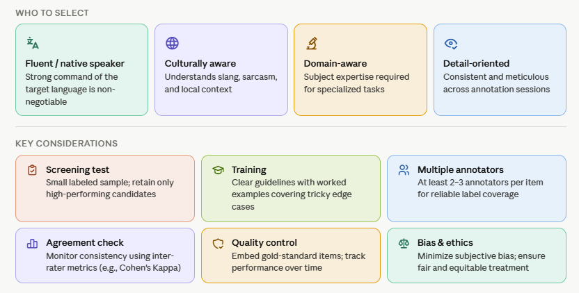

# Annotator Recruitment/Selection

Annotator quality is more important than annotator quantity. Recruit annotators who are fluent in the target language, familiar with the cultural context, and, when needed, knowledgeable about the topic domain. For emotion and hate speech tasks, it is especially important that annotators understand informal language, sarcasm, euphemism, and context-dependent expressions.

Effective annotation relies more on the quality and consistency of annotators than on their number. Annotators should be fluent in the target language, familiar with the relevant cultural context, and, when necessary, possess domain-specific knowledge. They should also be detail-oriented and able to apply annotation guidelines consistently to ensure reliable, high-quality labels.

:::info[Tips ]
Use a short qualification round before the main task. The goal is not only to select competent annotators, but also to identify whether the guidelines are clear enough to be applied consistently.
:::

**Before annotation begins, screen annotators for:**
- Language proficiency.
- Domain familiarity.
- Ability to follow instructions carefully.
- Comfort with sensitive or harmful content.
- Availability for training and calibration.