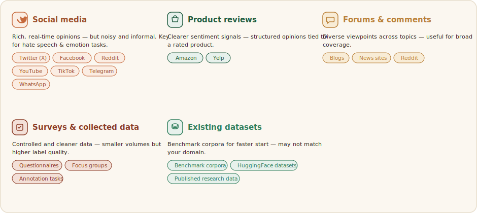
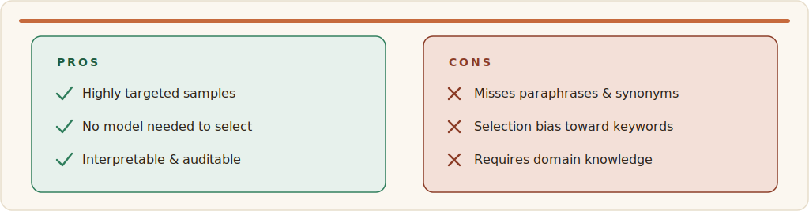
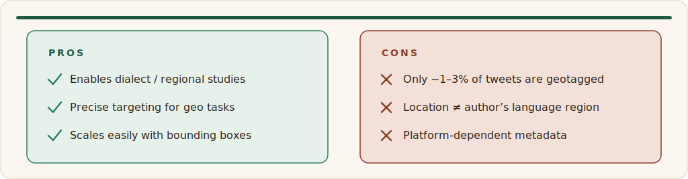
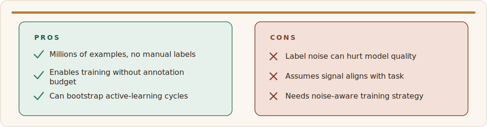
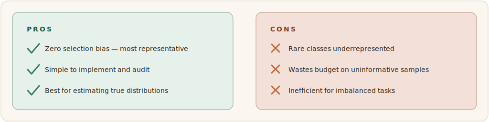
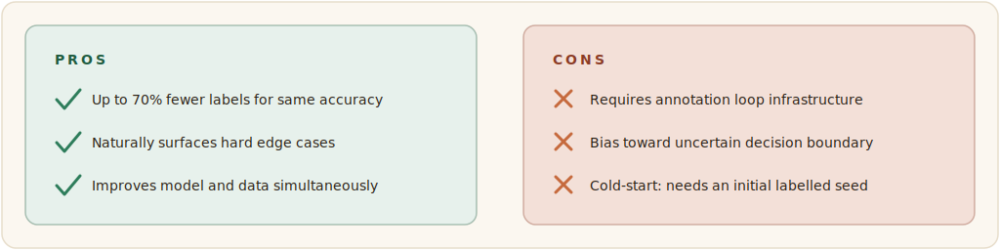
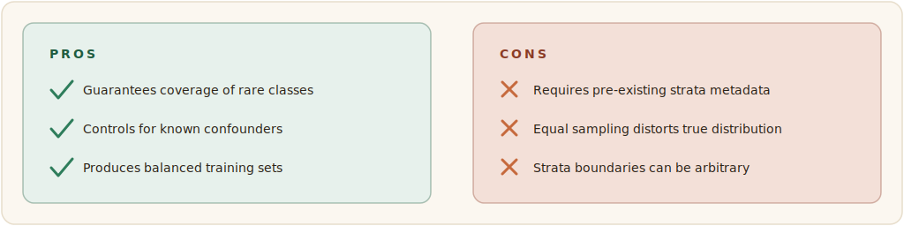
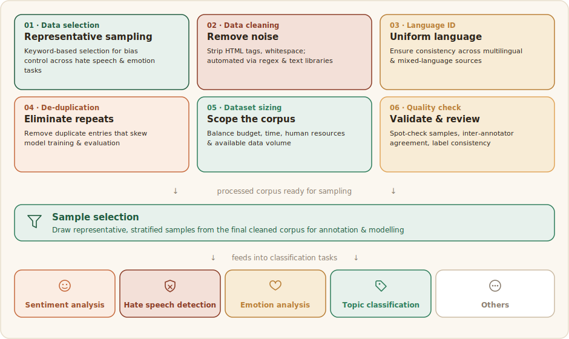

# Collecting & Preparing Data

This page walks through the data stages of a text-classification project end to end: choosing **where** the data comes from, **how** to select and sample it, how to **clean and standardise** it before annotation, and how to keep **quality** under control throughout.

## Data sources

Data source is the place where we get the data (text, audio, image or any of the combinations) to be annotated. The best data source depends on the task, language, domain, and cultural context. Product reviews are often useful for sentiment analysis because they contain explicit evaluative language. Social media posts are especially useful for emotion analysis and hate speech analysis because they capture spontaneous expression, disagreement, and interactional language. Forums, blogs, and comment sections can provide longer and more context-rich texts, while survey responses can be useful when researchers need cleaner data or want to target a specific population.

**Common Data Sources**: Selecting data sources that are relevant, ethical, and representative is essential for building high-quality text classification datasets such as sentiment, emotion, and hate speech datasets. Common sources include social media platforms such as Twitter (X), Facebook, Reddit, YouTube, TikTok, Telegram, and WhatsApp, which provide rich and real-time user opinions but often contain noisy and informal language. Product review platforms such as Amazon typically offer clearer sentiment signals, while forums, blogs, and news comment sections provide diverse viewpoints and discussions. Researchers may also collect data through surveys or controlled studies, which generally produce cleaner but smaller datasets. Additionally, existing benchmark datasets can accelerate research and enable comparison with prior work, although they may not always align with the target domain, language, or cultural context.



:::info[Tips ]
When selecting a source, prefer data that naturally contains the phenomenon of interest. For example, if the goal is to study offensive speech, choose platforms where interpersonal conflict or public debate is common. If the goal is to study sentiment, choose sources where opinions, reviews, and evaluations are frequent.
:::

:::warning[Benchmark datasets]
Benchmark datasets are useful for comparison, but they may not reflect the target language variety, region, or social context. Always check whether the original data distribution matches your intended use case.
:::

## Collection & selection approaches

Data can be collected through APIs, web scraping (with permission), manual collection, or surveys, while preserving useful metadata such as source, time, language, and identifiers for future analysis. Data sources should be relevant to the target domain, language, and cultural context, with careful attention to dataset quality, class balance, and representativeness. Throughout the process, researchers must also address ethical and legal requirements, including privacy, consent, and compliance with platform policies. Data samples can be collected using one of the approaches below.

:::info[Tips ]
Data collection should be guided by the annotation objective and the expected label distribution. For example, if a dataset is likely to contain too few hateful texts, keyword-based filtering or distant supervision can be used to enrich the sample. If the goal is to estimate natural distribution, random sampling or stratified sampling is more appropriate.
:::

**Keyword/Dictionary-based Selection:** Select documents or sentences that contain one or more predefined keywords, phrases, or lexicon entries. For example, in hate speech detection, a list of commonly used hate-related or offensive terms in the target language can be compiled and used to identify potentially relevant texts. This method helps enrich the dataset with task-relevant examples while reducing the amount of irrelevant data. A widely used resource for English emotion-related keywords is the NRC Emotion Lexicon.

```python
# Keyword / dictionary-based selection (e.g. hate-speech terms or NRC emotion lexicon)
import re, pandas as pd

lexicon = {"insult1", "slur2", "offensive3"}   # build per target language
pattern = re.compile(r"\b(" + "|".join(map(re.escape, lexicon)) + r")\b", re.I)

df = pd.read_csv("corpus.csv")
df["matched"] = df["text"].str.contains(pattern)
selected = df[df["matched"]]
print(len(selected), "candidate texts enriched for the task")
```



**Location-based Selection:** Is a data collection approach where texts are gathered based on the geographic location associated with users or posts. For example, when collecting social media data from X (formerly Twitter), researchers can filter posts originating from specific locations such as Ethiopia, Nigeria, or Kenya. This method is useful for studying regional language variation, local opinions, cultural expressions, or location-specific events, as it helps ensure that the collected data represents the target geographic area.

```python
# Location-based filtering of collected posts (place / bounding box)
TARGET = {"Ethiopia", "Nigeria", "Kenya"}

def in_region(post):
    place = (post.get("place") or {}).get("country")
    return place in TARGET

geo = [p for p in posts if in_region(p)]
print(len(geo), "geotagged posts (note: usually only ~1-3% are geotagged)")
```



**Distant supervision:** Is a method for automatically creating labeled training data by using existing knowledge sources instead of manual annotation. For example, for emotion classification, social media posts containing hashtags such as **#happy**, **#joy**, or **#sad** can be automatically labeled with the corresponding emotions. This approach enables the creation of large training datasets quickly and cheaply, although some automatically assigned labels may be incorrect or noisy.

```python
# Distant supervision: weak labels from emotion hashtags
HASHTAG_EMOTION = {"happy":"joy", "joy":"joy", "sad":"sadness", "angry":"anger"}

def weak_label(text):
    tags = re.findall(r"#(\w+)", text.lower())
    for t in tags:
        if t in HASHTAG_EMOTION:
            return HASHTAG_EMOTION[t]
    return None

df["weak"] = df["text"].apply(weak_label)
```



**Random Sampling**: Select items uniformly at random from the corpus with no targeting criteria. This is the baseline for any annotation project, ensuring an unbiased estimate of the true corpus-level label distribution.

```python
# Random baseline vs. stratified sampling that preserves class balance
from sklearn.model_selection import train_test_split

# Pure random (unbiased estimate of the true distribution)
rand = df.sample(n=2000, random_state=42)

# Stratified by a known column (guarantees rare classes appear)
strat, _ = train_test_split(df, train_size=2000,
                          stratify=df["weak"], random_state=42)
print(strat["weak"].value_counts(normalize=True))
```



**Active Learning Method**: Iteratively train a model on a small seed set, then use the model's uncertainty to select the most informative unlabelled examples for human annotation next. Maximizes annotation return on investment by labeling only where the model is confused.

```python
# Active learning: label where the model is least confident (uncertainty sampling)
import numpy as np

probs = model.predict_proba(unlabeled_X)        # shape (N, n_classes)
margin = np.sort(probs, axis=1)[:, -1] - np.sort(probs, axis=1)[:, -2]
to_label = np.argsort(margin)[:100]       # 100 most ambiguous items
print("Send these to annotators next:", to_label)
```



**Stratified Sampling**: Divide the corpus into strata — subgroups by class, source, time period, or demographic — and sample proportionally or equally from each. Ensures minority classes and subgroups are always represented in the annotation set.



#### Collection strategy guide
- Use keyword/dictionary-based selection when you need to target specific phenomena such as hate-related expressions or emotion lexicons.
- Use location-based selection when the research question involves dialect, region, or location-specific discourse.
- Use distant supervision when you need large amounts of weakly labeled data and can tolerate some label noise.
- Use random sampling when you want unbiased estimates of class prevalence.
- Use active learning when annotation budget is limited and model uncertainty can help choose informative examples.
- Use stratified sampling when you want to preserve balance across classes, sources, time periods, or demographic groups.
Any combination of the above also works well to filter quality data.

#### Comparisons of data selection methods

| Method | Cost | Label noise | Bias risk | Best for |
|--------|------|-------------|-----------|----------|
| Keyword / lexicon | Low | — | High (toward keywords) | Hate speech, rare phenomena |
| Location-based | Low | — | Medium | Dialect / regional studies |
| Distant supervision | Low | High | Medium | Large weakly-labelled emotion sets |
| Random sampling | Low | — | None | Estimating true distribution |
| Stratified | Medium | — | Low | Guaranteeing rare-class coverage |
| Active learning | High setup | — | Toward decision boundary | Maximising labels-per-dollar |

:::info[Tips ]
Always store metadata such as source, timestamp, language, and collection method. This makes later analysis, error inspection, and dataset documentation much easier.
:::

## Processing & sampling

After collection, texts should be cleaned and standardized before annotation. Remove obvious noise such as HTML tags, duplicate items, extra whitespace, URLs, and non-textual tokens. Apply language identification to filter out non-target languages, and remove exact or near duplicates to reduce annotation waste and leakage across splits.

Once the data source has been identified, several preprocessing and sampling steps are required to ensure the quality and representativeness of the dataset. First, texts should be carefully selected to reflect the diversity of the target population and minimize potential biases. For tasks such as hate speech and emotion analysis, keyword-based filtering can be useful for identifying relevant content. Data cleaning involves removing irrelevant elements such as HTML tags, URLs, special characters, and excessive whitespace using text-processing tools. Applying language identification and de-duplication helps eliminate non-target language and repeated content. The overall dataset size should be determined based on factors such as research objectives, available resources, annotation budget, human capacity, and project timelines.

:::info[Tips ]
Keep a copy of the raw data and a separate processed version. Never overwrite the original collection, because later decisions may need to be audited or reversed.
:::



:::info[Tips ]
For hate speech and emotion tasks, keyword filtering can help find likely positive cases, but it should never replace careful annotation, because keywords often miss indirect, ironic, or context-dependent expressions.
:::

#### Cleaning pipeline example
```python
import re, hashlib, html

def clean(text):
    text = html.unescape(text)
    text = re.sub(r"https?://\S+", " URL ", text)     # keep a placeholder, don't delete
    text = re.sub(r"@\w+", " @USER ", text)            # anonymise mentions
    text = re.sub(r"\s+", " ", text).strip()           # collapse whitespace
    return text                                       # NOTE: emojis intentionally kept

def dedup_key(text):
    return hashlib.md5(text.lower().encode()).hexdigest()

df["text"]  = df["raw"].apply(clean)
df = df.drop_duplicates(subset=df["text"].apply(dedup_key))   # dedup BEFORE splitting
```

## Quality control

Quality control should begin before full-scale annotation and continue throughout the process. Start with a pilot phase, then refine the guidelines, then monitor annotator performance using gold-standard items, disagreement review, and periodic feedback.

A practical quality-control workflow is:

Pilot annotation → guideline revision → main annotation → gold checks → disagreement review → adjudication → final dataset release.

Data quality control ensures that your sentiment labels are accurate, consistent, and reliable.

- Clear annotation guidelines: Provide precise definitions of sentiment classes (positive, negative, neutral) with examples, including tricky cases like sarcasm, negation, and mixed opinions. This reduces confusion and inconsistency.
- Multiple annotators & agreement: Assign each item to at least 2–3 annotators and measure how much they agree (e.g., using Kappa). High agreement indicates reliable labels.
- Gold-standard checks: Include a small set of pre-labeled (trusted) examples during annotation to evaluate annotator performance continuously.
- Disagreement resolution: Use majority voting or expert review to finalize labels when annotators disagree.
- Data cleaning: Remove duplicates, irrelevant content, spam, and noisy text to improve overall dataset quality.
- Class balance: Check that sentiment categories are not overly skewed (e.g., too many positives), or account for imbalance during modeling.
- Ongoing monitoring: Track annotator behavior over time to detect inconsistency or fatigue and take corrective action.

In short: combine good guidelines, multiple reviews, and continuous checks to maintain high-quality sentiment data.

#### Quality-control policy
- Use at least three annotators per item, and preferably more when feasible.
- Include gold-standard examples to monitor accuracy over time.
- Review items with persistent disagreement.
- Remove annotators whose responses are random, careless, or systematically inconsistent.
- Record adjudication decisions for transparency.

Example how to make majority voting:
```python
from collections import Counter
def majority_vote(labels):
    return Counter(labels).most_common(1)[0][0]
```
