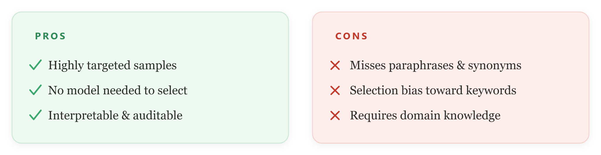
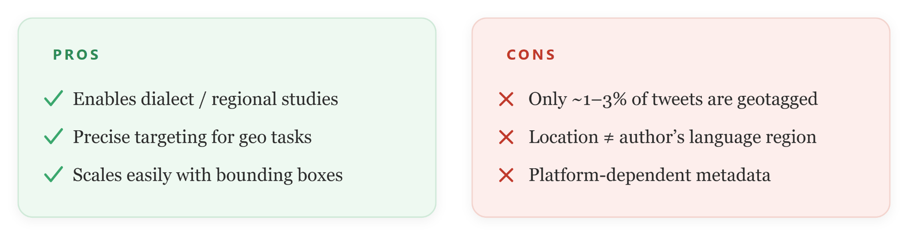
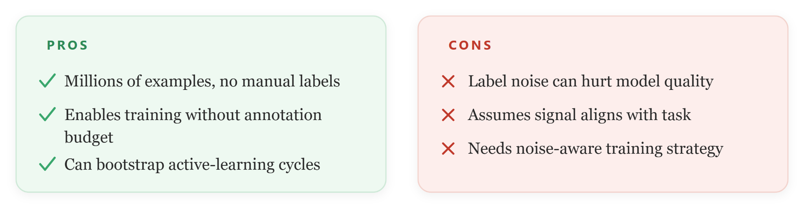
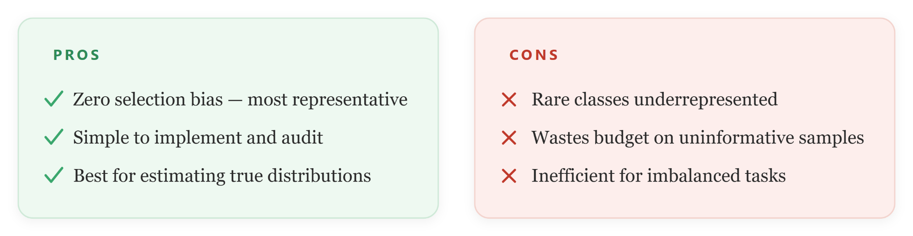
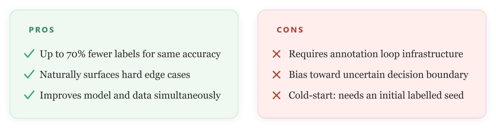
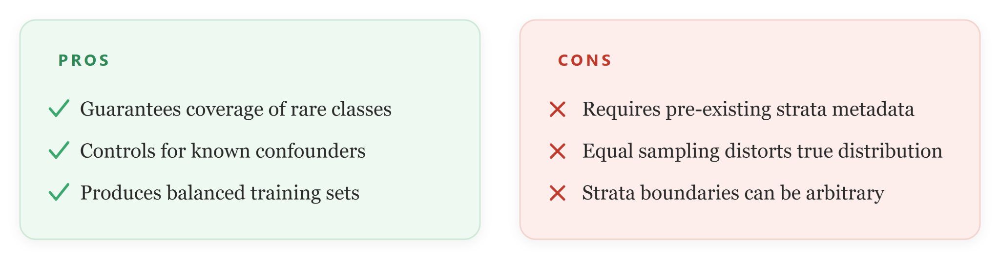
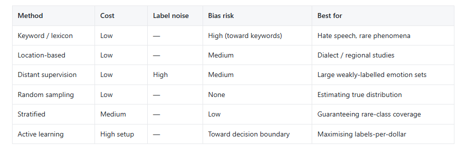

# Data Collection and Selection Approaches

Data can be collected through APIs, web scraping (with permission), manual collection, or surveys, while preserving useful metadata such as source, time, language, and identifiers for future analysis. Data sources should be relevant to the target domain, language, and cultural context, with careful attention to dataset quality, class balance, and representativeness. Throughout the process, researchers must also address ethical and legal requirements, including privacy, consent, and compliance with platform policies. Data samples can be collected using one of the approaches below.


:::info[Tips ]
Data collection should be guided by the annotation objective and the expected label distribution. For example, if a dataset is likely to contain too few hateful texts, keyword-based filtering or distant supervision can be used to enrich the sample. If the goal is to estimate natural distribution, random sampling or stratified sampling is more appropriate.
:::


**Keyword/Dictionary-based Selection:** Select documents or sentences that contain one or more predefined keywords, phrases, or lexicon entries. For example, in hate speech detection, a list of commonly used hate-related or offensive terms in the target language can be compiled and used to identify potentially relevant texts. This method helps enrich the dataset with task-relevant examples while reducing the amount of irrelevant data. A widely used resource for English emotion-related keywords is the NRC Emotion Lexicon.

```python
# Keyword / dictionary-based selection (e.g. hate-speech terms or NRC emotion lexicon)
import re, pandas as pd

lexicon = {"insult1", "slur2", "offensive3"}   # build per target language
pattern = re.compile(r"\b(" + "|".join(map(re.escape, lexicon)) + r")\b", re.I)

df = pd.read_csv("corpus.csv")
df["matched"] = df["text"].str.contains(pattern)
selected = df[df["matched"]]
print(len(selected), "candidate texts enriched for the task")
```




**Location-based Selection:** Is a data collection approach where texts are gathered based on the geographic location associated with users or posts. For example, when collecting social media data from X (formerly Twitter), researchers can filter posts originating from specific locations such as Ethiopia, Nigeria, or Kenya. This method is useful for studying regional language variation, local opinions, cultural expressions, or location-specific events, as it helps ensure that the collected data represents the target geographic area.

```python
# Location-based filtering of collected posts (place / bounding box)
TARGET = {"Ethiopia", "Nigeria", "Kenya"}

def in_region(post):
    place = (post.get("place") or {}).get("country")
    return place in TARGET

geo = [p for p in posts if in_region(p)]
print(len(geo), "geotagged posts (note: usually only ~1-3% are geotagged)")
```



**Distant supervision:** Is a method for automatically creating labeled training data by using existing knowledge sources instead of manual annotation. For example, for emotion classification, social media posts containing hashtags such as **#happy**, **#joy**, or **#sad** can be automatically labeled with the corresponding emotions. This approach enables the creation of large training datasets quickly and cheaply, although some automatically assigned labels may be incorrect or noisy.

```python
# Distant supervision: weak labels from emotion hashtags
HASHTAG_EMOTION = {"happy":"joy", "joy":"joy", "sad":"sadness", "angry":"anger"}

def weak_label(text):
    tags = re.findall(r"#(\w+)", text.lower())
    for t in tags:
        if t in HASHTAG_EMOTION:
            return HASHTAG_EMOTION[t]
    return None

df["weak"] = df["text"].apply(weak_label)
```



**Random Sampling**: Select items uniformly at random from the corpus with no targeting criteria. This is the baseline for any annotation project, ensuring an unbiased estimate of the true corpus-level label distribution. 

```python
# Random baseline vs. stratified sampling that preserves class balance
from sklearn.model_selection import train_test_split

# Pure random (unbiased estimate of the true distribution)
rand = df.sample(n=2000, random_state=42)

# Stratified by a known column (guarantees rare classes appear)
strat, _ = train_test_split(df, train_size=2000,
                          stratify=df["weak"], random_state=42)
print(strat["weak"].value_counts(normalize=True))
```



**Active Learning Method**: Iteratively train a model on a small seed set, then use the model's uncertainty to select the most informative unlabelled examples for human annotation next. Maximizes annotation return on investment by labeling only where the model is confused. 

```python
# Active learning: label where the model is least confident (uncertainty sampling)
import numpy as np

probs = model.predict_proba(unlabeled_X)        # shape (N, n_classes)
margin = np.sort(probs, axis=1)[:, -1] - np.sort(probs, axis=1)[:, -2]
to_label = np.argsort(margin)[:100]       # 100 most ambiguous items
print("Send these to annotators next:", to_label)
```



**Stratified Sampling**: Divide the corpus into strata — subgroups by class, source, time period, or demographic — and sample proportionally or equally from each. Ensures minority classes and subgroups are always represented in the annotation set.




### **Collection strategy guide**
- Use keyword/dictionary-based selection when you need to target specific phenomena such as hate-related expressions or emotion lexicons.
- Use location-based selection when the research question involves dialect, region, or location-specific discourse.
- Use distant supervision when you need large amounts of weakly labeled data and can tolerate some label noise.
- Use random sampling when you want unbiased estimates of class prevalence.
- Use active learning when annotation budget is limited and model uncertainty can help choose informative examples.
- Use stratified sampling when you want to preserve balance across classes, sources, time periods, or demographic groups. 
Any combination of the above also works well to filter quality data.

### **Comparisons of Data selection methods:**



:::info[Tips ]
Always store metadata such as source, timestamp, language, and collection method. This makes later analysis, error inspection, and dataset documentation much easier.
:::