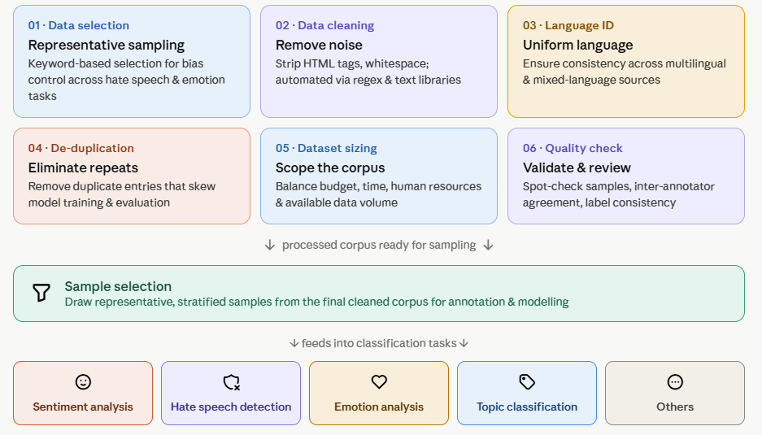

# Data Processing  and Sampling

After collection, texts should be cleaned and standardized before annotation. Remove obvious noise such as HTML tags, duplicate items, extra whitespace, URLs, and non-textual tokens. Apply language identification to filter out non-target languages, and remove exact or near duplicates to reduce annotation waste and leakage across splits.

Once the data source has been identified, several preprocessing and sampling steps are required to ensure the quality and representativeness of the dataset. First, texts should be carefully selected to reflect the diversity of the target population and minimize potential biases. For tasks such as hate speech and emotion analysis, keyword-based filtering can be useful for identifying relevant content. Data cleaning involves removing irrelevant elements such as HTML tags, URLs, special characters, and excessive whitespace using text-processing tools. Applying language identification and de-duplication helps eliminate non-target language and repeated content. The overall dataset size should be determined based on factors such as research objectives, available resources, annotation budget, human capacity, and project timelines. 

:::info[Tips ]
Keep a copy of the raw data and a separate processed version. Never overwrite the original collection, because later decisions may need to be audited or reversed.
:::




:::info[Tips ]
For hate speech and emotion tasks, keyword filtering can help find likely positive cases, but it should never replace careful annotation, because keywords often miss indirect, ironic, or context-dependent expressions.
:::

### **Cleaning pipeline example**
```python
import re, hashlib, html

def clean(text):
    text = html.unescape(text)
    text = re.sub(r"https?://\S+", " URL ", text)     # keep a placeholder, don't delete
    text = re.sub(r"@\w+", " @USER ", text)            # anonymise mentions
    text = re.sub(r"\s+", " ", text).strip()           # collapse whitespace
    return text                                       # NOTE: emojis intentionally kept

def dedup_key(text):
    return hashlib.md5(text.lower().encode()).hexdigest()

df["text"]  = df["raw"].apply(clean)
df = df.drop_duplicates(subset=df["text"].apply(dedup_key))   # dedup BEFORE splitting
```