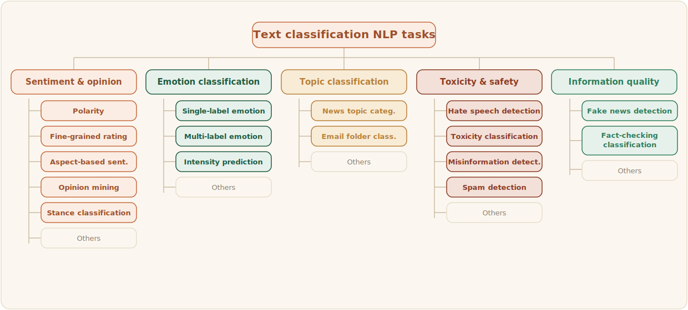

# Defining text classification tasks:

Text classification is a supervised NLP task in which a text is assigned one or more labels from a predefined label set. In this playbook, we focus on four common text classification tasks: sentiment analysis, emotion analysis, hate speech analysis, and topic classification. Although these tasks can overlap in practice, they differ in what they aim to capture: sentiment focuses on polarity, emotion focuses on affective state, hate speech focuses on harmful or discriminatory language

:::info[Scope note]
This chapter is designed for dataset creation and annotation. It does not cover downstream model training in detail, but the annotated outputs can later be used for classification, retrieval, moderation, or analytics pipelines.
:::

### Task distinction
Below is a short definition of the common NLP tasks. The details of each task are discussed later.
- Sentiment analysis answers: Is the text positive, negative, neutral, or mixed?
- Emotion analysis answers: What emotion or emotions are expressed?
- Hate speech analysis answers: Does the text contain hateful, offensive, or discriminatory language, and who is targeted?
- Topic classification answers: What is the main theme or domain of the text?

:::warning[Define tasks]
Define the annotation objective before collecting data. A dataset built for sentiment analysis should not be reused for hate speech or emotion analysis without revisiting the label schema and annotation guidelines.
:::