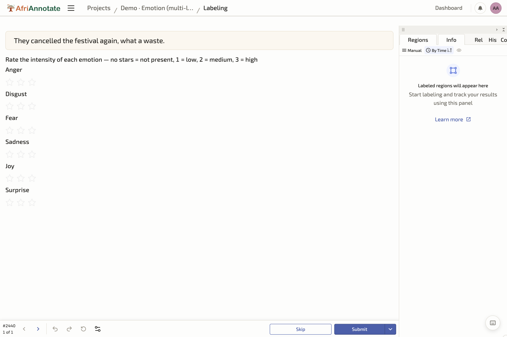

# Emotion Analysis

**What is Emotion Analysis?**

Emotion detection or emotion classification is a task that aims to identify and classify the emotions expressed in a piece of text. Unlike sentiment analysis, which usually categorizes text as positive, negative, or neutral, emotion analysis seeks to recognize more specific emotional states such as anger, joy, sadness, fear, surprise, disgust, and neutral.

Emotion annotation goes a step further than sentiment analysis by analyzing specific emotions and classifying the text into categories such as joy, anger, sadness, fear, or surprise. By recognizing these, companies can better understand customer responses, which helps them respond to specific issues accordingly. For example, if you can identify any frustration in a customer complaint, you can address the issue immediately and prevent escalation. Emotion can be annotated into one of the following approaches.

### Single-label Emotion Analysis

In single-label annotation, a text has either no emotion or only one of the emotions for the given list of emotions; each text is assigned one dominant emotion.

| Id | Text | Emotion |
|----|------|---------|
| sample_01 | Never saw him again. | Sadness |
| sample_02 | I love telling this story. | Joy |
| sample_03 | How stupid of him. | Anger |
| sample_04 | None of us did. | Neutral |
| sample_05 | I can't believe it! I won the scholarship! This is amazing! | Joy |

### Multi-label Emotion Analysis

In multi-label emotion analysis, a text may express no emotion, a single emotion, two emotions, or multiple emotions simultaneously. A sample multi-label emotion annotation interface is shown below. The use of checkboxes allows annotators to select one or more emotion categories, along with the corresponding intensity level for each selected emotion. In multi-label emotion annotation, recording emotion intensities is common practice because different emotions may be expressed with varying degrees of strength within the same text. Therefore, intensity annotations provide additional information beyond the mere presence or absence of an emotion.

Given annotations from multiple annotators, the final emotion labels can be determined through an aggregation process. When only binary emotion labels are available, a majority-vote approach can be used to determine the final label for each emotion category. However, when emotion intensity ratings are also collected, both the emotion labels and their intensities can be considered when making the final decision.

The following rule can be used to determine the final emotion label based on ratings from multiple annotators. The final label is binary, where 1 indicates the presence of the emotion, and 0 indicates the absence of a significant emotional expression.

For datasets annotated without considering intensities, decisions can be made by a simple majority vote. For emotion with intensity annotation, the following decision rule can be applied:

The majority vote works for simple cases. However, It may not work if you have an even number of annotators.  For example, given four annotator scores (0,0,3,3): 0 (no-anger), 3 (high-anger), there is no majority vote in this case. IF (at least two annotators assign a non-zero intensity score, e.g., 1, 2, or 3) AND (the average intensity score exceeds a predefined threshold), THEN the final emotion label = 1. ELSE the final emotion label = 0.

This approach combines annotator agreement and emotion intensity, resulting in a more reliable representation of the emotional content of the text.

### Conditions for Determining the Final Emotion Label

1. At least 2 people must select 1(low), 2(medium), or 3(high): This ensures that there is a basic level of agreement among the annotators that the content contains some level of emotion (low, medium, or high).
2. Avg score > threshold: The average score given by all annotators must be greater than a predefined threshold. This ensures that the intensity of the emotion is significant enough to be considered present.

Since we have a scale from 0 to 3, a threshold of 0.5  can be a good choice. The below are example scenarios.

#### Example 1

- Annotator scores: 0, 0, 3,3
- Average score: (0+ 0 + 3+3) / 4 =  1.5
- Result: Since 1.5 > 0.5, final label = 1 (emotion present).

#### Example 2

- Annotator scores: 1, 2, 1
- Average score: (1 + 2 + 1) / 3 = 1.33
- Result: Since 1.33 > 0.5, final label = 1 (emotion present).

#### Example 3

- Annotator scores: 1, 1, 0
- Average score: (1 + 1 + 0) / 3 = 0.666
- Result: Since 0.66 >  0.5, final label = 1 (emotion present).

#### Example 4

- Annotator scores: 1, 1, 0, 0,0
- Average score: (1 + 1+ 0 + 0+0) / 5 =  0.4
- Result: Since 0.4  <  0.5, the final label =0 ( no emotion present).

#### Example 5

- Annotator scores: 1, 2, 3, 2
- Average score = (1 + 2 + 3 + 2) / 4 = 8 / 4 = 2.0
- Result: Since 2.0 > 1.5, final label = 1 (emotion present).

This method combines both agreement among annotators and the intensity of the emotion, providing a balanced evaluation. Majority vote does not consider the intensity and may miss out on subtle emotional content. A sample format of the multi-label emotion dataset is shown below. The final binary emotion labels are then derived using the aggregation procedure described above.

| Id | Text | Anger | Fear | Joy | Sadness | Surprise |
|----|------|:-----:|:----:|:---:|:-------:|:--------:|
| sample_01 | Never saw him again. | 0 | 0 | 0 | 1 | 0 |
| sample_02 | I love telling this story. | 0 | 0 | 1 | 0 | 0 |
| sample_03 | How stupid of him. | 1 | 0 | 0 | 0 | 0 |
| sample_04 | None of us did. | 0 | 0 | 0 | 0 | 0 |
| sample_05 | I can't believe it! I won the scholarship! This is amazing! | 0 | 0 | 1 | 0 | 1 |

### Emotion Intensity

Annotators indicate the emotions that are likely conveyed in the text and their intensity levels, i.e., low (1), medium (2) or high (3). The scores that are associated to the different intensity levels (0 [no emotion] to 3 [high emotion]) are then averaged. This average score is used to classify the emotion intensity based on its proximity to the predefined values corresponding to the intensity (i.e., low (0), 1 (low), 2 (medium), and 3 (high)). 

The following is how to make majority vore during intensity annotation if the intensity labels are in likert scale 0 - 3(0 is - no emotion, 1 - low intensity, 2 - medium intensity, and 3- high intensity).

Example 1: Give an example of an emotion and a post [e.g., angry].

- Annotator scores = [1, 2, 2, 3]
- Average score = (1 + 2 + 2 + 3) / 4 = 2.0
- Intensity class = 2 (Moderate amount of emotion)

Example 2:

- Annotator scores = [0, 0, 1, 1]
- Average score = (0 + 0 + 1 + 1) / 4 = 0.5
- Intensity class = 1 (Low amount of emotion)

Example 3:

- Annotator scores = [3, 3, 3, 2]
- Average score = (3 + 3 + 3 + 2) / 4 = 2.75
- Intensity class = 3 (High amount of emotion)

Example 4:

- Annotator scores = [0, 0, 0, 1]
- Average score = (0 + 0 + 0 + 1) / 4 = 0.25
- Intensity class = 0 (No emotion)

A sample format of the multi-label emotion intensities dataset is shown below. Each emotion is assigned an intensity score ranging from 0 (not present) to 3 (high intensity). 

| Id | Text | Anger | Fear | Joy | Sadness | Surprise |
|----|------|:-----:|:----:|:---:|:-------:|:--------:|
| sample_01 | Never saw him again. | 0 | 0 | 0 | 2 | 0 |
| sample_02 | I love telling this story. | 0 | 0 | 2 | 0 | 0 |
| sample_03 | How stupid of him. | 2 | 0 | 0 | 0 | 0 |
| sample_04 | None of us did. | 0 | 0 | 0 | 0 | 0 |
| sample_05 | I can't believe it! I won the scholarship! This is amazing! | 0 | 0 | 3 | 0 | 3 |

