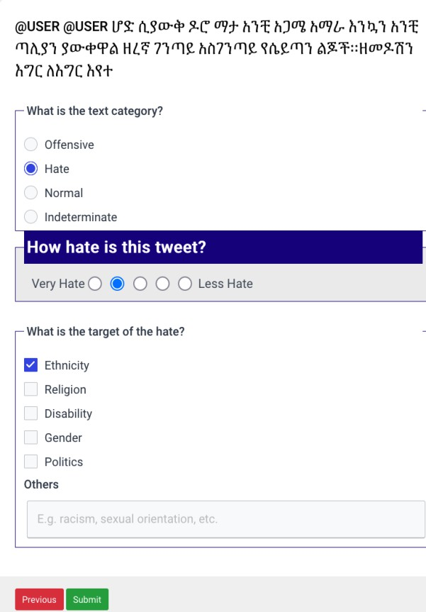

# Hate Speech Analysis

**What is Hate Speech Analysis?**

Hate speech detection is a task that focuses on identifying text that contains hate, offensive, abusive, or discriminatory language directed at individuals or groups based on attributes such as race, ethnicity, religion, gender, nationality, disability or other identity factors. The goal of this task is to automatically classify whether a piece of text expresses hate, hostility, or incitement to harm, often differentiate it from non-hateful content such as criticism, disagreement, or neutral statements. Hate speech detection is widely used in content moderation systems among various social media platforms to reduce online harassment and promote a safer digital communication ecosystem.

Researchers used various class labels, such as Muhammad et al. (2025), who used hate, abusive, normal and indeterminate as class labels, while Ayele et al. (2022, 2023) utilized hate, offensive, normal, and unsure class labels. Ayele et al. (2024) used class labels such as hate, offensive, normal and indeterminate. Davidson et al. (2017) used hate, offensive and neither class labels, while Davidson et al. (2019) used hate, and offensive class labels. Mathew et al. (2021) used hate, offensive, normal and undecided class labels. 

The most agreed-upon definitions of the hate speech classes are as follows:

- **Offensive speech:** is any form of bad language expressions including rude, impolite, insulting, or belittling utterances intended to offend or harm an individual.
- **Hate speech:** is language content that expresses hatred towards a particular group or individual based on their group identities such as race, ethnicity, religion, gender, disability, political affiliation, or other characteristics. It also includes threats of violence associating group identities.
- **Normal **is any form of expression that does not contain any bad language belonging to any of the above classifications.
- **Indeterminate **is any tweet that is not readable or is completely written in a language other than your language of annotation.

Hate speech can target one or many targets during expression. Ayele et al (2024) presented a more general list of hate speech target labels as follows:

- - **Ethnic**: if the hatred tweet targets an ethnic group identity
- **Religion**: if the hatred tweet targets a religious group identity
- **Gender**: if the hatred tweet targets a particular gender group identity
- **Disability**: if the hatred tweet targets disabled group identity
- **Politics**: if the hatred tweet targets people/entities due to political ideology
- **Unidentified target**: if the hatred tweet’s target is not clearly identified/known.
- **Other**: if the hatred tweet targets other groups/group identities such as sexual orientation, racism etc.

Some studies, such as Ayele et al (2024) also examine and rate the severity of hate and offensive messages with rating scales from 1-5.

