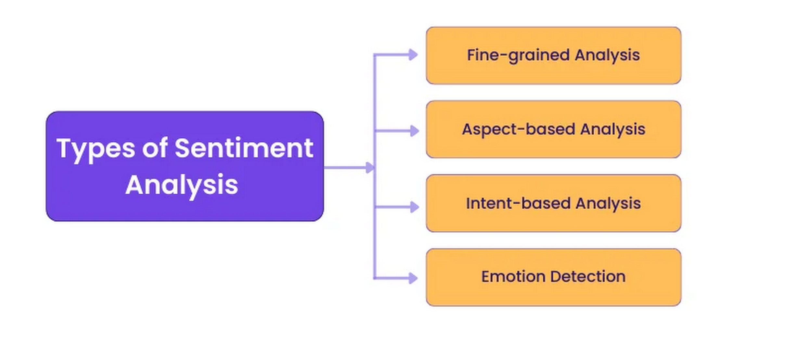
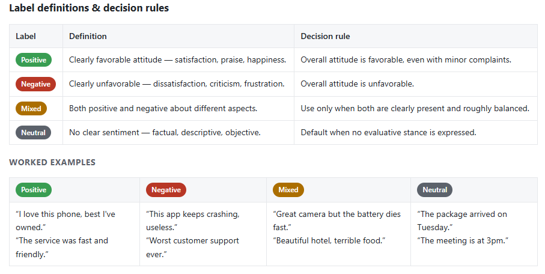

# Sentiment Analysis

Sentiment analysis in this playbook refers to labeling text according to the polarity of the expressed attitude toward a subject, product, event, or experience. The most common labels are positive, negative, neutral, and mixed. Depending on the project, sentiment may be annotated at the document level, sentence level, or aspect level.

The Sentiment Analysis Annotation Guidelines Template is a structured framework designed to standardize the process of annotating textual data for sentiment analysis. This template is particularly crucial in industries like customer service, marketing, and social media analytics, where understanding the sentiment behind user-generated content is essential. By providing clear instructions and examples, the template ensures that annotators can consistently label data as positive, negative, or neutral. For instance, in a customer feedback analysis project, this template helps teams align on how to interpret ambiguous phrases, ensuring the dataset's reliability and accuracy. The importance of such a template cannot be overstated, as it directly impacts the quality of machine learning models trained on the annotated data. 

### **8.1. Types of sentiment analysis**

Sentiment analysis can be annotated into one or more of the following annotation types.

**Fine-grained (Scaling) analysis:**
Graded sentiment analysis assigns scores on a scale, providing a more nuanced view of sentiment intensity. This approach helps gauge the strength of emotions expressed in the text. For example, a review might be labeled as “very positive,” “slightly positive,” “neutral,” “slightly negative,” or “very negative.”

 **Aspect-based analysis:**
 This focuses on identifying sentiment towards specific aspects or features of a product, service, or topic. For instance, in a hotel review, aspect-based analysis might determine positive sentiment towards the location but negative sentiment towards the cleanliness. For a smartphone review, it separately analyzes battery, screen, camera and performance to understand customer sentiment for each aspect.

**Intent-based analysis**

This analysis type can detect the motive behind a text, whether the author is trying to express an opinion, make a recommendation, ask a question, or express a need. Understanding intention is important in customer service, market research, and targeted advertising. For example, a customer tweets, ‘I wish Company X’s product had a longer battery life.’ This indicates dissatisfaction and a desire for improvement (intent to recommend a feature change). This helps Company X handle the negativity and use this feedback to improve their products.

### **8.2. Sentiment analysis labels definition**

While the types of sentiment targets can differ, the annotation labels can be two (positive and negative), three (positive, negative, and neutral), or all of the labels below.

- **Positive**: a message that conveys a clearly favorable attitude, such as satisfaction, approval, praise, or happiness toward a subject, product, or experience.
- **Negative**: a message that conveys a clearly unfavorable attitude, such as dissatisfaction, disapproval, criticism, or frustration toward a subject, product, or experience.
- **Mixed**: a message that includes both positive and negative sentiments, either about different aspects of the same subject or within the same statement.
- **Neutral**: a message that expresses no clear positive or negative sentiment, typically presenting factual, descriptive, or objective information without emotional judgment.

Examples of sentiment analysis are as follows:

