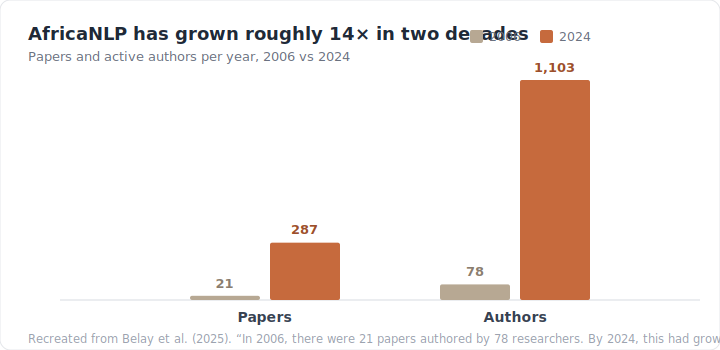
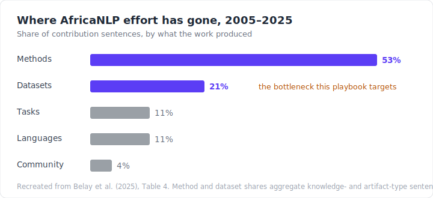

# 1. Introduction

:::tip[Help build the AfriPlaybook]
This playbook is open source and community-owned. You don't need to write a whole chapter to help. Fixing an error, translating a page, or sharing what worked on a real project all count. See [**Built in the open**](#built-in-the-open) below, or jump straight to the [contribution guide](https://github.com/warakacommunity/AfriPlaybook/blob/main/README.md#ways-to-contribute).
:::

> The bullet was the means of the physical subjugation. Language was the means of the spiritual subjugation.
>
> — Ngũgĩ wa Thiong'o, *Decolonising the Mind: The Politics of Language in African Literature* (1986)

Africa is home to almost a third of the world's living languages — about 2,140 of the roughly 7,160 spoken on Earth ([Ethnologue, 2024](../references.md#ethnologue-2024)). Almost none of them are visible to the systems now reshaping how the rest of the world reads, writes, searches, translates, and speaks. When a language model stumbles over Yorùbá, Chichewa, or Wolof, the cause is rarely the model. It is the data. The text and speech these systems learn from barely exist in a usable form.

[Joshi et al. (2020)](../references.md#joshi-2020) sort the world's languages into six tiers by how many resources they have. The bottom tier, the *left-behinds*, with essentially no labelled data and little prospect of being served by current methods, holds the overwhelming majority of languages, and African languages crowd into it. Most have no annotated corpus, no benchmark, no tools. They are missing not because they are small. Many have tens of millions of speakers. They are missing because no one has built the data. The picture still holds, though the field now treats *low-resource* as multidimensional — a matter of tools, speakers, funding, and institutional support as much as raw data, with no single agreed definition ([Ranathunga & de Silva, 2022](../references.md#ranathunga-desilva-2022); [Nigatu et al., 2024](../references.md#nigatu-2024)).


## Scraping will not fix this

When a language has no data, the instinct is to go and scrape more of it: crawl a wider slice of the web and trust that coverage will follow. For African languages, that instinct fails.

The web does not contain much African-language text, and what it contains is thin and noisy. When [Kreutzer et al. (2022)](../references.md#kreutzer-2022) audited the large multilingual crawls everyone trains on, they found that for many low-resource languages a large share of the data was mislabelled, machine-translated, or not language at all. At the tail, quality collapses along with quantity.

The only sure way to get high-quality data for African languages is to build it with the people who speak them, the people who know the words, the grammar, the idioms, and the culture. One of the main blockers to AfricaNLP is that the people who speak these languages are not the ones building the data. The people who build it often cannot tell what is correct, what is offensive, or what is missing. They do not know what matters to the communities behind the language, or how to keep the data they collect from causing harm.

That gap has real consequences. Data built without its speakers can look clean while being quietly wrong, and any model trained on it inherits every mistake. Such errors spread, into search results, translations, and the everyday tools that millions of people are starting to depend on. Getting the data right decides whether a language is served well, served badly, or left out of these tools altogether.

This playbook is about how to fix that problem. It is a practical, opinionated, step-by-step guide to building high-quality datasets for African languages, drawing on the direct experience of the people who speak and understand them. The playbook is built by the people who know the languages, for the people who want to build datasets for them. It is about how to do it right, and how to do it safely.

## The field is growing, the data is not keeping up

Over two decades, AfricaNLP has grown from a niche interest into an established field. A survey of the period counted 1,902 papers by 4,901 authors between 2005 and 2025: just 21 papers from 78 researchers in 2006, rising to 287 from 1,103 in 2024 ([Belay et al., 2025](../references.md#belay-2025)).



But more papers has not meant more data. When the same survey sorted nearly 7,800 contributions by what they actually produced, methods made up 53 percent and new datasets just 21 percent; the rest were benchmarks, surveys, and other work that adds no new data ([Belay et al., 2025](../references.md#belay-2025)). The field is learning to model far faster than it is building the data those models learn from.



Methods and datasets are not made the same way. A method can be carried from one language to the next; a dataset has to be built for each one, from scratch, by people who speak it. That means recruiting annotators, writing guidelines, running quality control, and securing consent. It is slow, unglamorous work, and it is rarely funded.

This guide solves that problem. It is a practical, step-by-step manual for building datasets for African languages, from deciding what to collect, through annotation design, quality control, and documentation, to release. It lays out each step so you do not have to work it out from scratch, which makes a good dataset far quicker and easier to build. It is written for the real conditions of African-language NLP: low resources, multilingual teams, scarce funding, and communities who must stay the owners of what they help create.

## Why we wrote this playbook

Almost every guide to building datasets quietly assumes English, a generous budget, and a problem someone has already solved once. Little of that holds when you are starting a corpus for a language with no prior resources, a volunteer team, and decisions to make that the literature never covers.

The AfriPlaybook is the manual we wish we had had. It is written for exactly those conditions, and its aim is narrow: to lower the barrier to getting started and to raise the floor on quality, so that the datasets this community produces are ones the world can trust and reuse.

To do that, the playbook does not stand alone. It pairs the step-by-step guide with two companion tools: [AfriAnnotate](/tool), for setting up and running annotation tasks, and [AfriFinder](/afrifinder), for recruiting native-speaker annotators. Together they let a small team move from a plan to a documented, released dataset without reinventing the process each time. Lowering the cost of building data is how the balance in the charts above begins to shift.

## Built in the open

This playbook is open source, maintained by the Waraka coomunity in collaboration with AfricaNLP and Masakhane. It is not just for researchers. It is for everyone who builds datasets for African languages, volunteers, students, community organizers, and professionals alike. The people who build datasets know best what a guide like this should say, so it is only as good as the people who contribute to it. There are many ways to help:

- **Write** a chapter or section that fills a gap.
- **Review** existing chapters: correct an error, sharpen a claim, add a reference.
- **Share a case study** from a real project, including what went wrong.
- **Open a discussion** when you disagree with an approach. Disagreement makes the guide better.

Start with the [contribution guide](https://github.com/warakacommunity/AfriPlaybook/blob/main/README.md#ways-to-contribute), raise an idea in [GitHub Discussions](https://github.com/warakacommunity/AfriPlaybook/discussions), or join us on [Discord](https://discord.gg/ChNPHV2PPS). If you build datasets for African languages, or want to learn how, you are already part of who this is for. Come and build it with us.

---

## How to cite this playbook

If the AfriPlaybook informs your research, teaching, or project, please cite it.

**BibTeX:**

```bibtex
@misc{masakhane2026playbook,
  author       = {{Masakhane Community}},
  title        = {AfriPlaybook: A Practical Guide for Building NLP Systems for African Languages},
  year         = {2026},
  publisher    = {Masakhane},
  url          = {https://warakacommunity.github.io/AfriPlaybook/},
  note         = {Open-source community resource}
}
```

**Plain text (APA-style):**

> Masakhane Community. (2026). *AfriPlaybook: A Practical Guide for Building NLP Systems for African Languages*. [https://warakacommunity.github.io/AfriPlaybook/](https://warakacommunity.github.io/AfriPlaybook/)

For other formats (MLA, Chicago, etc.) and a machine-readable [`CITATION.cff`](https://github.com/warakacommunity/AfriPlaybook/blob/main/CITATION.cff), see the [/cite](/cite) page.

If you reference a specific chapter, please include the chapter title and its URL.
