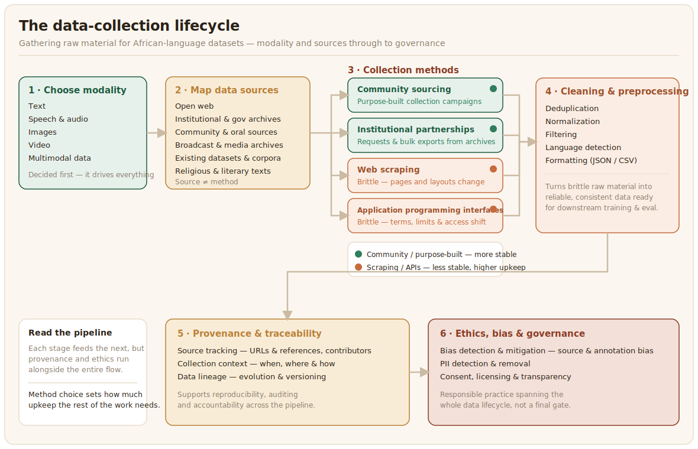

Every dataset starts the same way: someone has to go and get the raw material. This chapter is about that first step — what the rest of the playbook calls **data collection** or **data curation**. We mean this narrowly: the actual gathering of raw text, images, audio, or video, before anyone has cleaned it, labelled it, or decided what it means. What happens after collection — cleaning, annotation, quality control, and release — is covered in the chapters that follow.

How you collect data depends almost entirely on its **modality** — the format the data takes, whether that's text, images, audio, or video. Each modality has its own sources, its own tools, and its own failure modes, and a method that works well for one (scraping news sites for text) can be close to useless for another (there is no equivalent "scrape the web" shortcut for spoken-language audio in a language with no written tradition).

The sections below work through the building blocks in order: what modality you're collecting, where it can come from, two of the most common collection mechanisms in detail (web scraping and APIs), and a worked case study showing how these decisions interact when a project spans more than one modality at once. The chapter closes with what happens once raw data is in hand — planning the resources it took to get there, cleaning it, tracking where it came from, and governing it responsibly.

