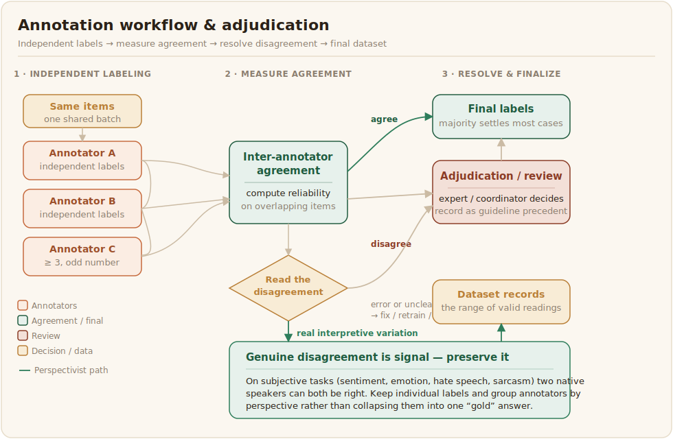

# Workflow and Adjudication

Once the task is designed and annotators are trained, the workflow decides how labels are produced, checked, and finalised. The central questions are how many people label each item, how work is assigned, and what happens when they disagree.

## Use multiple annotators per item

A single annotator's label is a single opinion, and you cannot tell a confident correct call from a confident mistake. Assigning each item to several annotators lets you measure reliability and resolve errors. The common practice for African-language datasets is at least three annotators per item, with an odd number so that a simple majority can settle most cases. The Masakhane named-entity datasets used three native speakers per language under a coordinator, which is enough to catch individual slips while staying affordable for a volunteer team ([Adelani et al., 2022](../references.md#adelani-2022)). More annotators raise reliability and cost together, so the right number is a budget decision as much as a statistical one.

## Assign work with deliberate redundancy

Decide on purpose how items overlap between annotators. Some overlap is essential, because the items that more than one person labels are what let you compute agreement and spot annotators who have drifted. Mixing a small set of trusted, pre-labelled "gold" items into the stream, without flagging them, gives a continuous read on whether each annotator is still applying the guideline correctly. Plan the assignment so that every item receives its required number of independent labels and so that no annotator reviews their own work, since self-review hides the very errors review exists to catch.

## Resolve disagreement, but read it first

When annotators disagree, the usual resolution is a majority vote, with an expert or the language coordinator adjudicating the cases a vote cannot settle. Record those adjudication decisions, because they become precedent for the guideline and material for training the next round of annotators.

Before treating disagreement as something to erase, though, read what it is telling you. Not all disagreement is error. It can come from an ambiguous item, from a gap in the guideline, from a genuine mistake, or from legitimate differences in how people interpret subjective and culturally loaded content ([Plank, 2022](../references.md#plank-2022)). That distinction matters a great deal for African data, where many of the most valuable tasks are subjective by nature. Sentiment, emotion, hate speech, and sarcasm all depend on dialect, region, and cultural context, and two native speakers from different communities can both be right. When disagreement traces to an unclear guideline or a genuine error, fix the guideline or retrain. When it reflects real interpretive variation, consider preserving the individual annotators' labels rather than collapsing them into one "gold" answer, so that the dataset records the range of valid readings instead of flattening minority perspectives out of existence. Recent African work goes further than simply keeping the labels: grouping annotators by how they agree, rather than reducing them to a majority vote, models these perspectives directly and improves performance on subjective tasks like sentiment, emotion, and hate speech across many languages ([Belay et al., 2026](../references.md#belay-2026)). A label that hides genuine disagreement is less honest than one that shows it.
