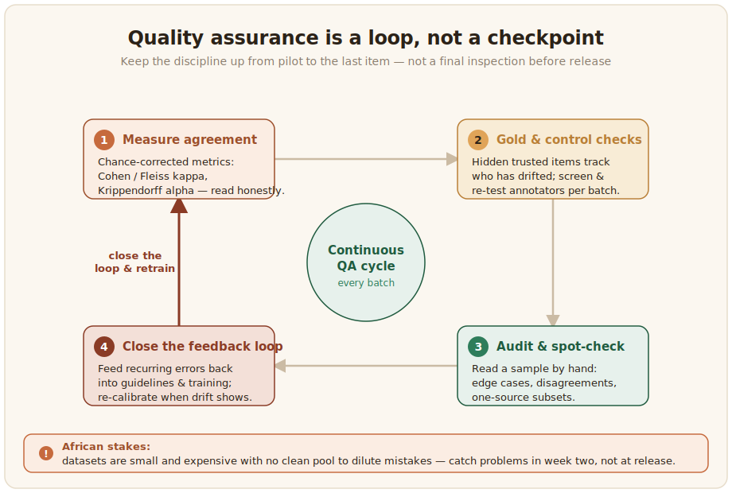

# Data Quality Assurance

Quality is not a final inspection you run before release. It is a discipline you keep up from the pilot to the last item. For low-resource African data the stakes are higher than usual, because every example is expensive to produce and there is no vast pool of clean data to dilute mistakes. When a large web crawl was audited, a striking share of the low-resource text turned out to be mislabelled, machine-translated, or not the target language at all ([Kreutzer et al., 2022](../references.md#kreutzer-2022)). A small, carefully assured dataset is worth far more than a large one nobody checked. This page covers the assurance side: measuring agreement, using gold data, auditing by hand, and closing the loop.



## Measure inter-annotator agreement

When several people label the same items, agreement tells you whether the labels are reliable or just one person's opinion repeated. Raw percentage agreement is easy to read but misleading, because some agreement happens by chance, so use a chance-corrected measure: [Cohen's kappa](https://scikit-learn.org/stable/modules/generated/sklearn.metrics.cohen_kappa_score.html) for two annotators, [Fleiss' kappa](https://www.statsmodels.org/stable/generated/statsmodels.stats.inter_rater.fleiss_kappa.html) for three or more, and [Krippendorff's alpha](https://pypi.org/project/krippendorff/) when annotations are missing or the labels are ordinal. Production-grade work often targets an alpha above 0.8, though the right threshold depends on how subjective the task is. African datasets show the full range in practice. MasakhaNER reached high agreement by training annotators in workshops where they discussed disagreements ([Adelani et al., 2022](../references.md#adelani-2022)), AfriSenti held sentiment agreement above 0.70 ([Muhammad et al., 2023](../references.md#muhammad-2023)), the Thiomi multimodal corpus kept Fleiss' kappa above 0.82 ([Thiomi Dataset, 2026](../references.md#thiomi-2026)), and AfriHate reported Randolph's kappa between 0.46 and 0.81 across its hate-speech datasets ([Muhammad et al., 2025](../references.md#afrihate-2025)). Lower numbers are not automatically a failure: on genuinely subjective tasks they can reflect real interpretive variation rather than sloppiness ([Plank, 2022](../references.md#plank-2022)). The worked formulas and code live in the task chapters; here the point is to choose the right metric and read it honestly.

Once you have chosen the metric, computing it on an exported annotation file is short. Tools using the Label Studio configuration format export annotations as JSON, so a task carries the labels every annotator gave it. The script below builds the annotator-by-item matrix from that export and reports the right statistic for the number of annotators, using established libraries rather than a hand-rolled formula.

```python
import json
from collections import defaultdict

from sklearn.metrics import cohen_kappa_score   # pip install scikit-learn
from statsmodels.stats.inter_rater import fleiss_kappa, aggregate_raters


def load_labels(export_path: str, from_name: str = "sentiment") -> dict:
    """From a Label Studio-format JSON export, return
    {task_id: {annotator: label}} for one labeling field."""
    by_task = defaultdict(dict)
    with open(export_path, encoding="utf-8") as f:
        tasks = json.load(f)
    for task in tasks:
        for ann in task.get("annotations", []):
            who = ann.get("completed_by", "unknown")
            for result in ann.get("result", []):
                if result.get("from_name") != from_name:
                    continue
                choice = result["value"]["choices"][0]   # single-choice task
                by_task[task["id"]][who] = choice
    return by_task


def agreement(by_task: dict) -> None:
    # Keep only items every annotator labelled, so the comparison is fair.
    annotators = sorted({a for labels in by_task.values() for a in labels})
    shared = {t: l for t, l in by_task.items() if len(l) == len(annotators)}
    print(f"{len(annotators)} annotators, {len(shared)} commonly-labelled items")

    if len(annotators) == 2:
        a, b = annotators
        y1 = [shared[t][a] for t in shared]
        y2 = [shared[t][b] for t in shared]
        print(f"Cohen's kappa: {cohen_kappa_score(y1, y2):.3f}")
    else:
        # Fleiss' kappa expects an items x categories count table.
        table = [[shared[t][a] for a in annotators] for t in shared]
        counts, _ = aggregate_raters(table)
        print(f"Fleiss' kappa: {fleiss_kappa(counts):.3f}")


if __name__ == "__main__":
    agreement(load_labels("afriannotate_export.json"))
```

Reading agreement once at the end hides the drift this chapter warns about. The same export carries an annotation timestamp, so the same matrix can be split by batch or by time and scored separately, which is exactly how the Setswana sentiment corpus surfaced annotators slowly diverging across its eight batches ([Abdulmumin et al., 2026](../references.md#abdulmumin-2026)). When labels are ordinal or annotators skip items, swap these functions for Krippendorff's alpha (the `krippendorff` package), which handles both cases that kappa does not.

## Use gold data and control checks

A gold standard is a set of items whose correct labels you already trust. Mixed into the annotation stream without being flagged, gold items give a continuous, per-annotator read on who is still applying the guideline and who has drifted, so you can retrain or remove an annotator before their errors spread through the data. Build the gold set carefully, because it becomes your reference for everything else, and remember that even gold is imperfect: audits of benchmark datasets find error rates from under one percent to over ten, depending on the task. Screen annotators the same way you check them, by having candidates pass a short annotation test before the main task and by re-showing a few items to measure each person's self-consistency.

## Audit and spot-check by hand

Aggregate agreement can look healthy while something systemic is quietly wrong, so do not trust the numbers alone. Pull a sample and read it. Spend the time on the places problems hide: the edge cases, the items where annotators clustered into disagreement, and any subset from a single source or annotator. The web-crawl audit is the cautionary tale here, since a brief human look at a sample exposed whole languages that automated pipelines had passed as clean ([Kreutzer et al., 2022](../references.md#kreutzer-2022)). A few hours of careful reading catches failures that no metric will surface on its own.

## Close the feedback loop

Quality assurance is a loop, not a checkpoint. Track agreement over the life of the project rather than only at the end, feed every recurring error back into the guidelines and the next round of training, and re-calibrate when annotators drift apart. Drift is real and measurable, and a single end-of-project agreement score can hide it. In a Setswana sentiment corpus, overall agreement looked healthy at κ = 0.76, yet items labelled within a minute of each other reached κ = 0.98 while items labelled more than a day apart fell to κ = 0.65, a clear sign that annotators slowly diverged across the eight batches of the project ([Abdulmumin et al., 2026](../references.md#abdulmumin-2026)). The reason to monitor continuously is economic as well as statistical: a problem caught in week two costs a fraction of the same problem discovered at release, when it has already contaminated the whole dataset ([Sambasivan et al., 2021](../references.md#sambasivan-2021)).
