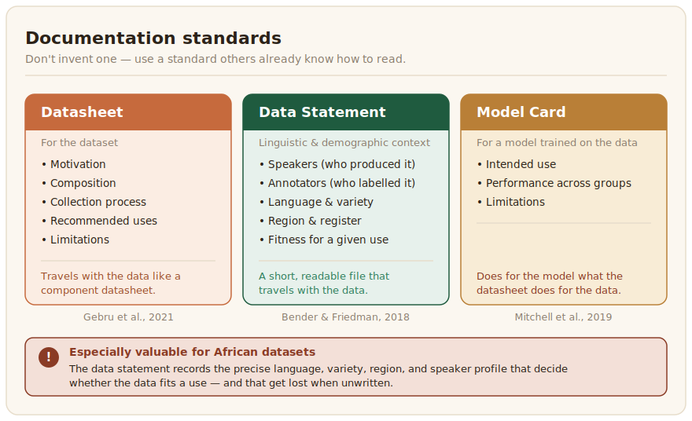

# Documentation and Reporting

A dataset without documentation is hard to trust and easy to misuse. Documentation is what lets someone else understand what your data is, judge whether it fits their purpose, and use it responsibly, and it is what lets you defend how it was made years later. For African-language data, where context and provenance carry extra weight, good documentation is not optional paperwork. It is part of the dataset.



## Use a standard, do not invent one

Three established standards cover most of what a dataset needs, and using them means others already know how to read your documentation. A **datasheet** describes a dataset's motivation, composition, collection process, recommended uses, and limitations, travelling with the data the way a datasheet travels with an electronic component ([Gebru et al., 2021](../references.md#gebru-2021)). A **data statement** focuses on the linguistic and demographic context that NLP data needs, recording who the speakers and annotators are, which language varieties are covered, and how that shapes what the data can be used for ([Bender & Friedman, 2018](../references.md#bender-friedman-2018)). A **model card** does the same for a model trained on the data, stating its intended use, its performance across groups, and its limitations ([Mitchell et al., 2019](../references.md#mitchell-2019)). For African datasets the data statement is especially valuable, because the precise language, variety, region, and speaker profile are exactly the details that determine whether the data is fit for a given use, and exactly the details that get lost when they are not written down.

## Document the things people most need, and most often omit

Whatever template you use, three things matter most and are most often skipped. Record the **languages and varieties precisely**, naming the language, script, region, and register rather than a vague label like "Swahili." Be honest about **limitations and failure cases**, since every dataset has gaps, biases, and conditions where it should not be used, and stating them is a strength rather than an admission of weakness. And make the collection **transparent**, recording where the data came from, from whom, under what consent, and how it was processed, which is the provenance the [data governance](../data-governance/index.md) chapter depends on.

A data statement captures exactly these linguistic and demographic details in a short, readable file that travels with the data. This is a fuller, human-facing companion to the machine-readable [dataset card](../2_data-collection/8_data-provenance-traceability.md) from Data Collection, and a starting template looks like this:

```yaml
# data-statement.yaml  (after Bender & Friedman, 2018)
languages:
  - name: Hausa
    iso639_3: hau
    script: Latn
    region: Kano, northern Nigeria
    register: news / formal written

curation_rationale: >
  Collected to support sentiment analysis for northern Nigerian media.

speakers:                 # who produced the source language
  description: professional journalists writing for a news outlet
  varieties: Kananci (the Kano dialect)

annotators:               # who labelled it
  count: 5
  background: native Hausa speakers from Kano, university-educated
  recruitment: recruited and paid per the project's consent form

speech_situation:
  medium: written text (published articles)
  time_period: 2024-2026

known_limitations: >
  Formal register only; under-represents spoken and rural varieties.
```

The `speakers` and `annotators` blocks are the heart of it: naming who produced and who labelled the data, with their variety and background, is what tells a reuser whether the dataset fits their context, and it is exactly what gets lost without a template. This and the other reusable templates are listed on the [templates](./templates.md) page.
