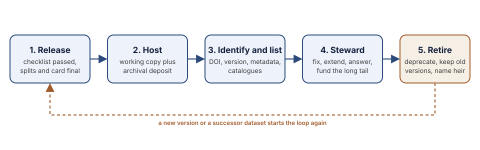

# Dataset Lifecycle: Sustainability, Discoverability, and Reuse

Most datasets are not lost to disasters. They fade. The download link moves when a student graduates. The only copy sits on a laptop that is replaced. A paper cites a URL that now returns a login page. Nobody knows who may fix an error, so nobody does. Two years after release, a corpus that cost a year of community effort is a rumour.

This chapter is about the part of the work that starts when the release checklist is done. It covers where the data should live, how to give it an identity that outlasts any single website, how to make sure the people who need it can find it, and who looks after it once the grant that paid for it has ended. Each of these is cheap to get right at release and expensive to repair later.

## What this chapter covers

- **[Release checklist](./release.md).** The final gate before publication. Quality, documentation, licence, consent, splits, and a stable home.
- **[Hosting and preservation](./hosting.md).** Choosing a home for the data, the two-copy pattern of a working repository plus an archival deposit, formats and packaging, access control, and the bandwidth realities of African users.
- **[Identifiers, versions, and catalogues](./discoverability.md).** Persistent identifiers, versioning that keeps published results reproducible, machine-readable metadata, the registries where African-language datasets should be listed, and how to be cited.
- **[Maintenance and stewardship](./maintenance.md).** Naming a steward, running a maintenance plan a volunteer community can keep, handling corrections and consent withdrawal, deprecating and succeeding a dataset, and paying for the long tail.

## Three ideas that run through it

**The dataset is a publication, not a file.** It has a version, a citation, a record of changes, and a named party who answers for it. Treat a release the way you would treat a journal article, because that is how others will use it ([Gebru et al., 2021](../references.md#gebru-2021)).

**Findable, accessible, interoperable, reusable.** The FAIR principles ([Wilkinson et al., 2016](../references.md#wilkinson-2016)) were written for scientific data of every kind, and they translate directly: a persistent identifier, open access under a clear licence, standard formats and metadata, and enough documentation that a stranger can reuse the data without writing to you.

**The people in the data keep rights in it.** Stewardship is a governance question before it is a technical one. The CARE principles ([Carroll et al., 2020](../references.md#carroll-2020)) add collective benefit, authority to control, responsibility, and ethics to FAIR, and the [Data Governance](../data-governance/index.md) chapter sets out what that means for a community-built corpus. This chapter assumes that framing and shows how to honour it after release.

If you are releasing your first dataset, read the pages in order. If you already have one out in the world and are worried about its future, start with [Maintenance and stewardship](./maintenance.md) and work backwards.
