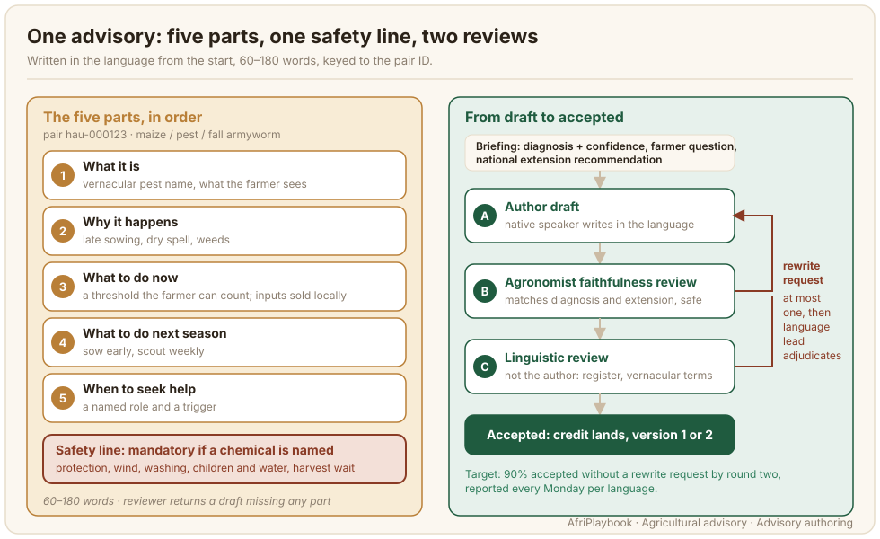
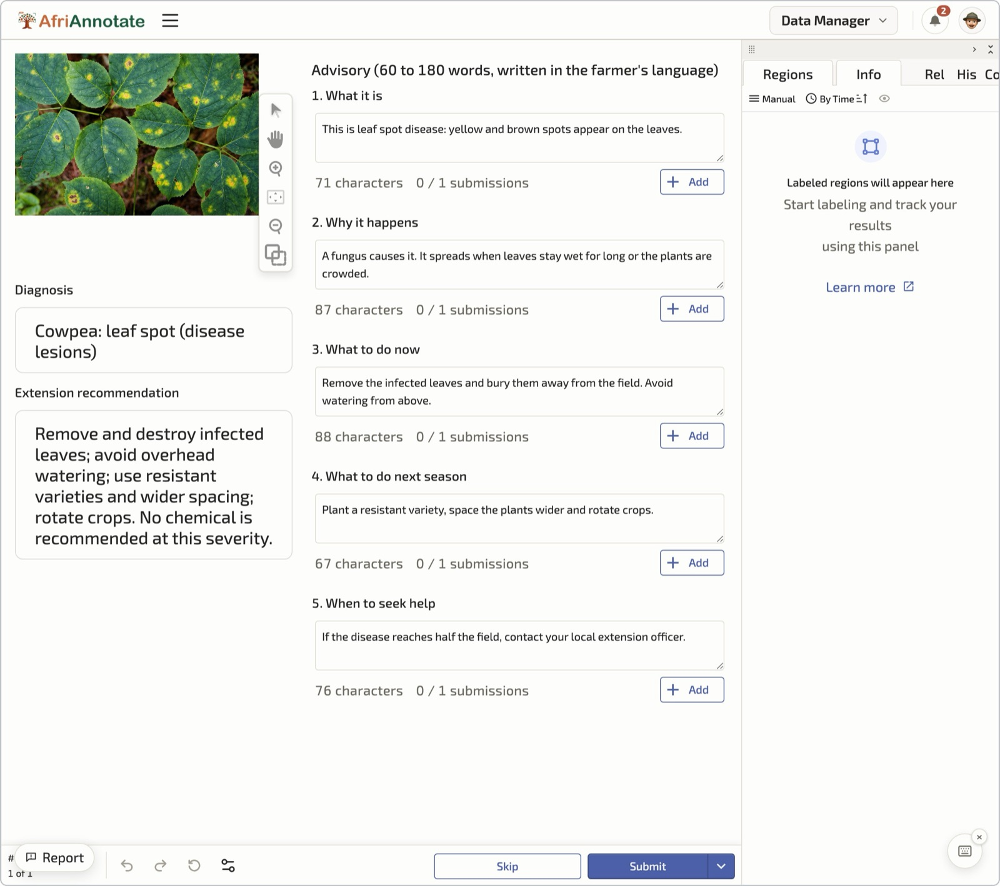

# Advisory Authoring

An advisory is the text a model will learn to say to a farmer: what the plant has, why, and what to do about it. It is the part of the dataset farmers will hear back, so its quality decides whether the model is useful or merely fluent. This page covers how to get advisories written in the language by people who can talk to farmers, and how to check them before they count.

The advisory attaches to a diagnosed image on the same pair ID. The diagnosis comes from [Diagnosis Labelling](./diagnosis-labelling.md); the spoken version of the advisory is recorded in the [Speech Layer](./speech-layer.md).



## What the data looks like

Each advisory is a short text in the target language, stored on the pair record with the author's ID, a word count, a flag for the safety line, and a version number that says whether it was accepted as drafted or after a rewrite. The record below is a trimmed pair record:

```json
{
  "pair_id": "hau-000123",
  "language": "hau",
  "diagnosis": { "label": "maize/pest/fall_armyworm", "confidence": "high" },
  "advisory": {
    "text": "Wannan tsutsar sojoji ce ta masara. ...",
    "author_id": "auth-hau-07",
    "authored_not_translated": true,
    "word_count": 159,
    "inputs_mentioned": ["emamectin benzoate"],
    "safety_line_present": true,
    "version": 2
  },
  "qa": { "status": "accepted" }
}
```

The `authored_not_translated` flag is a constant `true` in the schema, so the collection rule is visible in every record. The schema records the rule; the linguistic reviewer is the check that catches a translation.

Every advisory follows the same five parts: what it is, why it happens, what to do now, what to do next season, and when to seek help. Where the text names a chemical, a safety line on handling is mandatory. The structure keeps advisories comparable across languages and gives the reviewer a checklist. Length is 60 to 180 words. Under 60 usually means a part is missing; over 180 usually means the author has started writing an extension manual.

### A worked example in Hausa

The advisory below is illustrative. In a real collection the scouting threshold and the product come from the national extension recommendation, and the vernacular pest name from the language lead's term list.

> Wannan tsutsar sojoji ce ta masara. Tana shiga cikin tsakiyar shukar ta cinye sabbin ganye, shi ya sa ka ga ramuka da kashinta kamar garin itace. Ta fi yawa idan aka shuka a makare ko ruwa ya yi karanci. Yanzu: da farko ka tsinci tsutsotsin da ka gani, ka zuba yashi ko toka a tsakiyar shukar. Idan tsutsa ta kama fiye da shuka daya cikin biyar, feshi maganin Emamectin benzoate da safe ko yamma, kai tsaye cikin tsakiyar shukar, bisa ga umarnin kwalbar. Sa safar hannu da abin rufe fuska, kar ka feshi da iska, ka wanke hannu da jiki bayan feshi. Ka ajiye maganin nesa da yara da ruwa, kuma ka jira kwanakin da aka rubuta a kwalbar kafin ka girbe. Shekara mai zuwa: shuka da wuri tare da makwabta, ka cire ciyawa, ka bincika gona kowane mako. Idan tsutsa ta ci gaba bayan mako guda ko ta shiga gora, je ka ga jami'in noma na karamar hukumarka.

English gloss: This is fall armyworm on maize. It enters the whorl and eats the young leaves, which is why you see holes and droppings like sawdust. It is worse when sowing is late or rain is short. Now: first pick out the caterpillars you can see and drop sand or ash into the whorl. If it has attacked more than one plant in five, spray Emamectin benzoate in the morning or evening, straight into the whorl, following the label. Wear gloves and a face cover, do not spray into the wind, and wash your hands and body after spraying. Keep the product away from children and water, and wait the number of days written on the label before you harvest. Next season: sow early together with your neighbours, remove weeds, and check the field every week. If the caterpillar continues after one week or gets into the cob, go and see your local government extension officer.

What makes it usable: the pest has its local name, the product is one sold in Nigerian agro-dealer shops, the threshold is a count a farmer can do standing in the field, and the "seek help" line names a person the farmer can reach.

## Who does it and how

Authors are native speakers who can write the way an extension officer talks to a farmer: extension agents, agricultural teachers, radio farm-programme presenters. Fluency alone does not qualify an author. One who writes in a newspaper register produces text a farmer would not say and a model should not learn.

Plan on 6 to 10 authors per language, with 3 to 5 linguistic reviewers and 1 to 2 agronomists behind them. Authors work in the [AfriAnnotate](https://afriannotate.waraka.org) text-authoring template with the image, the agronomist's diagnosis, the national extension recommendation, and the collector's captured farmer question on one screen. Before the first batch each author is briefed on the vernacular term list, the style guide, and the five-part structure, with the language lead's worked examples for the common classes.

Authors write in the language from the start. Nothing is translated from English. The diagnosis and the recommendation reach the author as facts; the job is to say those facts to a farmer in that district.

## On the platform

The screenshot below shows the authoring task in AfriAnnotate. The author sees the photo, the diagnosis and the extension recommendation on the left, and writes the advisory on the right in its five parts, each in its own box with a character count.



The photo is a stock image standing in for a field photo. The sample advisory is in English for the reader; in a project the author writes in their own language.

## Guidelines that matter

These rules separate an accepted advisory from a rewrite request. Give them to the author as instructions.

1. **Write it as you would say it to the farmer in front of you.** Use the register of an extension visit, in the second person, with the words farmers use in your region.
2. **Use the vernacular crop and pest names from the term list.** Where no vernacular name exists, describe what the farmer sees ("the caterpillar inside the whorl") before giving any borrowed name.
3. **Name only inputs sold in this country.** Check any product against the language lead's list of what agro-dealers stock. Farmers cannot act on a product they cannot buy.
4. **Cover all five parts, in order.** If a part does not apply, say so in one sentence rather than skipping it.
5. **Add the safety line whenever you name a chemical.** Protective clothing, wind, washing afterwards, keeping the product away from children and water, and the days to wait before harvest as printed on the product label. The reviewer returns a draft without it.
6. **Stay within 60 to 180 words.** If you are over, cut a whole sentence rather than trimming every one.
7. **Make "when to seek help" concrete.** Name the role (the ward extension agent, the agro-dealer) and the trigger (a time, a count, a sign).
8. **Do not go beyond the diagnosis.** If the label says fall armyworm at high confidence, do not add stem borer advice "just in case". The agronomist will reject it.

:::tip[What a rewrite request usually says]
Expect most rewrite requests to name one of four faults: an English sentence structure carried into the language word by word (a calque), advice generic enough to fit any pest ("apply the recommended pesticide"), a product copied from a foreign manual that no local shop sells, and a chemical named with no safety line. Give authors these four as a checklist at the briefing, and read the first batch of rewrite reasons back to them before round two.
:::

## Quality control

Every advisory passes two independent reviews before it counts, agronomist first. The agronomist checks that the advisory follows from the diagnosis, matches the national extension recommendation, and is safe where it names a chemical. A native-speaker linguistic reviewer, never the author, then checks register, vernacular terms, and whether a farmer would understand it. Either reviewer can return the draft with a rewrite request; a returned draft gets at most one rewrite before it goes to the language lead for adjudication. The general pattern of review and logged adjudication is in [Workflow and Adjudication](../3_annotation-design/workflow-adjudication.md); this page only adds the two domain checks.

The number to track is advisory agreement: the share of advisories the linguistic reviewer accepts without a rewrite request. The target is 90% by round two, reported every Monday per language. A language still below that after two rounds has a briefing or recruitment problem: re-brief the authors with the specific rewrite reasons, then replace anyone still returning calques. The safety line is also checked mechanically, by an export check that refuses any accepted advisory naming a listed product with `safety_line_present` false.

## Known limitations

- **A native author is not an agronomist.** The advisory can be natural and wrong. The faithfulness review exists because linguistic review cannot catch a wrong dose.
- **The extension recommendation can itself be stale.** National guidelines lag product registrations and resistance reports. Record the recommendation source and version in the rubric so a later user knows what the advisory was faithful to.
- **The five parts can flatten cases that do not fit them.** A healthy-reference image has no "what to do now" beyond reassurance. Allow a one-sentence part.
- **Text length becomes audio length.** A 180-word advisory read aloud runs past a minute, which matters for the [Speech Layer](./speech-layer.md) and any voice interface.

## Further reading

- [Diagnosis Labelling](./diagnosis-labelling.md): where the label and confidence that brief the author come from.
- [Advisory annotation guidelines](../templates/advisory-annotation-guidelines.md): the author and reviewer sheets, including the five-part checklist.
- [Workflow and Adjudication](../3_annotation-design/workflow-adjudication.md): the general review and adjudication pattern this page assumes.
