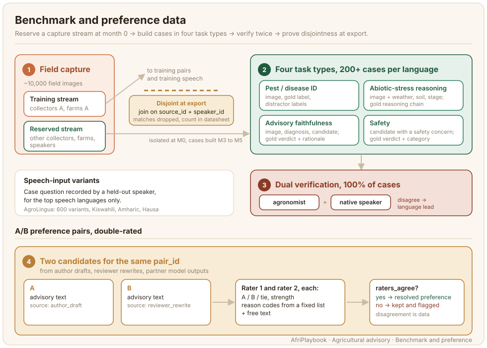

# Benchmark and Preference Data

A benchmark tells you whether a model learned what the training set taught, and a preference set tells you which of two advisories a farmer would rather hear. Both must be built so that no training image, farm, speaker or advisory leaks into them, or the numbers you report will flatter the model. This page describes how to reserve a capture stream, turn it into held-out cases across four task types, and collect A/B preference judgements with reason codes. AgroLingua Africa is the running example: 2,000 held-out cases (at least 200 per language) and 1,500 preference pairs per language across ten languages.



## What the data looks like

A benchmark case is built on one held-out pair. It carries the input a system will see, the gold answer, two verification records, and the disjointness assertion that makes the case usable. The record below is trimmed from the AgroLingua `benchmark_case` schema:

```json
{
  "case_id": "bm-hau-00217",
  "pair_id": "hau-004512",
  "language": "hau",
  "task_type": "advisory_faithfulness",
  "crop": "tomato",
  "input": {
    "image": "images/hau-004512.jpg",
    "question_text": "Me ya sa ganyen tumatir na ke juyawa rawaya?",
    "candidate_advisory": "…",
    "candidate_source": "perturbed"
  },
  "gold": {
    "answer": "unfaithful",
    "verdict": "unfaithful",
    "rationale": "Candidate names a fungicide for a nitrogen deficiency."
  },
  "verification": {
    "agronomist": {"verifier_id": "ag-07", "decision": "verified"},
    "native_speaker": {"verifier_id": "ns-31", "decision": "verified"}
  },
  "disjointness": {
    "source_id": "src-hau-kano-18",
    "source_disjoint_from_train": true,
    "speaker_disjoint_from_train": true
  },
  "consent": {"consent_ref": "c-hau-00931", "purposes": ["training", "benchmark", "release"]}
}
```

Cases are balanced across crops and four task types. Each type asks the system a different question and therefore needs different fields:

| Task type | What the case contains |
| --- | --- |
| Pest or disease ID | image, gold ontology label, distractor labels |
| Abiotic-stress reasoning | image plus context (weather, soil, stage), gold reasoning chain in the language |
| Advisory faithfulness | image, diagnosis, candidate advisory, gold verdict with rationale |
| Safety | image, diagnosis, candidate advisory containing a safety concern, gold verdict and safety category |

For the languages with the most speech (Kiswahili, Amharic and Hausa in AgroLingua, 600 variants in total), a case also carries a `speech_input` block: the case question recorded by a held-out speaker, with the 16 kHz derivative and transcript.

A preference pair is simpler. Two candidate advisories for the same pair sit side by side, and two raters each pick one, say how strongly, and give reasons from a fixed list plus free text:

```json
{
  "pref_id": "pf-swh-01188",
  "pair_id": "swh-002307",
  "language": "swh",
  "candidate_a": {"text": "…", "source": "author_draft"},
  "candidate_b": {"text": "…", "source": "reviewer_rewrite"},
  "ratings": [
    {"rater_id": "r-swh-04", "preferred": "b", "strength": "clear",
     "reasons": ["better_vernacular_terms", "uses_available_inputs"], "free_text": "…"},
    {"rater_id": "r-swh-11", "preferred": "b", "strength": "slight",
     "reasons": ["more_actionable"], "free_text": ""}
  ],
  "agreement": {"raters_agree": true, "resolved_preference": "b"}
}
```

The reason list in AgroLingua has nine values: more accurate, more natural language, better vernacular terms, more actionable, uses available inputs, safer, more complete, more concise, other. Keep the list short enough that raters use it consistently and long enough to separate a language preference from an agronomy preference.

## Who does it and how

The benchmark starts on day one, before a single case exists. At kick-off the language lead sets aside a reserved capture stream: separate collectors, separate farms, and separate districts where the country allows it. Those collectors use the same capture form and the same app as everyone else (see [Field Image Capture](./field-image-capture.md)), but their images land in a `<lang>-benchmark` project that training annotators never see. In AgroLingua the stream is isolated at month 0 and cases are built from it as it fills, between months 3 and 5, inside the roughly 10,000 field images rather than on top of them.

Case construction is done by a small team per language: an agronomist writes gold labels, distractors and reasoning chains; a native speaker writes the case question and, for faithfulness and safety cases, the candidate advisory. Candidates come from three places. Author drafts and reviewer rewrites from the [advisory authoring](./advisory-authoring.md) queue give realistic near-misses. Perturbed advisories, where the team deliberately swaps an input, a dose or a diagnosis, give controlled failures. Partner model outputs arrive later and are back-filled.

Speech-input variants are recorded by speakers who appear nowhere in the training [speech layer](./speech-layer.md). The platform keeps a separate speaker roster for the benchmark project, so the check is a roster membership test rather than a promise.

Preference rating is a native-speaker task, run in the `<lang>-preference` project on a pairwise template: two candidates side by side, forced choice with a tie option, reason checkboxes and a free-text box. Raters are drawn from the linguistic-review cohort, and the platform blocks a rater from judging a pair whose candidate they wrote. Pairs built from author drafts and reviewer rewrites run first, because both exist from month 2; pairs that use partner model outputs are back-filled in Tier 2 once the partner supplies them, and those outputs are released under the same CC-BY-4.0 licence by agreement.

## Guidelines that matter

These are the instructions that decide whether a benchmark measures anything.

1. **Never build a case on a seed image.** Open-seed images are tagged `source=open_seed` and are excluded from the reserved stream. A model may have seen them in pretraining, so a case built on one measures memory.
2. **Write the question the way a farmer asks it.** The case question is in the language, about this photo, and mentions what the farmer can see. A question that names the diagnosis gives the answer away.
3. **Make distractors plausible.** For pest and disease ID, pick distractors from the same crop and a neighbouring issue family. A distractor from a different crop is free marks.
4. **Ground a reasoning chain in the context given.** For abiotic-stress cases, every step of the gold chain must follow from the weather, soil or stage fields in the record. If it needs facts the record does not contain, add them to `context` or cut the step.
5. **One flaw per perturbed candidate.** When you perturb an advisory for a faithfulness or safety case, change one thing (the diagnosis, an input, a dose, a missing protective-equipment line) and record which, so the gold rationale is checkable.
6. **Rate the advice, then the language.** Preference raters read both candidates for agronomic sense first, then for register and vernacular terms, and tick reasons in that order. This order stops a fluent but wrong advisory winning on register.
7. **Do not resolve a disagreement by talking.** Two raters who disagree stay disagreed in the record. The `raters_agree` flag is data, and alignment work needs it.

## Quality control

Every case is verified twice, once by an agronomist who did not write it and once by a native speaker who did not write it. Each verification is a record with a verifier ID, a decision (verified, corrected, rejected), a note, the rubric version and a timestamp. Disagreements between the two go to the language lead, with the quality lead on escalation, and the adjudication is stored as a third record. The target is 100% dual verification; a case with one verification record stays out of the release.

The platform enforces disjointness at export: it joins the benchmark set against the training set on `source_id` and `speaker_id` and drops any row that matches, reporting the number dropped instead of removing it silently. The datasheet states the count and the join keys. The same export produces the speaker-disjoint split for the speech variants. See [Quality, Consent and Release](./quality-consent-release.md) for how the datasheet is assembled and [Workflow and Adjudication](../3_annotation-design/workflow-adjudication.md) for the general case of reading disagreement before erasing it.

Preference pairs are checked on a sample: the language lead re-rates a rolling sample of pairs and reviews every pair where both raters ticked `other`, since that usually means the reason list is missing a value.

## What it costs

| Item | Unit | Rate (USD) | Driver |
| --- | --- | ---: | --- |
| Held-out case, dual-verified | case | 3.50 | two verifiers plus construction time; reasoning and safety cases take longest |
| Speech-input variant | case | 2.00 | a held-out speaker session plus validation, priced like a speech item |
| Preference pair, double-rated | pair | 0.50 | two raters each reading two advisories of 60–180 words |

In AgroLingua that is USD 7,000 for 2,000 cases, USD 1,200 for 600 speech variants and USD 7,500 for 15,000 preference pairs. A case is the expensive item because it needs an agronomist, a native speaker and often a perturbation; the image it sits on is already paid for by the capture line. A preference pair is cheap because the candidates already exist and the cost is reading time.

## Known limitations

Leakage is the risk that matters, and it has four common routes.

- **Seed images.** Public images circulate in pretraining corpora. Keep them out of the benchmark by tag, and check with a perceptual-hash comparison of every benchmark image against the full seed set before release.
- **Same farm, different photo.** Two photos of the same diseased plot, one in training and one in the benchmark, share more than a label. Isolate collectors and farms at capture time, then test at export with the `source_id` join. Where a district could not be separated, say so in the datasheet.
- **Same speaker.** A voice heard in training speech should not ask a benchmark question. Keep the benchmark speaker roster separate and test with the `speaker_id` join.
- **Advisory reuse.** A training advisory copied into a faithfulness case, or an author draft used both as a training target and as a preference candidate, lets a model match text rather than judge it. Before release, run an exact-match and a character n-gram overlap check between benchmark candidate text and every training advisory, and between preference candidates and the benchmark, and drop or rewrite the overlaps.

Beyond leakage: 200 cases per language split four ways leaves about 50 per task type, so per-task scores per language carry wide confidence intervals; report the intervals or pool across languages. Preference data reflects the raters you recruited, and a cohort from one region will prefer that region's register, so keep rater region in the record.

## Further reading

- [Workflow and Adjudication](../3_annotation-design/workflow-adjudication.md): why disagreement between raters is worth keeping.
- [Quality, Consent and Release](./quality-consent-release.md): the datasheet fields that report disjointness and dropped rows.
- [Datasheets for Datasets](../references.md#gebru-2021): the structure the per-language datasheet follows.
- [AfriAnnotate](https://afriannotate.waraka.org): the platform whose split export and pairwise template are described here.
