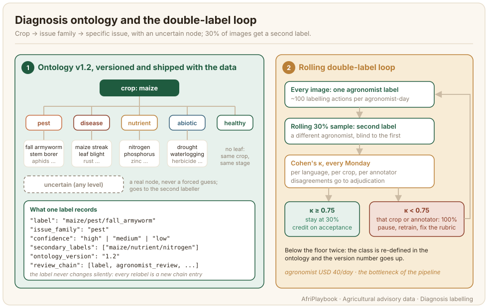

# Diagnosis Labelling

Diagnosis labelling is where an agronomist looks at the image and the collector's form and says what is wrong with the plant, in the terms the national extension service uses. It is the most expert step in the pipeline and the slowest, because there are far fewer agronomists than native speakers, and the label they give decides what advisory gets written, what the benchmark tests and what a model learns to say. This page covers the ontology, the label record, the double-labelling loop that keeps labels honest, and how to plan around the agronomist bottleneck.



## What the data looks like

A label is a path through a versioned ontology plus a confidence, and a chain of who did what to it. The diagnosis block of the AgroLingua pair record:

```json title="hau-000123.json (diagnosis block)"
"diagnosis": {
  "ontology_version": "1.2",
  "label": "maize/pest/fall_armyworm",
  "issue_family": "pest",
  "confidence": "high",
  "secondary_labels": ["maize/nutrient/nitrogen"],
  "review_chain": [
    { "stage": "label", "role": "agronomist", "reviewer_id": "agr-0142",
      "decision": "accept", "label_given": "maize/pest/fall_armyworm",
      "rubric_version": "hau-1.1", "timestamp": "2026-12-05T09:12:00Z" },
    { "stage": "label", "role": "agronomist", "reviewer_id": "agr-0207",
      "decision": "accept", "label_given": "maize/pest/fall_armyworm",
      "rubric_version": "hau-1.1", "timestamp": "2026-12-06T14:40:00Z" },
    { "stage": "agronomist_review", "role": "agronomist", "reviewer_id": "agr-0088",
      "decision": "accept", "rubric_version": "hau-1.1",
      "timestamp": "2026-12-09T11:05:00Z" }
  ]
},
"qa": { "status": "accepted", "double_labelled": true, "label_agreement": true }
```

**The ontology.** Three levels: crop, then issue family (pest, disease, nutrient, abiotic, healthy), then the specific issue as the leaf. `healthy` has no leaf; it means the same crop at the same stage with no issue. `uncertain` is a real node an agronomist can choose at any level, and `confidence` (high, medium, low) is recorded on every label. `secondary_labels` holds a second issue visible in the same image, common in the field where a nitrogen-starved plant also has armyworm damage. The ontology is versioned, and the version is written into every label, because the ontology will change during the project and a label from version 1.0 must not be read as if it came from 1.2.

**The reviewer chain.** Every action on the label is appended, never overwritten: the first label, the second label if the image was sampled, the reviewer's decision, and adjudication if the two disagreed. `reviewer_id` is opaque. `rubric_version` records which version of the language's rubric document applied, so a reviewer's decision can be read against the rules they actually had. `qa.double_labelled` and `qa.label_agreement` are what the weekly kappa is computed from.

## Who does it and how

**Agronomists.** One agronomist partner per language, aligned with the national extension service, and enough agronomists under that partner to carry the throughput. The label must match what the extension service tells farmers, so the partner brings the standard: the Federal Ministry of Agriculture and Rural Development (FMARD) and state Agricultural Development Programme (ADP) guidelines with the Institute for Agricultural Research (IAR) Zaria for Hausa, the Kenya Agricultural and Livestock Research Organization (KALRO) and the Ministry of Agriculture and Livestock Development (MoALD) for Kiswahili in Kenya, and Ethiopian Institute of Agricultural Research (EIAR) packages for Amharic and Afaan Oromo. Ask the partner to confirm the ontology's leaf nodes against that standard before labelling starts.

**The interface.** The agronomist sees both shots, the collector's form with the suspected issue and the farmer's question, and the ontology as a hierarchical picker with the uncertain node and the confidence choice. The vernacular name of each node sits beside the English one. The agronomist can reject the image for quality, with a reason that goes back to the collector.

**Double labelling.** A rolling 30% of images goes to a second agronomist, blind to the first label. Disagreements go to adjudication by the language lead, who consults the agronomist partner on the label and escalates to the quality lead when the two cannot settle it. AgroLingua labels about 15,000 images this way across ten languages, so roughly 4,500 get two labels.

**Rubric ownership.** The language lead owns one versioned rubric for the language: the ontology term list in the vernacular, worked examples per node, and the review checklist. A corner case that two agronomists read differently becomes a worked example in the next version.

## Guidelines that matter

1. Label what the image shows. The collector's suspected issue is a hint; if you cannot see the evidence for it, do not label it.
2. Go to the leaf if you can, stop at the family if you must. A confident `maize/disease` with `confidence: medium` is worth more than a guessed leaf with `confidence: high`.
3. Choose `uncertain` when the image does not let you decide. Never force a label to clear the queue; an uncertain label goes to a second agronomist, a wrong confident one goes into the training set.
4. Record a secondary label when two issues are visible. Do not pick the one you think matters more and drop the other.
5. Reject the image, with a reason, when it cannot be labelled: out of focus, wrong plant part, too far away. A rejected image costs the project USD 0.60; a mislabelled one costs an advisory, a speech item and possibly a benchmark case built on a wrong diagnosis.
6. Use the vernacular term list from the rubric, and flag a node whose vernacular name does not match what farmers in your district say. The advisory author will reuse it.
7. Do not review your own labels. The platform blocks it, and if your tool does not, the language lead must.

## Quality control

**The kappa floor.** Cohen's kappa is computed on the double-labelled sample per language, per crop and per annotator, every Monday, and the threshold is 0.75. Kappa corrects for the agreement two agronomists would reach by chance, which matters here because some crops have one dominant issue and raw agreement on them looks good even when the labelling is careless. Agreement is an exact match on the full label path: `maize/pest` against `maize/pest/fall_armyworm` is a disagreement, and `uncertain` is a label like any other. The 30% sample is drawn at random. Images that get a second label because the first was `uncertain` or `confidence: low` are double-labelled too, but they stay out of the kappa sample, so the metric measures routine labelling rather than the hard cases. Read the metric's caveats on the [Workflow and Adjudication](../3_annotation-design/workflow-adjudication.md) page before you set a floor for a smaller cohort.

**The loop.** While kappa holds above 0.75, the sample stays at 30% and labels are credited on acceptance. When any cell falls below the floor, that cell goes to 100% double labelling: every image of that crop, or every image by that annotator, gets a second label until the cell recovers. An annotator below the floor is paused automatically, retrained on the rubric's worked examples, and resumes on a short calibration set of gold images. A class that falls below the floor twice is a sign the class is badly defined, and the fix is in the ontology: split it, merge it or add worked examples, and raise the version number.

**Gold images.** Mix a small set of pre-adjudicated gold images into every agronomist's stream, unflagged. Ground-truth accuracy against gold gives a per-annotator read that does not wait for the weekly kappa.

**The three-stage review.** After labelling, every pair still passes the loop on the [Quality, consent and release](./quality-consent-release.md) page, where an independent agronomist reviews the label against the extension standard. A relabel at review is a new entry in the chain, and the original label stays visible.

:::tip[What worked: adjudicate in weekly batches]
Adjudicating each disagreement as it arrives spreads the language lead's attention thin and hides patterns. Batching the week's disagreements by ontology node shows at once which node is the problem, and the fix is usually a worked example in the rubric.
:::

## What it costs

The unit is an agronomist-day. AgroLingua budgets USD 40 per agronomist-day, at local rates, and plans on about 100 labelling actions per day: first labels, second labels and reviews all count as actions. For about 15,000 images, AgroLingua budgets 370 agronomist-days across ten languages (250 in the first tier, 120 in the second) to cover first labels, the 30% second labels and faithfulness review; double labelling above 30% is drawn from contingency. The driver is the double-labelling rate: every cell that drops to 100% adds a full second pass for that cell, so a badly defined class or a poorly trained agronomist costs real days. Retrain a weak annotator in the first week; relabelling their cell later costs the full second pass.

**The bottleneck and how to staff around it.** Agronomists are the scarcest people in the pipeline and the only ones you cannot replace with more native speakers. Recruit through the extension partner, because the partner knows who can label to the standard and can lend staff for defined days. Pre-sort the queue, so that the image-quality checks and the collector's suspected issue route rejects and obvious cases and the agronomist's day is spent on labels. And contract agronomist days in blocks that follow the cropping calendar: the queue fills in capture windows and empties between them, and a flat monthly allocation idles in the off-season and overflows in the peak.

## Known limitations

- **The ontology is a snapshot of one standard.** Extension standards differ between countries that share a language and are revised over time. Ship the ontology with the data and never rewrite old labels to a new version silently.
- **Kappa on a rolling sample lags.** A drift that starts on Tuesday shows up the following Monday, with a week of labels already in the queue. Gold images shorten the lag.
- **A photo is not a field visit.** Some diagnoses need the root, the soil or the weather. The `uncertain` node and `confidence: low` are the honest answers, and a model trained on this data inherits the same limit.
- **Agronomists disagree for real reasons.** Two experts trained under different services can both be right about an ambiguous lesion. Keep the disagreement in the chain, as the [adjudication page](../3_annotation-design/workflow-adjudication.md) recommends.
- **Throughput numbers are averages.** A hundred actions a day assumes a good queue and a familiar crop. Budget a lower rate for the first two weeks and for rare crops.

## Further reading

- [Field image capture](./field-image-capture.md): the form and the image the agronomist works from.
- [Advisory authoring](./advisory-authoring.md): what the author does with the label.
- [Workflow and Adjudication](../3_annotation-design/workflow-adjudication.md): multiple annotators, agreement and adjudication in general.
- [Annotation guidelines template](../templates/annotation-guidelines.md): the section structure the language rubric follows, and the [advisory-specific sheets](../templates/advisory-annotation-guidelines.md) for this chapter.
- [AfriAnnotate](https://afriannotate.waraka.org): hierarchical taxonomy labels with an uncertain node, built-in kappa, annotator auto-pause and gold-task accuracy, as used in the worked example.
