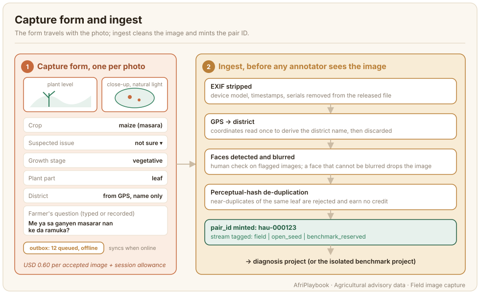
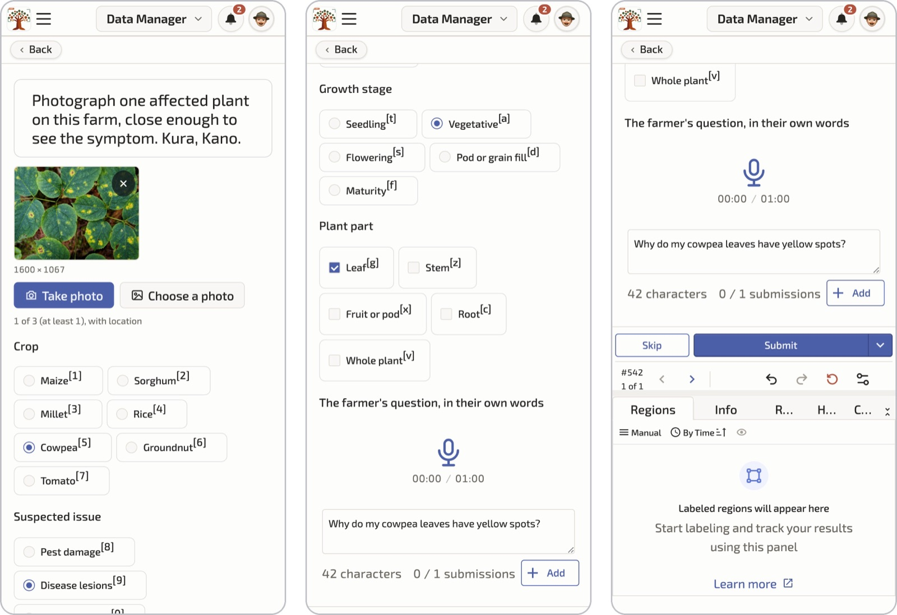

# Field Image Capture

Field image capture is the first task in the pipeline and the one that sets the ceiling for everything after it. An agronomist cannot label a blurred leaf, and an author cannot write a grounded advisory for a photo with no crop or growth stage recorded. This page covers who takes the photos, what they record with each one, how the season shapes the plan, and what happens to an image between the phone and the annotation project.



## What the data looks like

One accepted image is a photo plus a structured form, cleaned at ingest and given a pair ID. The image and metadata blocks of a pair record look like this (the diagnosis, advisory and consent blocks are added by later tasks):

```json title="hau-000123.json (image and metadata blocks)"
{
  "pair_id": "hau-000123",
  "language": "hau",
  "source": { "kind": "field", "source_id": "site-kn-0412" },
  "image": {
    "file": "images/hau/hau-000123.jpg",
    "width": 3024, "height": 4032,
    "sha256": "...",
    "anonymised": { "faces_removed": true, "faces_detected": 0,
                    "exif_stripped": true, "gps_coarsened": true }
  },
  "metadata": {
    "crop": "maize",
    "crop_vernacular": "masara",
    "suspected_issue": "unsure",
    "growth_stage": "vegetative",
    "plant_part": "leaf",
    "country": "Nigeria",
    "district": "Kano North",
    "capture_date": "2026-12-03",
    "farmer_question_text": "Me ya sa ganyen masarar nan ke da ramuka?"
  },
  "split": "train"
}
```

Two fields deserve attention. `suspected_issue` is the collector's own guess, from the ontology or `unsure`; it gives the agronomist a hint and the language lead a check on collector calibration. The agronomist's label replaces it. `farmer_question_text` is what the farmer actually asked, typed or transcribed at capture. It seeds the speech layer and keeps the advisory grounded in the question people ask rather than the one the author imagines.

## Who does it and how

**Collectors.** Recruit 5–10 per language through the language lead, from the farming communities where the crops grow. Extension agents, agricultural students and lead farmers make good collectors because they already know a diseased leaf when they see one and they have a reason to be in the field. Each collector captures 100–300 accepted images over a season. The worked example collects about 10,000 field images across ten languages this way.

**Two shots per plant.** Take a plant-level shot that shows the whole plant and its neighbours, then a close-up of the affected part. Under natural light, no flash, the affected area in focus and filling most of the frame. The agronomist needs the close-up to name the issue and the plant-level shot to judge stage and spread. In-app guidance cards show a good and a bad example of each.

**The form.** Every photo carries crop, suspected issue (with "not sure" allowed), growth stage, plant part, district and the farmer's question. The form takes under a minute once a collector is used to it, and it is what turns a folder of photos into a dataset. A photo with no form is rejected at ingest.

**Offline first.** Most fields have no signal. The capture app downloads the project, the form and the guidance cards to the phone; each capture goes into an on-device outbox and replays in order when the phone finds a network, and rejected writes are held for review so a collector never loses a day's work to a bad sync. Capture runs on [AfriAnnotate](https://afriannotate.waraka.org), which works this way. Offline capture matters because an app that needs a connection quietly selects for images taken near towns.

**Consent at capture.** Before the first photo on a farm, the collector plays the recorded oral consent script in the language, or hands over the written form, and logs the farmer's agreement against an opaque contributor ID. The platform blocks capture until a consent record exists. An oral consent record stays provisional until the language lead has listened to the recording, and the images from that farm earn no credit before then; see [Quality, consent and release](./quality-consent-release.md).

## On the platform

The screenshot below shows the capture task in the AfriAnnotate mobile view, as three screens of one task. The collector photographs the plant, fills in the structured form (crop, suspected issue, growth stage, plant part), and records or types the farmer's question. The app keeps working offline and uploads when a connection returns.



The photo is a stock image standing in for a field photo. The sample text is in English for the reader; in a project it is in the collector's language.

## Planning coverage

**The coverage matrix.** Agree a target matrix of crop by issue family by growth stage with the agronomist partner before capture starts, and make it the live dashboard. Per crop, target four issue families (pest damage, disease lesions, nutrient stress, abiotic stress) plus a healthy reference class of the same crop at the same stage. Each language's priority staples come from the national extension partner: for example, maize, sorghum, millet, rice, cowpea, groundnut and tomato for Hausa in northern Nigeria, or teff, wheat, maize, barley, faba bean, enset and coffee for Amharic in Ethiopia. A matrix that is only checked at delivery will have empty cells you can no longer fill.

**The cropping calendar.** You photograph what is in the field. In northern Nigeria and Senegal a November to May window covers dry-season irrigated crops (rice, tomato, onion, wheat) and storage and pest issues; rainy-season staples (millet, sorghum, groundnut, cowpea) need a June to July push or the open seed. Write the calendar for each country into the plan at kick-off and set collector targets per window.

**The open-data seed.** Open plant-disease image sets fill the cells the season cannot: PlantVillage ([Hughes and Salathé, 2015](../references.md#plantvillage-2015)), PlantDoc ([Singh et al., 2020](../references.md#plantdoc-2020)), CCMT ([Mensah et al., 2023](../references.md#ccmt-2023)), iCassava ([Mwebaze et al., 2019](../references.md#icassava-2019)) and PlantWild ([Wei et al., 2024](../references.md#plantwild-2024)). Check the published licence of every source before you keep a single image. As of September 2026: PlantDoc and CCMT are CC BY 4.0 and the Makerere cassava set ([Tusubira et al., 2022](../references.md#makerere-cassava-2022)) is CC0, so all three can go into a CC BY 4.0 release; PlantVillage is CC BY-SA 3.0, iCassava 2019 is under non-commercial competition rules, and PlantWild is CC BY-NC-ND 4.0, so none of those three can, unless the owner gives written permission. Keep only what is compatible with your release licence and attribute each image. Then filter: crop in the target list, minimum resolution, perceptual-hash near-duplicate removal, and a visual sanity pass by an agronomist. The worked example keeps about 5,000 seed images this way.

:::warning[Seed images get fresh advisories]
A seed image contributes pixels only. It goes through the same form, the same ontology label and the same native-authored advisory as a field image, tagged `source.kind = open_seed`.
:::

## Guidelines that matter

1. Photograph the affected part in focus and filling the frame, then the whole plant. Two shots, same plant, same form.
2. Use natural light. No flash, no shade from your own body, no photographing through plastic.
3. Fill every field of the form before you leave the plant. If you do not know the issue, choose "not sure". A wrong guess costs the agronomist more time than an honest blank.
4. Type or record the farmer's question in the farmer's own words. Do not translate it and do not tidy it.
5. One plant, one capture. Do not photograph the same leaf from five angles; the ingest de-duplication will reject four and you will not be paid for them.
6. Do not photograph people. If a person is unavoidable, keep their face out of frame. Faces are blurred at ingest, and an image where a face cannot be blurred is dropped.
7. Do not play the consent recording once for the whole village. Consent is per farmer and logged per farm.

## Quality control

Ingest is the first quality gate and it runs before any annotator sees the image. EXIF and device metadata are stripped. Device GPS is read once to derive the district name, and the coordinates are discarded. Faces are detected and blurred automatically, images flagged as containing people get a human check, and any image where a person cannot be blurred is dropped. A perceptual hash rejects near-duplicates within the batch and against the seed. Then the pair ID is minted and the image is tagged with its source: field or open seed.

The second gate is the agronomist at diagnosis time, who can reject an image for quality with a reason that goes back to the collector in the app. The language lead watches rejection rates per collector and the coverage matrix each week, pauses and retrains a collector whose rejections stay high, and steers capture targets while the season is still open.

## Known limitations

- **The season decides coverage.** Some cells will stay thin because the disease did not appear that year in that district. Report the matrix with the data.
- **Collectors select what they photograph.** People photograph striking damage and skip the mild, early-stage case a model most needs. Set explicit targets for early-stage and healthy images.
- **Phone cameras vary.** Record the device class; you cannot afford to standardise phones across a cohort.
- **District is the finest location you keep.** Decide the unit before ingest, because the coordinates are gone afterwards.
- **The seed sets carry their own bias.** PlantVillage-style images are lab-shot on plain backgrounds. Keep the seed share visible in the datasheet and do not let it dominate any crop.

## Further reading

- [Diagnosis labelling](./diagnosis-labelling.md): what the agronomist does with the image and the form.
- [Quality, consent and release](./quality-consent-release.md): the consent scripts, the opt-out window and the anonymisation table.
- [Image Data](../image-data/index.md): general image annotation, including the classification, detection and segmentation tasks this chapter does not cover.
- [Data governance](../data-governance/index.md): who controls the data and on what terms.
