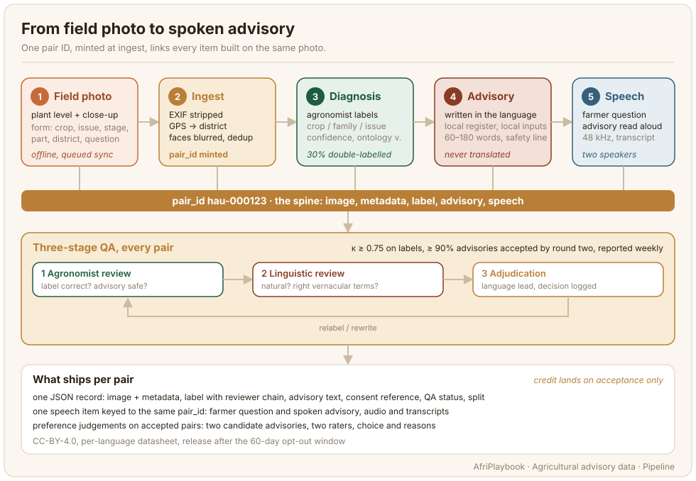

# Agricultural Advisory Data

A farmer photographs a sick plant and asks, in her own language, what is wrong and what to do. Agricultural advisory data is the paired record that teaches a model to answer her: the photo, an expert diagnosis of what it shows, an advisory written by a native speaker in the register an extension officer would use, and, for spoken systems, the question and the advisory as audio. This chapter is about building that record at scale, from the first photo in a field to the public release.

The chapter carries one worked example throughout: a collection of about 15,000 image-advisory pairs across ten languages, roughly 1,500 per language. A spoken layer covers a subset of the pairs: the worked example records 3,540 speech items. The volumes and thresholds quoted on each page belong to that example. Change them where your crop list or languages differ.

The whole pipeline runs on [AfriAnnotate](https://afriannotate.waraka.org). It does three jobs: it collects the data (offline photo capture and speech recording), it hosts the annotation (labelling, advisory authoring and review), and it pays contributors from its ledger. Where a page says "the platform", it means AfriAnnotate. It runs in the browser and as mobile and desktop apps, which keep working offline and upload when a connection returns. Each task page has a screenshot of its task on the platform: field capture, diagnosis labelling, advisory authoring, speech recording and preference ranking.

## The pair ID is the spine

Every record in this kind of dataset resolves back to one photo. The moment a photo passes ingest it receives a pair ID (for example, an ISO 639-3 code plus a six-digit sequence, such as `hau-000123`), and that ID never changes. The diagnosis label attaches to it. The advisory is written for it. The speech item that records the farmer's question and the advisory read aloud is keyed to it. Preference judgements are collected on accepted pairs and carry the same ID.

Mint the ID before anything else touches the image, and mint it in one place. Teams that assign IDs later, or per task, spend the last month of the project reconciling spreadsheets and discovering that a speech clip belongs to an advisory that was rejected in review. With one ID from ingest, the platform can enforce the rules that matter at export: every speech item points to an accepted advisory, and every item traces to a consent record and a reviewer chain.

## What one pair contains

| Part | What it holds | Who makes it |
| --- | --- | --- |
| Image | one field or seed photo, faces blurred, EXIF stripped | collector, ingest script |
| Metadata | crop, suspected issue, growth stage, plant part, district, farmer's question | collector, at capture |
| Diagnosis | ontology label, confidence, ontology version, reviewer chain | agronomist |
| Advisory | 60–180 words in the language, safety line if a chemical is named | native-speaker author |
| Speech | farmer question (spontaneous) and advisory (read), 48 kHz, transcript | two speakers, transcriber |
| Consent | reference, template version, purposes ticked, opt-out deadline | platform |
| QA | status, double-labelled flag, agreement, batch | reviewers, language lead |
| Split | train, dev or test | export script |

## The six pages

The chapter has five task pages and one page on the loop they share. Each task page follows the same order: what the data looks like, who does it and how, the guidelines that decide quality, quality control, limitations, further reading.

- **[Field image capture](./field-image-capture.md)**: trained collectors photograph plants in their own communities with a structured form, offline, and the ingest pipeline anonymises each image and mints the pair ID.
- **[Diagnosis labelling](./diagnosis-labelling.md)**: agronomists label each image against a versioned ontology, with a rolling double-labelled sample and a kappa floor.
- **[Advisory authoring](./advisory-authoring.md)**: native speakers write the advisory directly in the language, in the local register, with inputs a farmer there can buy.
- **[Speech layer](./speech-layer.md)**: consented speakers record the farmer's question in their own words and read the advisory aloud, keyed to the pair.
- **[Preference data](./preference-data.md)**: two native-speaker raters compare two candidate advisories for an accepted pair and record which one they prefer and why.
- **[Quality, consent and release](./quality-consent-release.md)**: the three-stage QA loop, weekly agreement reporting, consent gates, anonymisation, and the CC-BY-4.0 release with a per-language datasheet.

The sheets handed to collectors, agronomists, authors, reviewers, speakers and raters are collected in one template: [Advisory annotation guidelines](../templates/advisory-annotation-guidelines.md).

## Why this data is different

Three things separate advisory data from the image-text work in the [Image-Text](../image-text/index.md) chapter and the vision work in [Image Data](../image-data/index.md).

The label needs an expert. A native speaker can caption a market scene, but only an agronomist can tell fall armyworm damage from stem borer damage on a maize leaf, and the answer has to match what the national extension service tells farmers. Agronomist time is the scarcest input in the pipeline, and the [Diagnosis labelling](./diagnosis-labelling.md) page is largely about spending it well.

The text is advice, and advice can hurt. A wrong caption is a bad data point. A wrong advisory can tell a farmer to spray the wrong chemical at the wrong dose. That is why every advisory passes an agronomist faithfulness check as well as a linguistic one, and why a safety line is mandatory when a chemical is named.

The data is seasonal. You cannot photograph a disease that is not in the field this month. Capture windows follow the cropping calendar, the coverage matrix (crop by issue family by growth stage) is watched weekly, and an open-data seed fills the cells the season cannot.

## Three-stage QA

Every pair passes the same loop before it earns credit: an agronomist who did not label the image checks the label and the advisory's safety; a native speaker who did not write the advisory checks that it reads as authored in the local register; and the language lead adjudicates whatever the two stages disagree on. The loop is the same one the playbook describes in [Workflow and Adjudication](../3_annotation-design/workflow-adjudication.md), with the agronomist and the linguist as two reviewers with different competences rather than two of the same. The thresholds are Cohen's kappa of at least 0.75 on labels and at least 90% of advisories accepted by round two, reported every Monday, per language. Credit lands on acceptance only.

## What this chapter is not

It is not a guide to training the model. The data described here feeds vision-language and speech models, but model choice and fine-tuning are covered in the [model-building starter kit](../8_model-building/starter-kit.md) and [Compute-poor settings](../compute-poor/index.md). It is not a general image-annotation guide either; bounding boxes and segmentation masks are in [Image Data](../image-data/index.md). And it does not replace your national extension service: the ontology and the advisories must be checked against the standard that service publishes, and the agronomist partner in each country is the person who does that.

## Further reading

- [Workflow and Adjudication](../3_annotation-design/workflow-adjudication.md): the general shape of multi-annotator review and adjudication that this chapter's QA loop specialises.
- [Legal and consent](../legal-consent/index.md) and [Data governance](../data-governance/index.md): the consent, opt-out and release rules the pipeline enforces.
- [AfriAnnotate](https://afriannotate.waraka.org): the offline-first, consent-gated platform used in this chapter to collect the data, annotate it and pay contributors, with the coverage matrix, agreement metrics and contribution ledger built in.
