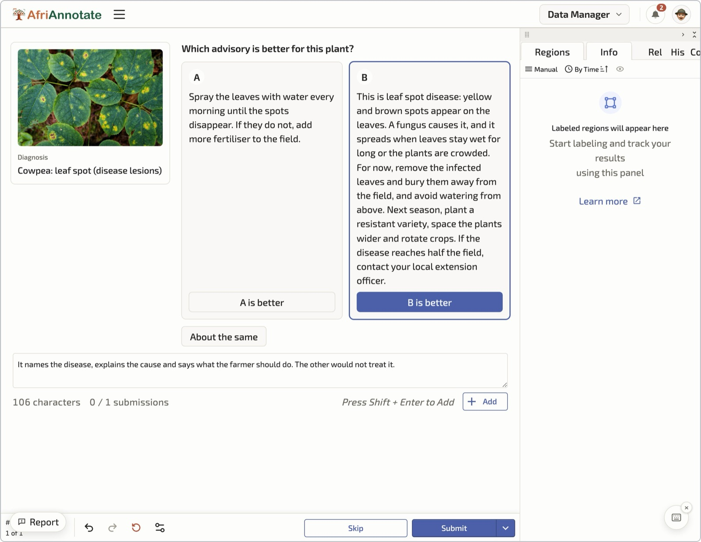

# Preference Data

A preference pair takes one image and its diagnosis, shows two candidate advisories for it as A and B, and asks a native speaker (the rater, or ranker) which one a farmer should receive and why. The resulting set records which advisory speakers of the language prefer, and the reasons they gave.


## How this differs from the other collections

The other pages in this chapter create new material: photos, labels, advisory text, recordings. Preference data creates judgements about material that already exists. Nobody visits a field, takes a photo or records a voice. Raters work on a phone or laptop, and the unit of work is one judgement. Where two raters judge the same pair, their agreement is part of the signal, so a disagreement stays in the record.

| | Image and advisory pairs | Speech | Preference data |
| --- | --- | --- | --- |
| What is collected | photos, labels, advisory text | recordings, transcripts | judgements on two existing advisories |
| Who does it | collectors, agronomists, authors | speakers, transcribers | native-speaker raters |
| Where | the field, then the platform | facilitated sessions | a phone or laptop, anywhere |
| Unit of work | one accepted pair | one validated item | one judgement |
| What QC measures | errors to correct: label agreement, rewrite rate | whether each clip is usable | rater reliability; disagreement is reported and kept |

## What the data looks like

One preference record points to an accepted pair by its pair ID and holds the two candidates, the ratings and, where a pair has two raters, an agreement flag. The record below is trimmed:

```json
{
  "pref_id": "pf-hau-000123",
  "pair_id": "hau-000123",
  "language": "hau",
  "candidate_a": { "text": "Wannan tsutsar sojoji ce ta masara. ...", "source": "native_authored" },
  "candidate_b": { "text": "...", "source": "partner_system" },
  "ratings": [
    { "rater_id": "r-hau-04", "choice": "A", "strength": "clear",
      "reasons": ["more_accurate", "uses_available_inputs"],
      "note": "B names a product our agro-dealers do not stock." },
    { "rater_id": "r-hau-11", "choice": "tie", "strength": null,
      "reasons": [], "note": "I would give either one to a farmer; B is shorter." }
  ],
  "raters_agree": false
}
```

`choice` is `A`, `B` or `tie`, and `strength` is `slight`, `clear` or `strong`. The `source` field is in the record and never on the rating screen.

The worked example uses nine reason codes: `more_accurate`, `safer`, `more_complete`, `more_actionable`, `uses_available_inputs`, `better_vernacular_terms`, `more_natural_language`, `more_concise` and `other`.

## Where the two candidates come from

Every pair already has one accepted advisory. The second candidate can come from three places.

| Source of the pair | Extra writing needed | What it tells you |
| --- | --- | --- |
| The author's first draft against the reviewed final | No new writing | Whether review improved the text. Only rewritten advisories qualify, and the final usually wins. |
| Two advisories written independently by different authors | A second authored and reviewed advisory for every pair | Which register and wording speakers prefer when both texts are sound. |
| An advisory from an outside source against the native-authored one | No new writing; the partner supplies the text and the right to release it | How native authoring compares with an existing advisory service or a system's output. |

:::warning[Decide the source first]
Choose the source of the candidates before you plan this task. Writing a second advisory for every pair is as much work as writing the first, while rating a pair takes a few minutes. A plan that covers only the rating assumes the candidates already exist.
:::

## Who does it and how

Raters are native speakers, ideally with farming or extension experience. The linguistic reviewers from [Advisory Authoring](./advisory-authoring.md) are a natural pool. AfriAnnotate blocks a rater from any pair where they wrote or reviewed a candidate.

At least one rater judges each pair. A second, independent rater on every pair is worth adding where the budget allows, because agreement between two raters is the only way to tell a firm preference from one person's taste. The rating screen shows the photo and the diagnosis alongside both advisories. Raters are blind to the source of each candidate, and the platform randomises which one appears as A for every pair.

Work is issued in batches of limited size, because each pair is 120 to 360 words of careful reading and attention drops over a long sitting. A cap of about 30 pairs keeps a batch near an hour. Raters accept the annotator agreement before their first batch and are credited per rating on the ledger.

## On the platform

The screenshot below shows the ranking task in AfriAnnotate. The rater sees the photo and its diagnosis beside the two advisories, shown as A and B in random order with their sources hidden. The rater chooses "A is better", "B is better" or "About the same", and gives a short reason.



The photo is a stock image standing in for a field photo. The sample text is in English for the reader.

## Guide for the native-speaker ranker

This is the guide the ranker follows for every pair. Hand it out with the [preference rater sheet](../templates/advisory-annotation-guidelines.md), which has the same steps in a printable form.

### Before the first batch

- Read the advisory rubric for your language, so you know what a good advisory contains: what the problem is, why it happens, what to do now, what to do next season, and when to seek help.
- Complete the practice batch. The language lead goes through your answers with you before you start paid work.
- Work alone, in a quiet place, on a screen large enough to read both advisories without scrolling back and forth.

### For each pair

1. **Look at the photo and read the diagnosis.** Make sure you understand what the problem is before you read any advice.
2. **Read advisory A in full, then advisory B in full.** Do not choose after the first one.
3. **Check correctness.** Does each advisory address the diagnosis shown? An advisory about a different pest, disease or crop is wrong, however well it is written.
4. **Check safety.** If an advisory names a chemical, it must say how to handle it safely. An advisory with a harmful step, or a chemical with no safety line, loses to one that is safe.
5. **Check that a farmer here could act on it.** Are the inputs sold locally? Are the measures ones a farmer uses? Are the crop and pest named the way farmers name them?
6. **Only then compare the language.** Which one sounds like an extension officer talking to a farmer in your area: clear, natural and in the right register?
7. **Choose A, B or tie,** tick every reason that applies, and write a short note that quotes the phrase that decided it.

### The order of the checks decides the choice

Apply the checks in the order above and stop at the first one that separates the two advisories.

| If | Then choose |
| --- | --- |
| One advisory is wrong about the problem or the action | the correct one |
| Both are correct, but one is unsafe or has no safety line for a chemical | the safe one |
| Both are correct and safe, but one uses inputs, measures or names farmers here do not use | the locally usable one |
| Both pass all three checks | the clearer and more natural one |
| You would give either to a farmer and cannot separate them | tie |

### Rules that keep the judgement honest

- **Never guess where an advisory came from.** The source is no reason to prefer it, and the order of A and B is random.
- **Do not reward length.** A longer advisory is better only if the extra text helps the farmer.
- **Use tie sparingly.** If you lean one way, choose it and mark the strength as slight.
- **If neither advisory is acceptable,** choose the less harmful one and say in the note what is wrong with both.
- **Do not discuss a pair with another ranker,** and do not look up the answer. The record needs your own judgement.
- **Stop when you are tired.** Finish the batch you started, then rest before the next one.

### A worked example

The photo shows maize with ragged holes in the whorl, and the diagnosis is fall armyworm. The example is illustrative and given in English.

- **Advisory A** tells the farmer to scout twenty plants, hand-pick the caterpillars where few plants are affected, and spray an approved product in the early morning if more than one plant in five is damaged. It says to wear gloves and a mask, keep children away and wait the label's days before harvest.
- **Advisory B** is shorter and reads more smoothly. It tells the farmer to spray "a strong insecticide" as soon as any damage appears, and says nothing about protection.

Both address the right problem, so the first check does not separate them. The safety check does: B recommends a chemical with no safety line and no threshold. The ranker chooses **A**, strength **clear**, with the reasons `safer` and `more_actionable`, and the note: "B says spray a strong insecticide with no protection; A gives a threshold and safety steps." B's smoother language does not count, because the choice was settled at an earlier check.

## Quality control

Four checks run on every batch.

- **Gold pairs.** The language lead seeds each batch with pairs that have a known answer, for example a candidate with its safety line removed or its diagnosis swapped. A rater whose gold accuracy falls below the floor set in the rubric is paused and retrained.
- **Rater agreement.** Where pairs have two raters, the share on which both made the same choice is reported every Monday, per language. It has no pass mark; a sudden drop is a reason to look at the batch.
- **Position bias.** For each rater, the share of A choices among non-tie ratings should sit near half, because the order is random. A rater far from half is choosing by position.
- **Speed.** The platform flags a rating submitted faster than the two texts can be read.

Disagreements are kept and flagged in the record with `raters_agree` false. Nobody adjudicates them. [Workflow and Adjudication](../3_annotation-design/workflow-adjudication.md) explains when disagreement is worth keeping, and the weekly report these numbers join is in [Quality, Consent and Release](./quality-consent-release.md#the-monday-report).

## Known limitations

- **Raters are not the farmers.** A literate speaker reading on a screen can prefer a text that a farmer hearing it aloud would find harder to follow.
- **Preferences follow the cohort.** Raters from one region prefer that region's register. Keep the rater's region in the record.
- **Fluency can beat accuracy.** The reason codes show whether a choice rested on agronomy or on language, so read them with the choice.
- **One or two ratings are thin.** A single rating cannot be checked against another, and with two raters a split cannot be told apart from one careless rating. Add a rating on split pairs if your use needs a majority.
- **Blinding can leak.** Candidates from different sources can differ in length or layout. Strip formatting before rating.

## Further reading

- [Advisory Authoring](./advisory-authoring.md): how the native-authored candidate is written and reviewed.
- [Quality, Consent and Release](./quality-consent-release.md): the weekly report, the annotator agreement and the release that preference records ship in.
- [Workflow and Adjudication](../3_annotation-design/workflow-adjudication.md): why disagreement between raters is worth keeping.
- [Advisory annotation guidelines](../templates/advisory-annotation-guidelines.md): the preference rater sheet.
