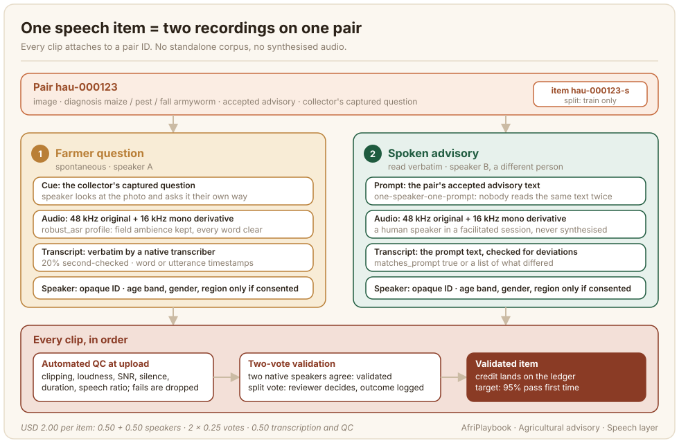

# Speech Layer

Most farmers who use an advisory model will talk to it, and it will talk back. The speech layer gives the model both sides of that exchange in the target language: a farmer asking about a plant in their own words, and the advisory for that plant read aloud. This page covers how to record, transcribe, and validate that layer on top of an existing set of image-advisory pairs.

This is not a standalone speech corpus. Every clip attaches to a pair ID, so the question and the advisory a model hears are about the image it sees. General practice for recording and transcribing African-language speech is in the [ASR chapter](../asr/index.md); this page covers only what changes when the audio must stay tied to a diagnosed image and its advisory.



## What the data looks like

One speech item is two recordings on one training pair. The farmer question is spontaneous: a speaker looks at the photo, sees the question the collector captured in the field as a cue, and asks in their own words what a farmer would ask. The spoken advisory is read: a different speaker reads the pair's accepted advisory aloud, verbatim. Both carry the pair ID, a 48 kHz original with a 16 kHz mono derivative, a verbatim transcript with timestamps, and speaker metadata that appears only when the speaker consented to share it. The record below is trimmed from the AgroLingua Africa speech-item schema:

```json
{
  "item_id": "hau-000123-s",
  "pair_id": "hau-000123",
  "language": "hau",
  "question": {
    "role": "farmer_question",
    "style": "spontaneous",
    "audio": { "original": "audio/hau/hau-000123-q.wav", "derivative_16k": "audio16k/hau/hau-000123-q.wav",
               "duration_s": 6.8, "sample_rate_original": 48000, "synthesised": false },
    "transcript": { "text": "Wannan masarar tawa, me ya sa ganyen ta yi ramuka haka?",
                    "verbatim": true, "timestamps": { "level": "word", "segments": ["..."] } },
    "speaker": { "speaker_id": "spk-hau-0412", "metadata_shared": true,
                 "age_band": "45-59", "gender": "male", "region": "Kano" },
    "validation": { "mode": "hybrid", "votes_yes": 2, "votes_no": 0, "outcome": "validated" }
  },
  "advisory": {
    "role": "spoken_advisory",
    "style": "read",
    "audio": { "original": "audio/hau/hau-000123-a.wav", "derivative_16k": "audio16k/hau/hau-000123-a.wav",
               "duration_s": 41.2, "sample_rate_original": 48000, "synthesised": false },
    "transcript": { "text": "Wannan tsutsar sojoji ce ta masara. ...", "verbatim": true,
                    "matches_prompt": true, "deviations": [] },
    "speaker": { "speaker_id": "spk-hau-0088", "metadata_shared": false },
    "validation": { "mode": "hybrid", "votes_yes": 2, "votes_no": 0, "outcome": "validated" }
  },
  "qa": { "status": "validated" }
}
```

Two fields are constants in the schema: `sample_rate_original` must be 48000 and `synthesised` must be false. The schema records the rule; the automated QC reads the actual sample rate from the file, and the facilitated session is what guarantees a human spoke every clip. A record that declares anything else is rejected before any human hears it.

The two speakers on an item are different people, so no one voice is both sides of an exchange.

## Who does it and how

Speakers are recruited through regional facilitators, at least three regions per country, with a target of 100 to 200 distinct speakers per language. Balance across age bands (18-29, 30-44, 45-59, 60+), gender, and region is tracked on the dashboard and recruitment is steered every week, because a pool that drifts to young urban men in month one cannot be rebalanced in month five without recording it again.

Recording happens in facilitated sessions: a facilitator brings a group of speakers together, works through the consent script, and runs the AfriAnnotate recorder at 48 kHz with live metering. A cooperative office or a classroom with the door closed and the generator off is enough; outdoors near the field is acceptable under the `robust_asr` profile as long as every word stays intelligible. Speakers are credited USD 0.50 per validated recording in AgroLingua Africa and paid out per session, so a speaker earns USD 10 to 25 for an afternoon.

Prompts follow a one-speaker-one-prompt rule: no advisory is read by the same person twice, and no speaker records enough of a language's items to dominate it. The platform assigns prompts, so facilitators do not keep the rule by hand.

Benchmark pairs get no training speech. The held-out cases have their own speech-input variants, recorded by speakers who never appear in the training pool, so speaker-level disjointness holds at export. See [Benchmark and Preference Data](./benchmark-and-preference.md).

## Guidelines that matter

For speakers recording the farmer question:

1. **Look at the photo, then ask what you would ask.** The collector's question on screen is a cue for the topic. Say it your own way; do not read it.
2. **One question, then stop.** Ask as a farmer would at a field visit. Do not add the answer.
3. **Do not say your name, a phone number, or a farm name.** Anything of that kind is redacted and the clip may be dropped.

For speakers recording the advisory:

4. **Read every word as written.** If a word is hard to say, stop and re-record. Do not paraphrase, skip, or improve the text.
5. **Read at the pace of a conversation.** Dictation speed sounds unnatural, and rushing swallows words.

For transcribers and validators:

6. **A read advisory's transcript is the advisory text.** Listen for deviations, list each one, and set `matches_prompt` false if any word differs after normalisation.
7. **A spontaneous question is transcribed verbatim.** Keep false starts, repetitions, and dialect forms. Do not correct a farmer's grammar.
8. **Vote on intelligibility and match.** A clip passes if every word can be made out and, for a read advisory, the read matches the text. Field ambience alone is never a reason to reject.

## Quality control

Automated QC runs on every clip at upload: clipping, loudness, signal-to-noise ratio, silence ratio, duration, and speech ratio. Under the `robust_asr` profile the thresholds admit natural field ambience and reject only clips a human could not use. Corrupt or empty clips never reach a validator.

Validation then runs in hybrid mode. Two native-speaker votes that agree validate a clip. A split vote goes to a reviewer, who can override in either direction, and the outcome is recorded on the item. The target is at least 95% of clips validated on first pass, per language, in the weekly report. A language below that usually has a session problem (a noisy venue, a facilitator not watching the meter), and the fix is in the next session.

Transcription differs by recording type. For a read advisory the prompt text is the transcript, and the validator confirms the read matches it. For a spontaneous question a native transcriber writes the verbatim transcript and a second transcriber checks a 20% sample; a transcriber whose sample shows errors gets the whole batch re-checked. Transcripts are scanned for spoken names and numbers, which are replaced with a redaction tag and counted on the record. Word-level timestamps come from forced alignment where it succeeds, utterance-level otherwise, and the record says which.

The vote-and-adjudicate pattern is the one in [Workflow and Adjudication](../3_annotation-design/workflow-adjudication.md). One difference: the advisory text already passed its own review, so a fault heard in a read advisory is a reading error, and the fix is a re-record.

## What it costs

The unit is the item: one question plus one spoken advisory, validated and transcribed. AgroLingua Africa prices it at USD 2.00, split as USD 0.50 to each of the two speakers, two validation votes at USD 0.25 each, and USD 0.50 for transcription and QC. Speakers are paid per session on the ledger, credited on validation.

The cost driver is the spontaneous question: the read advisory needs no transcription, while the question needs a human transcript, a 20% second check, and closer validation because there is no prompt to compare against. Facilitator logistics (venue, travel, a session allowance) sit in the field logistics line, so a language with dispersed regions costs more per item in practice than USD 2.00.

AgroLingua Africa records a core of 900 items each in Kiswahili, Amharic and Hausa and 120 in each of the other seven languages (3,540 items, about 40 to 45 hours) in the first tier, then extends to one item per training pair in the second (9,460 further items, about 145 to 165 hours). Start the extension only after the core has passed validation, because every session-level fault found in the core is one you avoid paying for 9,000 more times.

## Consent and release

Speaker consent is taken at the session, before the first recording, on a separate speaker template.

:::danger[Voice is biometric data]
A voice recording can identify a person on its own, so the speaker consent form names the recording as biometric data and asks separately whether the voice may be used for training, publication and benchmark use, whether it may be released publicly under CC-BY-4.0, and whether age band, gender and region may be attached. A speaker can say yes to the first and no to the others; a refused metadata share leaves `metadata_shared` false and the fields absent. The 60-day opt-out applies to speech as to everything else. See [Legal and Consent](../legal-consent/index.md) for the framework and [Quality, Consent and Release](./quality-consent-release.md) for this chapter's templates.
:::

## Known limitations

- **Read speech has read prosody.** The spoken advisory is a person reading a text. That suits text-to-speech training, and it sounds different from an extension officer talking at a field visit. Do not train a conversational response model on it and expect natural prosody.
- **The cued question is not a field question.** Speakers ask in a session, looking at a photo, prompted by the collector's captured question. It is closer to how farmers ask than a read prompt, and further than a recording made at the plant. Kallaama, which recorded spontaneous agricultural speech in Senegal, is the closer reference for the field register ([Gauthier et al., 2024](../references.md#kallaama-2024)).
- **Tracking balance does not guarantee it.** The 60+ band and remote regions fill last in every language. Report the achieved balance per cell in the datasheet, alongside the target.
- **Word-level timestamps depend on an aligner for the language.** Where none exists the record falls back to utterance level; check the `level` field before assuming word timing.

## Further reading

- [Automatic Speech Recognition (ASR)](../asr/index.md): recording, transcription, and QA practice for African-language speech in general.
- [Advisory Authoring](./advisory-authoring.md): the text the spoken advisory reads, and why its length band matters for audio.
- [Quality, Consent and Release](./quality-consent-release.md): the consent templates, the opt-out window, and how speaker metadata reaches the release.
- [Advisory annotation guidelines](../templates/advisory-annotation-guidelines.md): the speaker and validator sheets.
- [Kallaama (Gauthier et al., 2024)](../references.md#kallaama-2024): spontaneous agricultural speech in Wolof, Pulaar and Sereer, the nearest published relative of the farmer-question recordings.
