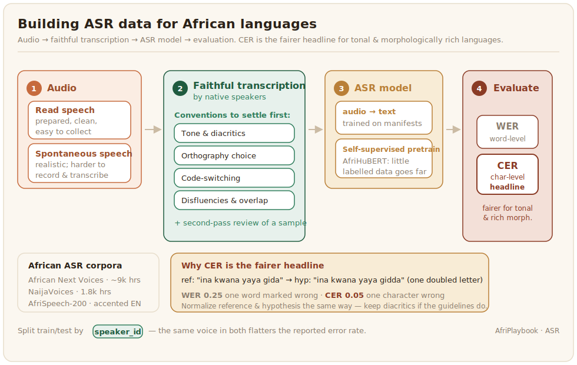

# Automatic Speech Recognition (ASR)

ASR turns spoken audio into text. It is the most developed speech task for African languages and the gateway to the rest, because transcription is the bridge from a recording to something a machine can read. This page covers what is distinctive about building ASR data. The shared recording, consent, and transcription groundwork is in the [Speech overview](../sections/speech.md), and the general pipeline in the Foundations chapters.



## What the data looks like

ASR learns from audio paired with accurate transcripts. The kind of audio matters: read speech, where people read prepared sentences, is clean and easy to collect but does not match how people actually talk, while spontaneous speech is realistic but harder to record and transcribe. African ASR now has both, and the recent surge in purpose-built corpora is the main reason the task has moved fastest. African Next Voices recorded roughly 9,000 hours of everyday speech across eighteen languages in Kenya, Nigeria, and South Africa ([African Next Voices, 2025](../references.md#african-next-voices)), NaijaVoices added 1,800 hours of Igbo, Hausa, and Yorùbá ([Emezue et al., 2025](../references.md#emezue-2025)), and Google's WAXAL released a large multilingual African speech set for ASR and TTS ([WAXAL, 2026](../references.md#waxal-2026)). Domain- and accent-focused sets fill the gaps: AfriSpeech-200 gathered 200 hours of accented English for clinical and general use across thirteen countries ([Olatunji et al., 2023](../references.md#afrispeech-2023)), Kallaama covers agricultural speech in three Senegalese languages ([Gauthier et al., 2024](../references.md#kallaama-2024)), Zambezi Voice covers four Zambian languages ([Sikasote et al., 2023](../references.md#zambezi-2023)), and Mozilla's Common Voice crowdsources read speech for several African languages. Self-supervised models like AfriHuBERT now let a little labelled data go further by pretraining on raw audio first ([Alabi et al., 2025](../references.md#afrihubert-2025)).

ASR datasets are usually distributed as a manifest: one record per utterance pointing at an audio file and its transcript, with the metadata a trainer needs. Keeping duration and sample rate in the manifest lets you filter and batch without re-reading every file. Each record is one line in the file, shown indented here for readability:

```json
{
  "audio_filepath": "clips/hau_0001.wav",
  "text": "ina kwana, yaya gida?",
  "duration": 3.2,
  "sample_rate": 16000,
  "language": "hau",
  "speaker_id": "spk_017",
  "speech_type": "spontaneous"
}
```

Recording `speaker_id` is what lets you split train and test by speaker, which matters more than it looks: if the same voice appears in both, the reported error rate flatters the model, because it has heard that speaker before.

## Distinctive annotation: transcription is the hard part

For ASR the annotation is transcription, and its conventions decide the dataset's quality. Settle them before you start: how to write tone and diacritics, which orthography to follow when a language has more than one, how to mark code-switching into a colonial language, and how to handle disfluencies, false starts, and overlapping speech. These are not edge cases for African languages, they are the norm, and inconsistent transcription quietly teaches the model the wrong spelling of half its vocabulary. Transcribers must be native speakers, and a second-pass review of a sample is worth its cost.

A transcription config plays the audio and gives the transcriber a text box, plus tick-boxes for the conditions that the conventions above need to be applied to consistently. Capturing those conditions as structured labels, rather than leaving them implicit in the text, lets you measure how much of your data is spontaneous, code-switched, or noisy:

```xml
<View>
  <Audio name="audio" value="$audio"/>
  <TextArea name="transcript" toName="audio" rows="3"
            editable="true" required="true"
            placeholder="Transcribe exactly what is said, following the guidelines"/>
  <Choices name="conditions" toName="audio" choice="multiple">
    <Choice value="Code-switching"/>
    <Choice value="Overlapping speech"/>
    <Choice value="Background noise"/>
    <Choice value="Disfluency or false start"/>
    <Choice value="Unclear, needs review"/>
  </Choices>
</View>
```

The `$audio` value is the `audio_filepath` from the manifest above, so the same file feeds collection, transcription, and training without reformatting.

A transcription task in the AfriAnnotate editor: the clip plays above a text box for the transcript.


## Evaluation

ASR is scored by error rate against a reference transcript. [Word Error Rate (WER)](https://en.wikipedia.org/wiki/Word_error_rate) is standard but punishes morphologically rich languages unfairly, since one wrong morpheme can mark a whole word wrong, so report [Character Error Rate (CER)](https://en.wikipedia.org/wiki/Word_error_rate#Character_error_rate) alongside it. CER is more forgiving and more informative for the agglutinative and tonal languages common on the continent. As always, a human listen to a sample catches failures, such as a systematically mis-transcribed dialect, that an aggregate error rate hides.

Both rates are one function call each with `jiwer`, and computing them side by side makes the WER-versus-CER gap visible:

```python
# pip install jiwer
import jiwer

references = ["ina kwana yaya gida"]
hypotheses = ["ina kwana yaya gidda"]   # one doubled letter

print(f"WER: {jiwer.wer(references, hypotheses):.3f}")  # 0.25: one word marked wrong
print(f"CER: {jiwer.cer(references, hypotheses):.3f}")  # 0.05: one character wrong
```

One spelling slip turns into a quarter of the words being "wrong" under WER but only a twentieth of the characters under CER, which is exactly why CER is the fairer headline number for morphologically rich and tonal languages. Normalize the reference and hypothesis the same way before scoring, and make that normalization match your transcription conventions: if the guidelines keep diacritics, the scorer must keep them too, or it will reward the model for dropping the tone marks the dataset worked to capture.
