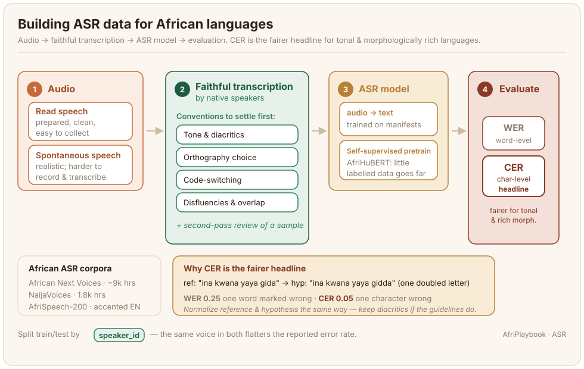

# Automatic Speech Recognition (ASR)

ASR turns spoken audio into text. It is the most developed speech task for African languages and the gateway to the rest, because transcription is the bridge from a recording to something a machine can read. This page covers the deeper how-to: what the data actually looks like, the collection and transcription pipeline, the language-family constraints that shape recording decisions, the quality-assurance workflow, evaluation, and deployment realities.

For the higher-level decision — should you build a corpus, fine-tune MMS, deploy Whisper, or transfer from a related language — start with the [Before You Start · ASR](../before-you-start/asr.mdx) page. The two chapters are complementary: that page decides which path to take, this page details how the chosen path is actually executed. The shared recording, consent, and transcription groundwork sits in the [Speech overview](../sections/speech.md), and the general pipeline in the Foundations chapters.



## What the data looks like

ASR learns from audio paired with accurate transcripts. The kind of audio matters: read speech, where people read prepared sentences, is clean and easy to collect but does not match how people actually talk, while spontaneous speech is realistic but harder to record and transcribe. African ASR now has both, and the recent surge in purpose-built corpora is the main reason the task has moved fastest. African Next Voices recorded roughly 9,000 hours of everyday speech across eighteen languages in Kenya, Nigeria, and South Africa ([African Next Voices, 2025](../references.md#african-next-voices)), NaijaVoices added 1,800 hours of Igbo, Hausa, and Yorùbá ([Emezue et al., 2025](../references.md#emezue-2025)), and Google's WAXAL released a large multilingual African speech set for ASR and TTS ([WAXAL, 2026](../references.md#waxal-2026)). Domain- and accent-focused sets fill the gaps: AfriSpeech-200 gathered 200 hours of accented English for clinical and general use across thirteen countries ([Olatunji et al., 2023](../references.md#afrispeech-2023)), Kallaama covers agricultural speech in three Senegalese languages ([Gauthier et al., 2024](../references.md#kallaama-2024)), Zambezi Voice covers four Zambian languages ([Sikasote et al., 2023](../references.md#zambezi-2023)), and Mozilla's Common Voice crowdsources read speech for several African languages. Self-supervised models like AfriHuBERT now let a little labelled data go further by pretraining on raw audio first ([Alabi et al., 2025](../references.md#afrihubert-2025)).

ASR datasets are usually distributed as a manifest: one record per utterance pointing at an audio file and its transcript, with the metadata a trainer needs. Keeping duration and sample rate in the manifest lets you filter and batch without re-reading every file. Each record is one line in the file, shown indented here for readability:

```json
{
  "audio_filepath": "clips/hau_0001.wav",
  "text": "ina kwana, yaya gida?",
  "duration": 3.2,
  "sample_rate": 16000,
  "language": "hau",
  "speaker_id": "spk_017",
  "speech_type": "spontaneous"
}
```

Recording `speaker_id` is what lets you split train and test by speaker, which matters more than it looks: if the same voice appears in both, the reported error rate flatters the model, because it has heard that speaker before.

## What "African-language speech" actually varies on

Every ASR corpus decision cascades through the model. The variation African languages carry, and that generic ASR pipelines routinely under-serve, sits along four axes.

- **Tone and diacritics carry lexical meaning.** In Yoruba, Igbo, Ewe, Fon, Twi, and most Bantu languages, dropping a tone diacritic on the reference transcript teaches the model to drop it on inference — and downstream users end up with technically-correct-looking text that mispronounces or mis-parses the intended word. Establish the tone convention in the annotation guidelines, verify it against a linguistic reference, and enforce it in evaluation normalisation.
- **Code-switching is the rule, not the exception.** Real African-language speech mixes local languages with English, French, Arabic, or a regional lingua franca. A monolingual corpus produces a model that fails immediately on code-switched input; a mixed corpus needs explicit code-switch marking or the model learns confused acoustic-to-orthographic mappings.
- **Dialect and variety matter more than the language name suggests.** Kiswahili in Tanzania differs from Kiswahili in Uganda and Kenyan coastal; Nigerian English is not South African English. Corpora built in one variety and deployed in another degrade in ways that per-language error rates miss.
- **Recording environment sets the ceiling.** Studio-recorded corpora produce models that fail on phone-microphone input; Common Voice-style community recordings are closer to real-world audio and generalise better despite being noisier. Match the training recording condition to the deployment condition.

## Recording pipeline

Two broad recording modes serve ASR — read speech (speakers reading prepared prompts) and spontaneous speech (interviews, radio, natural conversation). Both are valid, but the choice cascades into everything downstream.

**Read speech** is the fastest path to a corpus and the cheapest to transcribe (the transcript is the prompt). It is the right choice when the deployment target is broadcast-adjacent (announcements, prepared speeches, formal contexts) or when the project is early and needs any usable model quickly. Prompts must be curated for phonetic coverage — every phoneme in every position, including tone contrasts. See [TTS · Phonetic coverage](../text-to-speech/index.md#phonetic-coverage-what-enough-means-per-language-family) for the per-family constraints.

**Spontaneous speech** matches how people actually talk and produces models that generalise to real deployment surfaces (voice notes, phone calls, market conversations). It is 3–5x more expensive to transcribe per hour of audio than read speech, and requires a code-switching-aware transcription convention. Use when the deployment target is anything other than prepared speech.

**Session structure.** For read-speech recording, sessions of 60 to 90 minutes with breaks work better than four-hour marathons — vocal fatigue produces silent quality drift. For spontaneous speech, capture in natural chunks (interview turns, broadcast segments) and edit into utterance-level clips at post-processing. Record at 16 kHz mono for ASR (higher sample rates buy nothing for speech recognition and inflate storage).

**Community-recording models.** For at-scale African-language corpora, the Common Voice pattern — a web/mobile client that presents prompts and captures contributions from any speaker with a microphone — is the reference. NaijaVoices, African Next Voices, and Common Voice itself all use variants of this pattern. The Common Voice technical description ([Ardila et al., 2020](https://arxiv.org/abs/1912.06670)) is the design reference; adapt but do not skip its contribution-model discipline (per-clip validation by other speakers before a clip enters the released set).

## Distinctive annotation: transcription is the hard part

For ASR the annotation is transcription, and its conventions decide the dataset's quality. Settle them before you start: how to write tone and diacritics, which orthography to follow when a language has more than one, how to mark code-switching into a colonial language, and how to handle disfluencies, false starts, and overlapping speech. These are not edge cases for African languages, they are the norm, and inconsistent transcription quietly teaches the model the wrong spelling of half its vocabulary. Transcribers must be native speakers, and a second-pass review of a sample is worth its cost.

A transcription config plays the audio and gives the transcriber a text box, plus tick-boxes for the conditions that the conventions above need to be applied to consistently. Capturing those conditions as structured labels, rather than leaving them implicit in the text, lets you measure how much of your data is spontaneous, code-switched, or noisy:

```xml
<View>
  <Audio name="audio" value="$audio"/>
  <TextArea name="transcript" toName="audio" rows="3"
            editable="true" required="true"
            placeholder="Transcribe exactly what is said, following the guidelines"/>
  <Choices name="conditions" toName="audio" choice="multiple">
    <Choice value="Code-switching"/>
    <Choice value="Overlapping speech"/>
    <Choice value="Background noise"/>
    <Choice value="Disfluency or false start"/>
    <Choice value="Unclear, needs review"/>
  </Choices>
</View>
```

The `$audio` value is the `audio_filepath` from the manifest above, so the same file feeds collection, transcription, and training without reformatting.


**Transcription conventions to fix in writing before annotation begins:**

- **Orthography and script.** Which convention applies (Latin vs. Ajami for Hausa, Ge'ez vs. Latin transliteration for Amharic). Mixing scripts within a single corpus teaches the model a bimodal spelling distribution that later inference cannot reproduce.
- **Diacritic and tone marking.** Preserve fully, normalise to Unicode NFC, or strip — with the reasoning documented and enforced in evaluation. See the [non-Latin scripts in real UIs](../deployment/non-latin-scripts.md) chapter for the deployment-side implications.
- **Code-switching notation.** How to mark a switch (inline tag, separate field, no marking). Whatever you choose, apply it consistently — inconsistent marking is worse than none.
- **Disfluencies and false starts.** Verbatim transcription including fillers (`um`, `eh`, restarts) produces models that transcribe those tokens, which is useful for some downstream tasks and noise for others. Decide up front and document.
- **Numbers, dates, abbreviations.** Written as spoken, in the target language. Same discipline as the [TTS chapter's normalisation section](../text-to-speech/index.md#text-preparation-and-normalisation).
- **Speaker-turn overlaps.** Two speakers talking over each other — transcribe both with a turn marker, or split into per-speaker clips, or discard. Document the rule.

## Quality assurance during collection

Quality problems caught during transcription cost minutes. The same problems caught at model training cost weeks. Build a per-batch review workflow before the corpus starts.

- **Per-clip second-pass review.** A second transcriber, independent of the first, listens to a random 5–10% sample of each batch and re-transcribes. Compute per-clip character error rate between the two transcripts; anything above a threshold (typically CER > 0.05) is flagged for adjudication. This is the single cheapest quality signal.
- **Per-condition sampling.** The `conditions` labels in the transcription config are not just for the trainer's benefit — sample the flagged clips separately (all "code-switching" flagged, all "background noise" flagged) and review them together. Systematic transcription errors surface in these focused reviews that random sampling misses.
- **Per-speaker balance.** Track cumulative recorded minutes per speaker and flag imbalances. A corpus where three speakers account for 40% of the data will produce a model that flatters those voices and fails on others.
- **Duration and audio-quality checks at ingest.** Automated per-clip loudness normalisation, silence trimming, and clipping detection. A clip that peaks at digital zero should be re-recorded, not "fixed" in post.
- **Weekly IAA measurement** — inter-annotator agreement on the sample second-pass reviewed batch. Falling IAA over time is the earliest signal that transcription guidelines are drifting or annotator fatigue is setting in.

## Evaluation

ASR is scored by error rate against a reference transcript. [Word Error Rate (WER)](https://en.wikipedia.org/wiki/Word_error_rate) is standard but punishes morphologically rich languages unfairly, since one wrong morpheme can mark a whole word wrong, so report [Character Error Rate (CER)](https://en.wikipedia.org/wiki/Word_error_rate#Character_error_rate) alongside it. CER is more forgiving and more informative for the agglutinative and tonal languages common on the continent. As always, a human listen to a sample catches failures, such as a systematically mis-transcribed dialect, that an aggregate error rate hides.

Both rates are one function call each with `jiwer`, and computing them side by side makes the WER-versus-CER gap visible:

```python
# pip install jiwer
import jiwer

references = ["ina kwana yaya gida"]
hypotheses = ["ina kwana yaya gidda"]   # one doubled letter

print(f"WER: {jiwer.wer(references, hypotheses):.3f}")  # 0.25: one word marked wrong
print(f"CER: {jiwer.cer(references, hypotheses):.3f}")  # 0.05: one character wrong
```

One spelling slip turns into a quarter of the words being "wrong" under WER but only a twentieth of the characters under CER, which is exactly why CER is the fairer headline number for morphologically rich and tonal languages. Normalize the reference and hypothesis the same way before scoring, and make that normalization match your transcription conventions: if the guidelines keep diacritics, the scorer must keep them too, or it will reward the model for dropping the tone marks the dataset worked to capture.

**Beyond aggregate error rate.** Aggregate CER hides where a model fails. Report per-speaker, per-domain (read vs. spontaneous), per-code-switching-condition, and per-dialect CER separately, and flag any subgroup with a materially higher error rate. A model whose overall CER is 12% but whose women-speakers CER is 22% is a model that will silently under-serve half its users.

**Diacritic-preservation check.** For tone languages, run a separate evaluation with tone marks stripped from both reference and hypothesis, and compare to the diacritic-preserving CER. A large gap means the model is systematically dropping tone marks and the aggregate CER is optimistic.

**Human review as a final gate.** Automatic metrics catch consistency; human listeners catch content failures — a systematically mis-transcribed loanword, a dialect the model treats as a different language, a background noise that flips a specific phoneme. Budget a per-release listening pass on 200 random utterances by native speakers before publishing metrics.

## Deployment realities

For a language covered by [Meta MMS](https://huggingface.co/facebook/mms-1b-all), the out-of-the-box model is usually the fastest path to a usable system. Fine-tune the language-specific MMS adapter on your best available in-domain speech data; measure on a 200-500-utterance native-speaker-verified in-domain evaluation set. For high-resource languages with domain match, Whisper large-v3-turbo is often the production default for its size class. See the [Before You Start · ASR](../before-you-start/asr.mdx#models—what-has-been-trained-on-this-data) page for the model-choice tree.

**On-device deployment.** For phone-tier deployment (edge devices, offline apps), on-device ASR runtimes matter. [whisper.cpp](https://github.com/ggerganov/whisper.cpp) is the reference for Whisper-family models across CPU, ARM, and Apple Silicon with quantised model support. On Android Go and mid-range phones, whisper-tiny quantised or a distilled MMS adapter is the achievable target. See the [edge devices](../deployment/edge-devices.md) chapter for the phone-tier map and runtime choices.

**WhatsApp voice notes** are an increasingly common African deployment surface: users voice-note more comfortably than they type in complex diacritics or Ajami/Ge'ez scripts. ASR on voice notes is often more useful than a keyboard input for the same user population. See the [SMS, USSD, and WhatsApp](../deployment/sms-ussd-whatsapp.md) chapter for the deployment integration details.

**Streaming vs. batch.** Real-time transcription (streaming) is a different engineering problem from batch transcription. Whisper and MMS are batch-first; streaming ASR needs either a streaming-native architecture (Conformer, RNN-T) or a chunked-and-stitched approximation with the accuracy tradeoff that implies. Decide streaming vs. batch at project scoping, not after model training.

## What breaks — common failure modes

- **Diacritic-flat transcripts, tone-flat model.** Transcribers dropped diacritics inconsistently and the model learned to omit them. Fix: audit tone marks in a batch review before continuing collection.
- **Speaker leakage across splits.** Same speaker in train and test; error rate flatters. Fix: split by `speaker_id`, not by clip.
- **Corpus-domain vs. deployment-domain gap.** Model trained on read speech, deployed on spontaneous WhatsApp voice notes; error rate triples. Fix: match training recording condition to deployment condition, or budget a domain-adaptation fine-tune.
- **Systematic dialect blindness.** Aggregate CER looks acceptable; per-dialect breakdown shows one variety at 3x the average error. Fix: per-dialect evaluation is not optional; if your target deployment covers multiple varieties, the corpus needs to too.
- **Code-switching collapse.** Monolingual corpus, model fails immediately on real user code-switched input. Fix: include a proportion of code-switched examples in training, marked consistently.
- **Post-quantisation degradation on-device.** Fine-tuned in float16, deployed at INT8 — accuracy drops sharply. Fix: measure at deployment precision from the start; see [compute-poor training](../compute-poor/index.md) for the quantisation discipline.
- **Gender or age imbalance in speaker mix.** Corpus skews to one demographic; model under-serves the others in deployment. Fix: track speaker demographics in the manifest and enforce balance at collection time.
