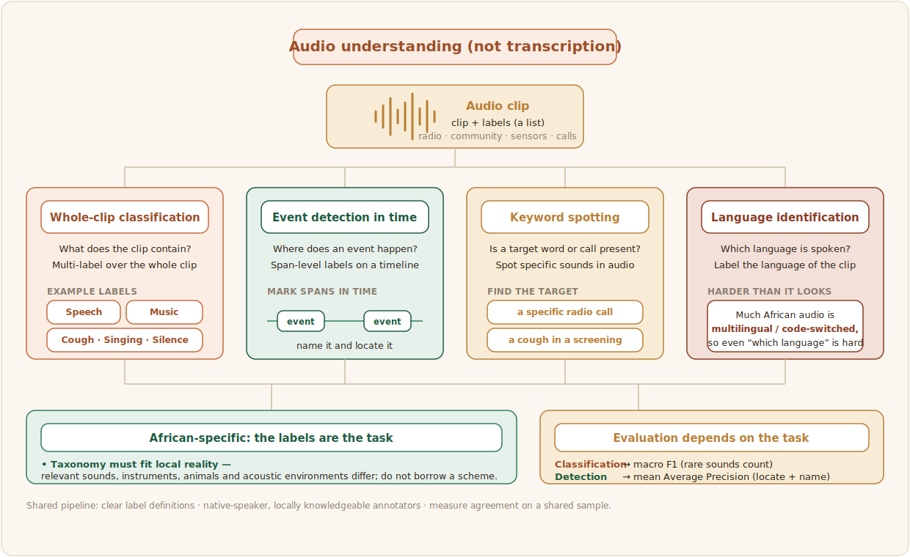

# Audio Understanding

Audio understanding covers the speech and sound tasks that are not transcription: classifying what a clip contains, detecting events within it, spotting keywords, or identifying which language is being spoken. These tasks matter for African contexts in ways transcription does not, because much useful audio is not speech to be transcribed but sound to be recognised, from a cough in a health screening to a specific call in a radio broadcast.



## What the data looks like

Audio-understanding data is audio clips paired with labels, and the label scheme is the heart of the task. The clips can come from radio archives, community recordings, environmental sensors, or call centres, and the labels say what each clip is or contains. Two African-specific points stand out. The taxonomy of labels has to fit local reality rather than a borrowed one, since the relevant sounds, instruments, animals, and acoustic environments differ. And much of the audio is multilingual and code-switched, so even a task as simple as language identification is harder than it looks, which is why African-aware tools matter throughout the [speech pipeline](../sections/speech.md). General multilingual speech corpora such as African Next Voices provide raw material that can be relabelled for understanding tasks ([African Next Voices, 2025](../references.md#african-next-voices)).

The data is one clip per record with its labels. Because a clip can contain more than one thing at once, the label field is a list, so a clip can carry several labels or just one. Each record is one line in the file, shown indented here for readability:

```json
{
  "audio_filepath": "clips/radio_0231.wav",
  "duration": 6.0,
  "labels": ["Speech", "Music"],
  "language": "swa",
  "source": "community radio archive"
}
```

The label set here (`Speech`, `Music`) is only an illustration: the point from above is that the taxonomy must be built for the local reality, so the right labels are whatever sounds matter to the project and community, whether that is a specific cough in a health screening or a particular call in a broadcast.

## Distinctive annotation and evaluation

Labelling audio for understanding is a listening task, and the guidance from [Annotation Design](../3_annotation-design/annotation-task-design.md) applies directly: clear label definitions, native-speaker and locally knowledgeable annotators, and agreement measurement on a shared sample. Where clips can carry more than one label, or where the boundary of an event must be marked in time, the task becomes multi-label or span-level, and the guidelines must say how to handle overlap and uncertainty. Evaluation depends on the task: accuracy and F1 for classification, and mean average precision for detection, where the model must locate events in time as well as name them. Subjective or culturally specific labels carry the same caveat as elsewhere, that disagreement can be signal rather than noise.

A whole-clip classification config uses multiple-choice over the audio, with `choice="multiple"` so a clip can carry several labels at once:

```xml
<View>
  <Audio name="audio" value="$audio"/>
  <Choices name="content" toName="audio" choice="multiple">
    <Choice value="Speech"  hotkey="1"/>
    <Choice value="Music"   hotkey="2"/>
    <Choice value="Singing" hotkey="3"/>
    <Choice value="Cough"   hotkey="4"/>
    <Choice value="Silence or noise" hotkey="5"/>
  </Choices>
</View>
```

When instead you need to mark *where* an event happens, not just that it is present, switch `<Choices>` for the `<Labels>` and timeline approach from the [Speaker Diarization](./speaker-diarization) page, which turns the same audio into span-level labels for detection. Score whole-clip classification with macro F1, so rare but important sounds are not drowned out by common ones, and score detection with mean average precision, which checks the model located events in time as well as named them.

Classifying an audio clip in the AfriAnnotate editor:


