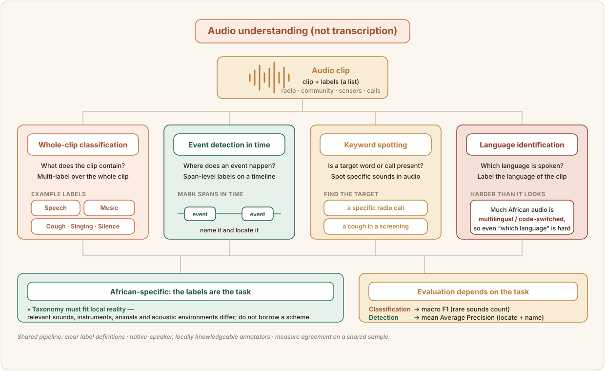

# Audio Understanding

Audio understanding covers the speech and sound tasks that are not transcription: classifying what a clip contains, detecting events within it, spotting keywords, or identifying which language is being spoken. These tasks matter for African contexts in ways transcription does not, because much useful audio is not speech to be transcribed but sound to be recognised, from a cough in a health screening to a specific call in a radio broadcast.

This page is the practical guide to building audio-understanding data and models for African contexts: the label-taxonomy decisions that make or break the corpus, the recording and preprocessing pipeline, the evaluation choices that surface the failures aggregate accuracy hides, and the common deployment mistakes. For the shared recording and consent groundwork see the [Speech overview](../sections/speech.md); for transcription-based tasks see [ASR](../asr/index.md) instead.



## The four sub-tasks and when each applies

Audio understanding is not one task but a family. The framing determines the label scheme, the annotation workflow, and the evaluation. Get this wrong at scoping and the corpus is built for a task no one wanted.

- **Whole-clip classification.** One label (or a small set) per clip: "This is Kiswahili news broadcast", "This clip contains coughing", "This is a distress call". Simplest to annotate, cheapest to model, sufficient for many triage use cases (routing calls to the right desk, flagging health-relevant audio for review).
- **Event detection with timestamps.** Where in a longer clip an event of interest occurs, with start and end times: "Coughing at 00:14–00:17 and 01:22–01:25", "Speech onset at 00:03". More expensive to annotate than classification, but load-bearing for any pipeline that must locate events, not just detect their presence.
- **Keyword spotting (KWS).** A specialised detection variant: "Does this clip contain the phrase 'help' in any of {Kiswahili, English, Yoruba}?" Used in voice assistants (wake-word detection) and in emergency-triage systems. Latency-sensitive and often deployed on-device.
- **Spoken language identification (LID).** Which language a clip contains — a first-pass gate for downstream ASR or MT routing. Simple in theory, hard in African contexts because of code-switching, dialect variation, and speakers whose accent in a lingua franca can trip general-purpose LID models.

## What "African audio" actually varies on

Three axes routinely undermine audio-understanding pipelines built on borrowed assumptions.

- **The label taxonomy is not universal.** A speech / music / noise / silence taxonomy borrowed from AudioSet or ESC-50 misses most of what matters in an African deployment. A community-radio archive contains market-noise, call-and-response singing, drums that Western taxonomies treat as one category and locals distinguish by ceremony, animal calls specific to region and season. A health-screening archive contains coughs, breathing patterns, and vocalisations whose diagnostic categories a global taxonomy under-serves. Build the taxonomy with the community that will use the corpus; adapt existing schemes rather than importing them.
- **Multilingual, code-switched audio is the norm.** Language ID on a 5-second clip that switches from Kiswahili to English mid-utterance is genuinely hard. Even whole-clip classification of "is this Yoruba?" fails when the clip is a Yoruba host interviewing an English-speaking guest with alternating turns. Design labels to accommodate mixed input (`labels: ["Kiswahili", "English", "Code-switched"]`) or the corpus quietly learns that its "Kiswahili" class also contains English.
- **Acoustic environment matters more than the model architecture.** Community-radio recordings, market recordings, and outdoor call-centre audio are noisier than studio speech and than most Western public-audio corpora. A model trained on the studio-conditions AudioSet and evaluated on market audio will fail; a model trained on real African deployment audio will generalise. Match training and deployment acoustic conditions or plan a domain-adaptation step.

## What the data looks like

Audio-understanding data is audio clips paired with labels, and the label scheme is the heart of the task. The clips can come from radio archives, community recordings, environmental sensors, or call centres, and the labels say what each clip is or contains. General multilingual speech corpora such as African Next Voices provide raw material that can be relabelled for understanding tasks ([African Next Voices, 2025](../references.md#african-next-voices)); WAXAL, NaijaVoices, and Common Voice can all be repurposed with an appropriate label pass.

The data is one clip per record with its labels. Because a clip can contain more than one thing at once, the label field is a list, so a clip can carry several labels or just one. Each record is one line in the file, shown indented here for readability:

```json
{
  "audio_filepath": "clips/radio_0231.wav",
  "duration": 6.0,
  "labels": ["Speech", "Music"],
  "language": "swa",
  "source": "community radio archive"
}
```

For event detection with timestamps, add a `spans` field with start and end times per event; the manifest becomes richer but the same file feeds annotation, training, and evaluation:

```json
{
  "audio_filepath": "clips/health_0044.wav",
  "duration": 30.0,
  "spans": [
    {"label": "Cough", "start": 4.2, "end": 5.1},
    {"label": "Cough", "start": 12.6, "end": 13.9},
    {"label": "Breathing", "start": 20.0, "end": 30.0}
  ],
  "language": "hau",
  "source": "clinical screening"
}
```

## Data collection specifics for African contexts

The raw audio comes from wherever the deployment target uses it. Match the collection surface to the deployment surface.

- **Community-radio archives** — the highest-volume source for African-language audio. Access typically requires the radio station's agreement (which is often forthcoming for research and community-benefit projects). Consent is the tricky part: broadcast audio was consented for broadcast, not necessarily for downstream ML use. The consent conversation must extend to the specific new use case.
- **Environmental sensors and passive recording** — for wildlife acoustics, agricultural monitoring, or crowd-context audio. Collection is cheap once deployed; annotation is expensive because sensor-collected audio is often uneventful (long silences interrupted by rare events of interest). Design a sampling strategy that yields useful annotator throughput.
- **Call-centre and helpline archives** — for spoken-language ID, keyword spotting for distress terms, or classification of call topics. Consent is the load-bearing decision: callers did not consent to ML training when they called the helpline. Retroactive extension of consent is not consent; if the archive is being repurposed, treat it as a research artefact only and do not release the underlying audio.
- **Health screenings and clinical audio** — for coughing, breathing, or vocalisation-based diagnostic tasks. Regulatory regimes vary; the [legal, consent, and community IP](../legal-consent/index.md) chapter is the operational reference, plus jurisdiction-specific medical-data compliance (NDPA, PoPIA, etc.).

## Label taxonomy design

The taxonomy is the corpus. Two failure modes are near-universal.

**Borrowed-taxonomy failure.** Importing AudioSet or ESC-50 labels into an African-language project and expecting them to fit produces a corpus that measures the wrong thing. The correct approach: start from the deployment use case ("we need to route helpline calls by topic"), enumerate the categories that matter, verify with the community that they align with distinctions locals actually make, and only then check whether a subset of a public taxonomy covers them.

**Taxonomy drift during annotation.** Annotators encounter clips that fit no existing category and either force them into a nearby category (silently expanding what that category means) or invent new labels (silently fragmenting the taxonomy). Document a formal "expand or subsume" workflow before annotation begins: uncertain clips flag for adjudication, and adjudication decisions expand the guidelines with worked examples rather than being made ad hoc.

## Distinctive annotation and evaluation

Labelling audio for understanding is a listening task, and the guidance from [Annotation Design](../3_annotation-design/annotation-task-design.md) applies directly: clear label definitions, native-speaker and locally knowledgeable annotators, and agreement measurement on a shared sample. Where clips can carry more than one label, or where the boundary of an event must be marked in time, the task becomes multi-label or span-level, and the guidelines must say how to handle overlap and uncertainty.

A whole-clip classification config uses multiple-choice over the audio, with `choice="multiple"` so a clip can carry several labels at once:

```xml
<View>
  <Audio name="audio" value="$audio"/>
  <Choices name="content" toName="audio" choice="multiple">
    <Choice value="Speech"  hotkey="1"/>
    <Choice value="Music"   hotkey="2"/>
    <Choice value="Singing" hotkey="3"/>
    <Choice value="Cough"   hotkey="4"/>
    <Choice value="Silence or noise" hotkey="5"/>
  </Choices>
</View>
```

When instead you need to mark *where* an event happens, not just that it is present, switch `<Choices>` for the `<Labels>` and timeline approach from the [Speaker Diarization](../speaker-diarization/index.md) page, which turns the same audio into span-level labels for detection.

Classifying an audio clip in the AfriAnnotate editor:


**Evaluation depends on the task:**

- **Whole-clip classification** — macro F1 as the headline metric so rare but important labels are not drowned out by common ones. Aggregate accuracy is misleading for imbalanced label sets and hides class-specific failures.
- **Event detection** — mean average precision (mAP), which checks the model located events in time as well as named them. An event detected at the wrong time is not a correct detection.
- **Keyword spotting** — precision at fixed recall (or the reverse), with the specific point on the curve driven by the deployment use case. A wake-word detector that misses commands is a broken product; a health-triage detector that false-flags too often overwhelms clinicians.
- **Language ID** — per-language accuracy AND per-code-switching-condition accuracy. Aggregate LID accuracy on monolingual clips is unrelated to LID performance on real code-switched deployment input.

**Per-source evaluation.** Split evaluation by data source (radio, community recording, sensor, call-centre) and report per-source metrics. A model whose overall F1 is acceptable but whose call-centre F1 is catastrophic will silently under-serve exactly the deployment use case that motivated the project.

## Deployment realities

- **On-device keyword spotting.** KWS is often the audio-understanding task teams first try to deploy on-device, since the latency target for wake-word detection is sub-100ms and cloud round-trips are too slow. Quantised sub-1M-parameter models are the target; see the [edge devices](../deployment/edge-devices.md) chapter for the runtime landscape.
- **Streaming vs batch.** Event detection on a live audio stream is a different engineering problem from event detection on pre-recorded clips. Streaming pipelines need bounded latency between event occurrence and detection; batch pipelines can afford to look at the whole clip. Choose at scoping.
- **False-positive cost is deployment-specific.** A health-triage detector that flags a normal breath as a cough sends a clinician a false alert; a security keyword-spotter that flags a benign phrase as a distress call escalates unnecessarily. Choose the operating point on the precision-recall curve deliberately for the specific deployment.
- **Audio privacy is data privacy.** Any audio-understanding pipeline that logs input for retraining or debugging is collecting personal audio data, subject to the same jurisdictional protections as other biometric data. See [legal, consent, and community IP](../legal-consent/index.md).

## What breaks — common failure modes

- **Borrowed-taxonomy corpus that doesn't match deployment.** Model achieves high F1 on the training labels; deployment users experience it as consistently wrong because the labels don't map to their categories. Fix: build the taxonomy with the deployment community from the start.
- **Code-switching invisible to LID.** Language ID model trained on monolingual clips fails on real code-switched user input. Fix: include code-switched training examples and evaluate LID separately on code-switched subset.
- **Acoustic-condition mismatch.** Studio-clean training data, market-noise deployment audio; F1 drops sharply in production. Fix: match acoustic conditions or plan explicit domain adaptation.
- **Class-imbalance-hidden failure.** Overall accuracy looks good; per-class F1 reveals the rare-but-important label has near-zero recall. Fix: macro F1 as the headline metric; per-class breakdown always reported.
- **Consent gap on archived audio.** Archive was consented for one purpose (broadcast, call handling), repurposed for ML training without new consent. Fix: consent is not retroactive; treat repurposed archives as research artefacts and do not release underlying audio.
- **Event-detection timing sloppiness.** Model marks events with wide margins; mAP looks acceptable at loose tolerances, catastrophic at the deployment tolerance. Fix: measure at the tolerance the deployment actually requires.
- **Post-quantisation collapse on-device.** Quantisation for on-device inference drops accuracy sharply; the demo worked but production doesn't. Fix: measure at deployment precision from the start; see [compute-poor training](../compute-poor/index.md).
