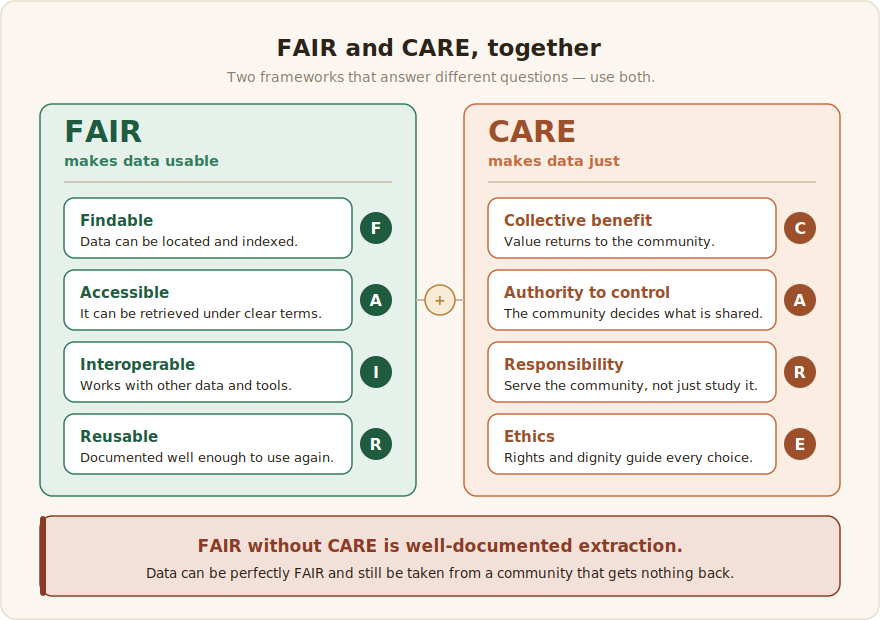

# Data Governance

Data governance is the set of decisions about who controls a dataset: who may access it, who may use it, who profits from it, and who is accountable when something goes wrong. For African-language data these are not legal formalities to add at the end. They decide whether a dataset strengthens a community or quietly extracts from it. The data comes from people, from their voices, words, and knowledge, and governance is how those people keep a say in what they helped create.

This matters more here than in well-resourced settings, because the same openness that helps a low-resource language can also expose it. A freely downloadable corpus is easy to reuse, and just as easy to scrape into a commercial model that returns no benefit, credit, or say to the speakers. African NLP communities have been clear about this. The Masakhane community holds that Africans should decide what data represents their communities, retain ownership of it, and know how it is used ([Masakhane](../references.md#masakhane)). Governance is how that principle turns into practice.

:::tip[The one-line version]
Decide with the community who controls the data, get real consent, choose a licence on purpose, protect the people in the data, and make sure the benefits reach the speakers.
:::

## Govern for the community, not just the dataset

### Community ownership and self-determination

The people whose language it is should have the final say over how their data is used. This participatory commitment, treating native speakers as co-owners rather than suppliers of raw material, runs through the continent's strongest data efforts. It shaped the early Masakhane translation work ([Nekoto et al., 2020](../references.md#nekoto-2020)), AI4D's African Language Program, which built open datasets through community challenges and short research fellowships ([Siminyu et al., 2021](../references.md#siminyu-2021)), and large speech corpora such as NaijaVoices that are recorded by community members rather than scraped ([Emezue et al., 2025](../references.md#emezue-2025)). It also reflects a wider call to decolonise language technology by centring the communities whose languages are at stake instead of treating them as data sources ([Bird, 2020](../references.md#bird-2020)). Self-determination is not a single veto at release. It shapes every earlier choice: what gets collected, from whom, on what terms, and who may use the result.

### FAIR and CARE, together

Two frameworks should guide a dataset's design, and they answer different questions. FAIR asks whether data is Findable, Accessible, Interoperable, and Reusable, and it is now a baseline expectation for research data ([Wilkinson et al., 2016](../references.md#wilkinson-2016)). FAIR says nothing about power or justice, though. Data can be perfectly FAIR and still be taken from a community that gets nothing back. CARE was written to fill that gap. Its four commitments, Collective benefit, Authority to control, Responsibility, and Ethics, assert the right of Indigenous and local communities to govern data about them ([Carroll et al., 2020](../references.md#carroll-2020)). Use both. FAIR makes the data usable; CARE makes it just. FAIR without CARE is well-documented extraction.

The findability half of FAIR has a practical home in African NLP. Lanfrica's African AI Atlas tracks datasets, models, and papers that would otherwise sit scattered across repositories, PDFs, and dead project pages, so that work already done can be found and reused instead of rebuilt from scratch ([Lanfrica](../references.md#lanfrica)).

## Consent and rights

### Informed consent

Anyone who contributes data, whether a voice recording, a translation, an annotation, or a photo, should know before they contribute what they are agreeing to: what the data is for, who will be able to use it, whether it will be public, and that they may decline or withdraw without penalty. This is not optional for the recording-based collection common in African-language work, where the contributor's own voice or image is the data. NaijaVoices shows what good practice looks like. To build an 1,800-hour Igbo, Hausa, and Yorùbá speech corpus from more than 5,000 voice donors, it trained community facilitators in the ethics of data collection and informed consent, and those facilitators explained the project, its purpose, and the intended use of the data to each contributor before any recording began ([Emezue et al., 2025](../references.md#emezue-2025)). Gather informed consent, fair compensation, and clear data-rights terms together, at the point of collection ([Esethu Framework, 2025](../references.md#esethu-2025)). Adding consent afterward is usually impossible, which is what makes this an early decision rather than a late one.

### Rights over sourced and contributed data

Be clear about which kind of data you hold, because the rights differ sharply. Contributed data, the recordings, transcriptions, and labels people make for your project, is governed by the consent and terms you agree with them. Sourced data, the text pulled from the web, social media, or archives, carries someone else's rights: copyright, platform terms of service, and often no clear licence at all. African NLP practitioners have flagged copyright and access as a central, unresolved problem, since much of the available text sits in a legal grey zone and "publicly visible" is not the same as "free to redistribute or train on" ([Carnegie Endowment, 2024](../references.md#carnegie-2024)). When the rights are unclear, record the uncertainty rather than hide it.

## Licensing

A licence tells the world what may and may not be done with your data. In African NLP the common failure is not the wrong licence but a missing or unclear one, and an unlicensed dataset is effectively unusable, because a reuser cannot tell whether they are allowed to touch it ([Lanfrica, "Licensing as a Barrier"](../references.md#lanfrica-licensing)). Choose on purpose.

### Data and code are licensed differently

Software licences such as MIT or Apache-2.0 are not built for data, and putting a code licence on a corpus leaves its reuse rights ambiguous. For open data the Creative Commons family is the usual choice: CC0 for a public-domain dedication, CC BY for reuse with attribution, or CC BY-SA for attribution plus share-alike. Pick the one that matches how open you actually want to be, and apply it to the data, separately from any code.

### African and community licences

Fully open CC licences assume the goal is maximum reuse. For low-resource African data, maximum reuse often means a well-funded foreign lab can take the corpus, train on it, and give nothing back to the speakers. A newer class of community-centred licences exists to close that gap, and the most developed of them is African.

The Nwulite Obodo Open Data License (NOODL) takes its name from the Igbo for "raising, reviving, and building the community," and it was written to address the inequitable openness that standard licences impose on African dataset creators ([NOODL, 2025](../references.md#noodl-2025)). Its central idea is to set terms by who the reuser is. Users in Africa and other developing nations may reuse the data freely on a share-alike basis and distribute adaptations within the region. Users outside those regions accept the same share-alike terms and must also return royalties or other benefits to the African dataset owners. Openness becomes reciprocal rather than a one-way export.

The Esethu license, from Lelapa AI, Way With Words, and Data Science for Social Impact, adds an economic loop: licensing revenue is reinvested into expanding the dataset and supporting local employment, so the resource and its community grow together ([Esethu Framework, 2025](../references.md#esethu-2025)). Both build on the precedent of Te Hiku Media's Kaitiakitanga License for Māori data, which treats data as cared for rather than owned, directs benefit back to the source community, and forbids uses such as surveillance or unconsented corpus-building ([Te Hiku Media](../references.md#tehiku-kaitiakitanga)). Consider one of these whenever a plain CC licence would mean giving up the community's say, or its share of the value its data creates.

### Attribution and reuse

Whatever licence you pick, require attribution and record provenance: where the data came from, who contributed it, and on what terms. Provenance lets downstream users credit the source and respect the conditions, and it lets you prove years later that the dataset was built legitimately. Recording it is covered in [Documentation](../6_documentation/documentation.md).

## Privacy and sensitive data

### Personally identifiable information

African-language collection routinely captures personal data: names and places in text, and, unavoidably, voices in audio and faces in images, which identify a person directly. Collect as little as the task needs, anonymise where you can by masking names and stripping metadata, and never treat a recorded voice as anonymous. Where identifiable data is essential, it has to rest on explicit, informed consent, and the consent terms must travel with the data.

### Sensitive and restricted content

Some knowledge should not be public even when it is easy to collect. Sacred or ceremonial material, culturally restricted knowledge, health information, and politically dangerous speech can all put contributors at real risk. This is what CARE's Authority to control protects: the community, not the collector, decides what may be shared and what stays closed ([Carroll et al., 2020](../references.md#carroll-2020)). When unsure, ask the community and default to not releasing.

### The law that applies: African data-protection regimes

Across the continent, governance is now law as much as ethics. By 2026, 44 African countries had enacted data-protection legislation, and most had a functioning authority to enforce it ([Tech In Africa, 2026](../references.md#techinafrica-2026)). If you collect personal data, and a recorded voice is personal data, you are almost certainly covered by one of these regimes:

- **South Africa, POPIA** (Protection of Personal Information Act, 2020): a rights-based law that calls for a lawful basis, purpose limitation, and an impact assessment for automated processing.
- **Nigeria, Data Protection Act (2023)**, building on the earlier NDPR: consent, data-subject rights, and registration of data controllers.
- **Kenya, Data Protection Act (2019)** and its 2021 regulations, alongside the 2025–2030 National AI Strategy, which adds dataset-level expectations including proposed audit trails for AI training data.
- **Ghana, Data Protection Act (2012)**: one of the continent's earliest.
- **African Union, Malabo Convention**: the first continent-wide treaty on personal-data protection and cybersecurity, in force since June 2023 ([Malabo Convention, 2023](../references.md#malabo-2023)).

The practical demands are similar across these laws: collect on a lawful basis, usually informed consent; use the data only for the purpose you stated; honour data-subject rights to access, correction, and deletion; and be ready to run an impact assessment for anything that feeds automated decisions. Check the law of every country your contributors are in, not only your own. African Next Voices makes the point concrete. It gathered roughly 9,000 hours of speech across Kenya, Nigeria, and South Africa ([African Next Voices, 2025](../references.md#african-next-voices)), which placed one project under three separate data-protection regimes at once.

## Ethics and harm avoidance

### A lightweight ethics review

Before collection starts, work through a short and honest review: who could be harmed by this dataset, how, and what would reduce the risk. It does not need to be a formal institutional board, which many community projects cannot access, but it does need to happen before data is gathered, while choices are still cheap to change. How the work is done, and who is consulted along the way, often decides whether a community is genuinely served or merely studied, which is what CARE's Responsibility and Ethics commitments ask you to attend to ([Carroll et al., 2020](../references.md#carroll-2020)).

### Bias, representation, and harm

Ask who is represented in the data and who is missing, across dialects, regions, genders, and ages, because those gaps become the blind spots of any model trained on it. Tasks that involve harmful content, such as hate speech or offensive language, carry a second duty of care toward the annotators who have to read it, met through content warnings, opt-outs, and support (see the annotation chapters). Documenting known biases plainly is part of governance, not an admission of failure.

## Community ownership and benefit-sharing

### Governance models

Decide in writing who decides, and keep that authority with the community. In practice this can be a community advisory board, a designated language lead for each language, or a formal data-trust arrangement, and the right model depends on the project's scale and the community's structure. What matters is that the decision rights are explicit and held by the people whose language it is, rather than defaulting to whoever happens to host the files.

### Benefit-sharing and credit

Governance is hollow if value only flows outward. Benefit-sharing means the gains from a dataset, whether recognition, compensation, capacity, tools, or a share of downstream value, return to the contributors and their community. This is the organising idea behind the Kaitiakitanga License's principle that benefit flows to the source, the Esethu framework's reinvestment of licensing revenue into the dataset and local jobs, and NaijaVoices' "data farming" model, which pairs collection with reciprocal community support and micro-grants for local language work ([Te Hiku Media](../references.md#tehiku-kaitiakitanga); [Esethu Framework, 2025](../references.md#esethu-2025); [Emezue et al., 2025](../references.md#emezue-2025)). At a minimum, credit the annotators, speakers, and communities by name in datasheets and publications. They are co-creators, and naming them is the cheapest benefit-sharing there is.

:::note[How this connects]
Governance decisions made here set the terms for everything downstream: what you may [collect](../2_data-collection/1_data-modalities.md), how you run [annotation](../3_annotation-design/annotation-task-design.md), and what you record in [Documentation](../6_documentation/documentation.md). Get governance right early and the rest of the project stands on solid ground.
:::
