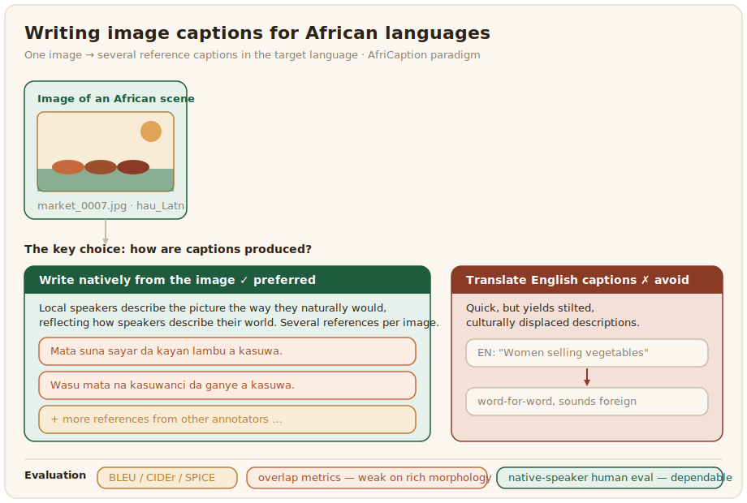

# Image captioning

Image captioning describes an image in fluent text. It is the multimodal cousin of text generation, and it inherits both that task's difficulty in low-resource languages and the vision task's dependence on relevant images. For African languages a good caption is not just grammatical, it is culturally apt, naming what is in the picture the way a local speaker would.



## What the data looks like

A captioning dataset pairs images with one or more reference captions in the target language. The crucial choice is how the captions are produced. Translating English captions is quick but yields stilted, culturally displaced descriptions, while writing captions natively from the image gives text that reflects how speakers actually describe their world. AfriCaption took the second route, establishing a paradigm for image captioning across linguistically diverse African languages including Igbo, Hausa, Yoruba, Ewe, Luganda, and Kinyarwanda rather than translating from English ([AfriCaption, 2025](../references.md#africaption-2025)). As with all African vision work, captions of images that show African scenes and objects matter more than captions of borrowed Western photos.

A record pairs an image with several reference captions, since one caption cannot represent the many valid ways to describe a picture:

```json
{
  "image": "images/market_0007.jpg",
  "captions": [
    "Mata suna sayar da kayan lambu a kasuwa.",
    "Wasu mata na kasuwanci da ganye a kasuwa."
  ],
  "language": "hau_Latn",
  "source": "AfriCaption"
}
```

Collecting more than one caption per image is worth the cost, because the overlap metrics below reward a generated caption that resembles any reference, and a single reference unfairly penalizes a correct caption phrased differently.

## Annotation and evaluation

Captioning annotation is writing descriptions, and the guidelines must fix the level of detail, the handling of uncertain content, and how many captions each image gets, since a single caption underrepresents the many valid ways to describe a picture. Native speakers should write, not translate. The config shows the image and a single text box, with the guideline to describe the picture the way a local speaker would rather than translate:

```xml
<View>
  <Image name="image" value="$image"/>
  <TextArea name="caption" toName="image" rows="3"
            editable="true" required="true"
            placeholder="Describe the image as a local speaker naturally would"/>
</View>
```

Run several annotators over the same images to collect the multiple references the format expects. Captioning is evaluated with overlap metrics such as [BLEU](https://en.wikipedia.org/wiki/BLEU) and [CIDEr](https://github.com/salaniz/pycocoevalcap) and the semantic metric SPICE, all of which share BLEU's weakness on morphologically rich languages and its blindness to a caption that is fluent but wrong, so native-speaker human evaluation remains the dependable measure, exactly as in [text generation](../text-generation/index.md).
