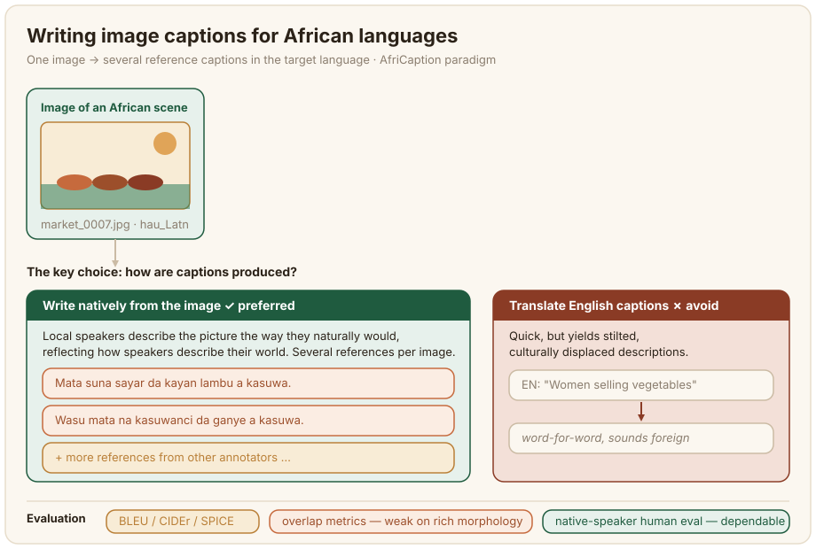

# Image captioning

*Last reviewed: 2026-07-07.*

Image captioning describes an image in fluent text. It is the multimodal cousin of text generation, and it inherits both that task's difficulty in low-resource languages and the vision task's dependence on relevant images. For African languages a good caption is not just grammatical, it is culturally apt, naming what is in the picture the way a local speaker would.



## What the data looks like

A captioning dataset pairs images with one or more reference captions in the target language. The crucial choice is how the captions are produced. Translating English captions is quick but yields stilted, culturally displaced descriptions, while writing captions natively from the image gives text that reflects how speakers actually describe their world. AfriCaption took the second route, establishing a paradigm for image captioning across linguistically diverse African languages including Igbo, Hausa, Yoruba, Ewe, Luganda, and Kinyarwanda rather than translating from English ([AfriCaption, 2025](../references.md#africaption-2025)). As with all African vision work, captions of images that show African scenes and objects matter more than captions of borrowed Western photos.

A record pairs an image with several reference captions, since one caption cannot represent the many valid ways to describe a picture:

```json
{
  "image": "images/market_0007.jpg",
  "captions": [
    "Mata suna sayar da kayan lambu a kasuwa.",
    "Wasu mata na kasuwanci da ganye a kasuwa."
  ],
  "language": "hau_Latn",
  "source": "AfriCaption"
}
```

Collecting more than one caption per image is worth the cost, because the overlap metrics below reward a generated caption that resembles any reference, and a single reference unfairly penalizes a correct caption phrased differently.

## Annotation and evaluation

Captioning annotation is writing descriptions, and the guidelines must fix the level of detail, the handling of uncertain content, and how many captions each image gets, since a single caption underrepresents the many valid ways to describe a picture. Native speakers should write, not translate. The config shows the image and a single text box, with the guideline to describe the picture the way a local speaker would rather than translate:

```xml
<View>
  <Image name="image" value="$image"/>
  <TextArea name="caption" toName="image" rows="3"
            editable="true" required="true"
            placeholder="Describe the image as a local speaker naturally would"/>
</View>
```

Run several annotators over the same images to collect the multiple references the format expects. Captioning is evaluated with overlap metrics such as [BLEU](https://en.wikipedia.org/wiki/BLEU) and [CIDEr](https://github.com/salaniz/pycocoevalcap) and the semantic metric SPICE, all of which share BLEU's weakness on morphologically rich languages and its blindness to a caption that is fluent but wrong, so native-speaker human evaluation remains the dependable measure, exactly as in [text generation](../text-generation/index.md).

For embedding-based semantic scoring — a useful second opinion — **[CLIPScore](https://arxiv.org/abs/2104.08718)** measures caption-image alignment without needing reference captions, and **[BERTScore](https://github.com/Tiiiger/bert_score)** applied to captions in the target language gives a reference-based semantic signal that partially corrects for BLEU's morphology blindness. Neither replaces human evaluation; both are useful for tracking regression during development.

## The 2026 modelling landscape

Image captioning in 2026 is dominated by the same multimodal LLM (MLLM) lineage that took over VQA. Prompt-based captioning from a general MLLM is the workable baseline, not a fine-tuned encoder-decoder captioner. The specific open-model recommendations in mid-2026:

- **[PaliGemma 2](https://arxiv.org/abs/2412.03555)** (Google, 2024) — 3B/10B/28B parameter variants, purpose-built with captioning as a first-class task, Apache-2.0 licensed. The strongest small-scale open baseline for captioning in Latin-script African languages, especially via lightweight fine-tuning on AfriCaption's per-language splits.
- **[Qwen2.5-VL](https://qwenlm.github.io/blog/qwen2.5-vl/)** (Alibaba, 2024-2025) — 3B/7B/32B/72B variants, Apache-2.0 licensed, strong on multilingual captioning benchmarks. Measure against PaliGemma 2 as the honest open comparison for the small-model size class; 32B/72B is where the ceiling of open captioning quality sits.
- **[InternVL 3](https://github.com/OpenGVLab/InternVL)** (OpenGVLab, 2026) — 1B–78B variants, MIT-licensed, competitive multilingual coverage. Worth measuring against Qwen2.5-VL specifically because the two models fail on different image types.
- **[Molmo](https://molmo.allenai.org/)** (Allen AI, 2024) — fully open (data + weights + code), captions the model was trained to speak the description aloud (a design choice that produces qualitatively different captions from the Qwen or PaliGemma lineages). Useful when the deployment surface is voice-driven.

**Closed-API baselines.** As with VQA, **Gemini 2.5 Flash / Pro**, **GPT-4o / GPT-4.1**, and **Claude Sonnet 4** all handle African-language captioning to varying degrees. Their captions tend to be more fluent than open-model captions but not necessarily more accurate — they hallucinate objects, over-caption in an English-inflected style, and introduce culturally displaced framings. Use as the ceiling reference for research, not the deployment surface, unless the budget and licensing permit it.

**Editorial opinion.** For a new African-language captioning project on an AfriCaption-covered language, the shortest defensible path is: **prompt-based evaluation of Qwen2.5-VL-7B and PaliGemma 2 (10B) on the AfriCaption test split**, followed by **LoRA fine-tuning of the stronger open model on AfriCaption's per-language training split**, followed by **native-speaker evaluation of 200+ captions** before deployment. For an uncovered language, translation-based captions must be image-verified by native speakers — the "translate English COCO captions" shortcut produces training data that harms fine-tuned models more than it helps them.

## What it will actually cost you

Captioning data is expensive per-record because native writing is skilled work, and multi-reference captions cost more than single-reference. Rough order-of-magnitude:

- **Prompt-only evaluation of open MLLMs on an AfriCaption-covered language.** One to two person-weeks; ten to forty GPU-hours across the candidate models.
- **LoRA fine-tuning an MLLM on an AfriCaption split.** Two to four person-weeks; twenty to eighty GPU-hours.
- **Extending AfriCaption to a new African language, natively authored** (1,000-3,000 images × 3-5 captions each). Six to fifteen months elapsed; six to fifteen person-months. Native captioning throughput is slower than translation; budget accordingly.
- **A defensible evaluation-only captioning set** (500-1,000 images × 3-5 captions each). Three to six months; two to five person-months.
- **Human evaluation of generated captions.** One to two person-weeks per evaluator per 200 items — captioning evaluation is faster than VQA evaluation because the evaluator does not have to reason about the question-answer match.

## Known limitations to watch for

- **BLEU and CIDEr under-report caption quality in morphologically rich languages.** A caption that correctly names three inflections of the same root scores worse than a caption that reuses the root once. Report BERTScore or SSA-COMET-family metrics alongside, and treat human evaluation as final.
- **MLLMs describe Western scenes better than African scenes.** A model that captions a European kitchen well may misname the objects, the setting, and the activities in a Nigerian market. The failure mode is not language coverage — it is visual coverage. Evaluate on target-context images specifically.
- **Fluent captions can be catastrophically wrong.** A grammatically perfect Yoruba caption that misidentifies the dish in the image is a worse failure than a broken caption that names the dish correctly. Fluency is not a proxy for correctness; the review protocol must treat these as separate axes.
- **Translated captions are training-data poison.** Fine-tuning a captioning model on machine-translated captions of an English corpus does more harm than good — it teaches the model to produce grammatically-target-language English-shaped captions. AfriCaption's native-writing methodology is the reason to trust its data.
- **Consent for identifiable people is load-bearing.** A caption that identifies a person by name, community, or role turns an image record into personally identifiable data. Guidelines must forbid identifying captions unless explicit consent has been obtained.
- **Cultural naming matters.** A dish that has three names in three languages, a garment that carries community-specific meaning, or a ceremony that is only named by insiders — all of these produce brittle captioning behaviour if the annotator was not from the community. Recruit annotators from the visual context, not just the language.

## Further reading

- [AfriCaption paper (2025)](https://aclanthology.org/) — the reference native-writing captioning corpus for African languages; required reading before designing any new captioning collection.
- [PaliGemma 2 (Steiner et al., 2024)](https://arxiv.org/abs/2412.03555) — the workable open MLLM baseline for captioning, with a first-class captioning-task design.
- [CLIPScore (Hessel et al., 2021)](https://arxiv.org/abs/2104.08718) — the reference-free caption-image alignment metric; useful as a second-opinion signal alongside BLEU.

<details>
<summary>Additional references</summary>

- [Qwen2.5-VL blog (Alibaba, 2025)](https://qwenlm.github.io/blog/qwen2.5-vl/) — the current strongest open MLLM lineage for multilingual captioning at the 7B–72B size class.
- [InternVL 3 (Chen et al., 2026)](https://github.com/OpenGVLab/InternVL) — the competing OpenGVLab MLLM lineage.
- [BERTScore (Zhang et al., 2020)](https://arxiv.org/abs/1904.09675) — the reference-based semantic scoring metric applicable to captions in the target language.
- [Molmo (Deitke et al., 2024)](https://arxiv.org/abs/2409.17146) — the fully-open Allen AI MLLM; useful when the deployment surface is voice-driven.

</details>
