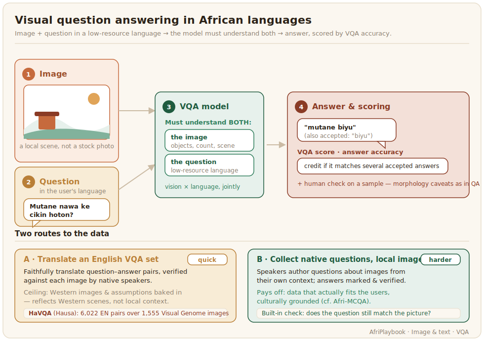

# Visual question answering

Visual question answering (VQA) asks a model a question in natural language about an image and expects an answer: what colour is the car, how many people are there, what is the person doing. For African languages it is a demanding test, because the model must understand both the image and a question posed in a low-resource language at the same time.



## What the data looks like

A VQA dataset is images, questions about them, and answers, usually many questions per image. The first substantial African resource, HaVQA, built Hausa VQA by carefully translating 6,022 English question-answer pairs over 1,555 Visual Genome images, keeping the translations faithful to what the images show ([HaVQA, 2023](../references.md#havqa-2023)). That translation route is the pragmatic starting point, but it has a ceiling: the images and questions come from a Western dataset, so they reflect Western scenes and assumptions. Collecting questions written natively by speakers about images from their own context is harder, but it produces data that actually fits the users, and cultural multimodal benchmarks such as Afri-MCQA push in that direction.

A record links an image to a question and the answers people gave, with a list of answers so the scoring below can credit any accepted form:

```json
{
  "image": "images/vg_001234.jpg",
  "question": "Mutane nawa ke cikin hoton?",
  "answers": ["mutane biyu", "biyu"],
  "language": "hau_Latn",
  "source": "HaVQA"
}
```

Keeping several accepted answers per question matters here for the same morphology reason as in text question answering: "biyu" and "mutane biyu" are both correct, and a single gold answer would mark one of them wrong.

## Annotation and evaluation

VQA annotation is writing questions and marking correct answers, or translating and verifying them against the image, which native speakers must do, since a translated question that no longer matches the picture is worse than useless. Define how to handle open-ended answers, synonyms, and inflected forms before starting. The config shows the image and gives a box for the question and the answer, so a native speaker can author a pair or, in the translation route, retype and correct them against the picture. The check that the question still matches the image is built in as an explicit choice:

```xml
<View>
  <Image name="image" value="$image"/>
  <Header value="Question about the image"/>
  <TextArea name="question" toName="image" rows="1" editable="true"
            placeholder="Write a question about what the image shows"/>
  <Header value="Answer"/>
  <TextArea name="answer" toName="image" rows="1" editable="true"
            placeholder="Write the correct answer"/>
  <Choices name="matches_image" toName="image" choice="single" required="true">
    <Choice value="Question and answer match the image"/>
    <Choice value="Does not match, discard"/>
  </Choices>
</View>
```

VQA is scored by answer accuracy, often with a VQA score that gives credit when an answer matches several human responses, and the same morphology caveats apply as in text question answering, so the [Exact Match and token-F1 approach](../text-generation/question-answering.md) from there carries over, with a human check on a sample needed alongside the automatic number.
