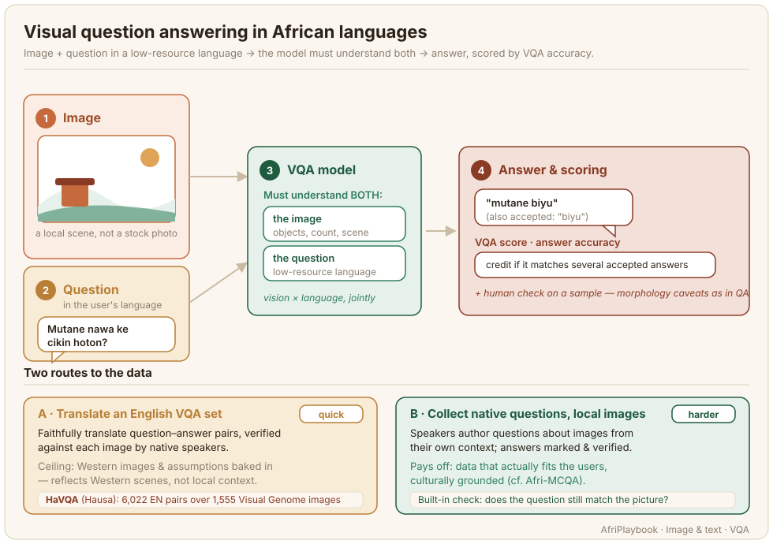

# Visual question answering

*Last reviewed: 2026-07-07.*

Visual question answering (VQA) asks a model a question in natural language about an image and expects an answer: what colour is the car, how many people are there, what is the person doing. For African languages it is a demanding test, because the model must understand both the image and a question posed in a low-resource language at the same time.



## What the data looks like

A VQA dataset is images, questions about them, and answers, usually many questions per image. The first substantial African resource, HaVQA, built Hausa VQA by carefully translating 6,022 English question-answer pairs over 1,555 Visual Genome images, keeping the translations faithful to what the images show ([HaVQA, 2023](../references.md#havqa-2023)). That translation route is the pragmatic starting point, but it has a ceiling: the images and questions come from a Western dataset, so they reflect Western scenes and assumptions. Collecting questions written natively by speakers about images from their own context is harder, but it produces data that actually fits the users, and cultural multimodal benchmarks such as Afri-MCQA push in that direction.

A record links an image to a question and the answers people gave, with a list of answers so the scoring below can credit any accepted form:

```json
{
  "image": "images/vg_001234.jpg",
  "question": "Mutane nawa ke cikin hoton?",
  "answers": ["mutane biyu", "biyu"],
  "language": "hau_Latn",
  "source": "HaVQA"
}
```

Keeping several accepted answers per question matters here for the same morphology reason as in text question answering: "biyu" and "mutane biyu" are both correct, and a single gold answer would mark one of them wrong.

## Annotation and evaluation

VQA annotation is writing questions and marking correct answers, or translating and verifying them against the image, which native speakers must do, since a translated question that no longer matches the picture is worse than useless. Define how to handle open-ended answers, synonyms, and inflected forms before starting. The config shows the image and gives a box for the question and the answer, so a native speaker can author a pair or, in the translation route, retype and correct them against the picture. The check that the question still matches the image is built in as an explicit choice:

```xml
<View>
  <Image name="image" value="$image"/>
  <Header value="Question about the image"/>
  <TextArea name="question" toName="image" rows="1" editable="true"
            placeholder="Write a question about what the image shows"/>
  <Header value="Answer"/>
  <TextArea name="answer" toName="image" rows="1" editable="true"
            placeholder="Write the correct answer"/>
  <Choices name="matches_image" toName="image" choice="single" required="true">
    <Choice value="Question and answer match the image"/>
    <Choice value="Does not match, discard"/>
  </Choices>
</View>
```

VQA is scored by answer accuracy, often with a VQA score that gives credit when an answer matches several human responses, and the same morphology caveats apply as in text question answering, so the [Exact Match and token-F1 approach](../text-generation/question-answering.md) from there carries over, with a human check on a sample needed alongside the automatic number.

## The 2026 modelling landscape

The dominant shift since HaVQA is that **general-purpose multimodal large language models** (MLLMs) now handle VQA out-of-the-box as a prompting task, replacing the fine-tuned encoder-decoder VQA architectures of 2020-2023. The workable open baselines for African-language VQA in mid-2026 are:

- **[PaliGemma 2](https://arxiv.org/abs/2412.03555)** (Google, 2024) — a compact vision-language model built on Gemma 2, 3B/10B/28B parameter variants, 224/448/896 pixel resolutions, Apache-2.0 licensed. The strongest small-scale open baseline for VQA on Latin-script African languages via prompting or lightweight fine-tuning.
- **[Qwen2-VL](https://arxiv.org/abs/2409.12191)** and **[Qwen2.5-VL](https://qwenlm.github.io/blog/qwen2.5-vl/)** (Alibaba, 2024-2025) — 2B/7B/72B variants, strong on multi-image and video reasoning, Apache-2.0 licensed. Consistently top-of-leaderboard on multilingual VQA benchmarks; measure against PaliGemma 2 as the honest open comparison.
- **[InternVL 2.5 / 3](https://github.com/OpenGVLab/InternVL)** (OpenGVLab, 2025-2026) — 1B–78B variants, MIT-licensed, published multilingual VQA numbers competitive with Qwen2.5-VL. Worth including in a candidate measurement plan.
- **[LLaVA-NeXT](https://llava-vl.github.io/blog/2024-01-30-llava-next/)** and its multilingual variants — the earlier open-source MLLM lineage; useful as a baseline for reproducibility, less strong than the 2025-2026 releases.
- **[Molmo](https://molmo.allenai.org/)** (Allen AI, 2024) — Apache-2.0 fully open (data + weights + code), pointing-grounded VQA, worth measuring for use cases where the answer must reference a specific location in the image.

**Closed-API baselines.** For teams building a research reference rather than a shippable deployment, **Gemini 2.5 Flash / Pro**, **GPT-4o / GPT-4.1**, and **Claude Sonnet 4** all handle African-language VQA to varying degrees. Their coverage is uneven per-language and per-orthography, and licensing prevents redistribution or reproducible evaluation without live API access. Use them as the ceiling reference against which open MLLMs are measured, not as the primary deployment surface unless the budget and terms permit it — see the [compute-poor chapter's API caveats](../compute-poor/index.md#api-based-approaches-—-legitimate-but-not-free).

**Editorial opinion.** For a new African-language VQA project in 2026, the shortest defensible path is: **prompt-based evaluation of Qwen2.5-VL-7B and PaliGemma 2 (10B or 28B)** against your candidate test set, followed by lightweight LoRA fine-tuning on HaVQA (Hausa) or your language's translated Visual Genome subset if prompt-only performance is inadequate. Do not skip native-speaker evaluation of 200+ outputs — automatic VQA scores on translated benchmarks systematically over-report perceived quality.

## What it will actually cost you

VQA data is expensive per-record because every record touches an image, a question, and an answer, and every one needs a native speaker's judgement that all three are consistent. Rough order-of-magnitude:

- **Prompt-only evaluation of open MLLMs (PaliGemma 2, Qwen2.5-VL) on HaVQA or a translated benchmark.** One to two person-weeks; ten to forty GPU-hours for inference across the candidate models. Colab Pro / Kaggle is enough for 7B-class models at inference; 28B/72B needs a dedicated GPU.
- **LoRA fine-tuning an MLLM on HaVQA for a covered language.** Two to four person-weeks; twenty to eighty GPU-hours. Adapter weights can be released independently of the base model, which sidesteps some redistribution restrictions.
- **Extending HaVQA to a new African language via careful translation.** Three to eight months elapsed; three to eight person-months of question-authoring and image-verification work. Translation without image-verification produces training data that is worse than no data — every translated question has to be checked against the image by a native speaker.
- **Building a natively-authored VQA corpus** (500-2,000 image-question-answer triples). Six to twelve months elapsed; five to twelve person-months. Native question-authoring is skilled work; two to four expert authors + adjudicators is the workable team size. Cost per record is 3-5x higher than for translated corpora.
- **Human evaluation of VQA outputs.** Two to three person-weeks per evaluator per 200 items — VQA evaluation is slower than sentiment or NER evaluation because the evaluator has to look at the image, read the question, read the model's answer, and judge the joint correctness.

## Known limitations to watch for

- **Translated benchmarks over-report quality.** A model that scores well on HaVQA is scoring well on Hausa translations of Visual Genome images, not on Hausa questions about Hausa scenes. The gap between the two settings is large and consistently under-reported.
- **Multimodal LLMs hallucinate confidently in low-resource languages.** Prompting an MLLM in Yoruba often produces a fluent, grammatical, plausible-looking, and factually wrong answer. Fluency is not a signal of correctness in this class of model on this class of language.
- **Image bias is not language bias.** A model that handles Hausa questions well on Western images may fail catastrophically on African market scenes, agricultural imagery, or traditional dress — because the visual encoder was trained on a Western-heavy corpus, not because of the language. Diagnose language failure and image failure separately.
- **VQA scoring credits partial matches unequally.** The classic VQA score (10 annotators, credit for matching 3+) does not translate cleanly to African-language settings where morphological variation multiplies acceptable forms. Report accuracy alongside human agreement on a random sample; do not rely on a single automatic number.
- **Counting questions are the model's blind spot.** MLLMs consistently underperform on "how many" questions across all languages. If your use case is counting-heavy (agriculture, retail inventory, medical imaging), measure this specifically before scoping.
- **Cross-script transfer is unusually weak.** A VQA model prompted in Latin-script Hausa handles Ajami-script Hausa poorly, and vice versa. Script is treated as a separate language by most tokenisers.

## Further reading

- [HaVQA paper (Parida et al., 2023)](https://arxiv.org/abs/2305.17690) — the reference African-language VQA corpus and its translation-based construction methodology. Required reading for any team scoping VQA in an African language.
- [PaliGemma 2 (Steiner et al., 2024)](https://arxiv.org/abs/2412.03555) — the workable small-scale open MLLM baseline; the model card documents which languages have been validated in evaluation.
- [Qwen2-VL (Wang et al., 2024)](https://arxiv.org/abs/2409.12191) — the current strongest open MLLM lineage for multilingual VQA; the paper's multilingual evaluation is the reference for expected out-of-the-box performance across languages.

<details>
<summary>Additional references</summary>

- [InternVL 2.5 / 3 (Chen et al., 2024-2026)](https://arxiv.org/abs/2412.05271) — the competing OpenGVLab MLLM lineage; worth measuring against Qwen2.5-VL for language coverage.
- [Molmo (Deitke et al., 2024)](https://arxiv.org/abs/2409.17146) — the fully-open Allen AI MLLM with pointing-grounded VQA; use when the answer must reference a specific location in the image.
- [Afri-MCQA (ACL 2026)](https://aclanthology.org/) — the multi-modal QA benchmark with 15 African languages, 7.5k pairs, text+speech configurations. Not strictly VQA but the closest African-language multimodal QA measurement surface.
- [LLaVA-NeXT (Liu et al., 2024)](https://arxiv.org/abs/2410.02713) — the earlier open MLLM lineage; useful for reproducibility baselines.

</details>
