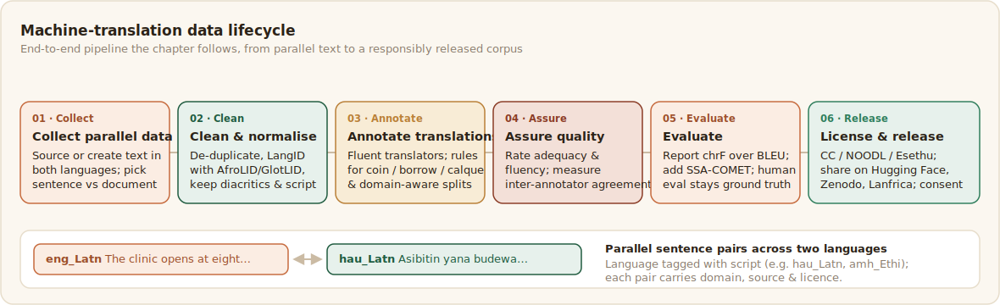

# Machine Translation

Machine translation is one of African NLP's flagship goals and one of its hardest, because it needs parallel data, sentences paired across two languages, that barely exists for most African languages. This chapter follows the pipeline end to end: collecting parallel text, cleaning it, annotating new translations, assuring quality, evaluating, and releasing.



## What machine translation needs, and why African languages make it hard

A machine-translation system learns to map text from a source language to a target language. Modern systems are neural, and the strongest are large multilingual models trained on many language pairs at once, which lets a high-resource pair lend statistical strength to a low-resource one. The applications are immediate for African languages: access to health, government, and education information, and participation in a digital world that defaults to a handful of languages. The obstacle is data. Neural translation is hungry for parallel sentences, and for most African languages there are few, scattered across religious texts, the occasional news site, and government documents. What exists online is often unreliable, since an audit of web-mined data found that for many low-resource languages a large share was mislabelled, machine-translated, or not the language at all ([Kreutzer et al., 2022](../references.md#kreutzer-2022)). The community has answered with purpose-built data. Masakhane's MAFAND showed that a few thousand high-quality human translations in the news domain go a long way ([Adelani et al., 2022b](../references.md#mafand-2022)), Meta's NLLB and its FLORES-200 benchmark extended coverage and evaluation to 200 languages including many African ones ([NLLB Team, 2022](../references.md#nllb-2022)), and efforts such as Toucan and Cheetah now target more than 400 African languages. The lesson is consistent: for African translation, building a small amount of good parallel data beats waiting for the web to supply it.

## Collect parallel data

The first job is finding or creating text that exists in both your source and target language. Common sources are religious translations, since the Bible is the most multilingual text in existence, along with news outlets with multilingual editions, government and health publications, and translations the community produces itself. Decide early whether you are aligning at the sentence level or the document level, because it matters more than it sounds. Most translation data is sentence pairs, but real translation works over whole documents, and the AfriDoc-MT corpus showed that models trained only on sentences struggle to handle longer documents ([AfriDoc-MT, 2025](../references.md#afridocmt-2025)). Choose the domain deliberately as well. A general-domain dataset is broadly useful but shallow, while a domain-specific one serves a concrete need: AfriDoc-MT was built in health and IT, AfriScience-MT in STEM, and the Kallaama corpus in agriculture, each because that domain mattered to its community. When parallel text simply does not exist, the answer is human translation, ideally through the same participatory, native-speaker route the rest of this playbook recommends ([Nekoto et al., 2020](../references.md#nekoto-2020)).

A parallel corpus is, at heart, two aligned sides plus the metadata that lets others trust it. One JSON object per pair keeps the alignment explicit and carries the domain, direction, and provenance that a bare two-column file loses:

```json
{
  "src_lang": "eng_Latn",
  "tgt_lang": "hau_Latn",
  "src": "The clinic opens at eight in the morning.",
  "tgt": "Asibitin yana budewa da karfe takwas na safe.",
  "domain": "health",
  "source": "MAFAND",
  "translator": "native-speaker",
  "license": "CC BY 4.0"
}
```

Naming the languages with their script (`hau_Latn`, `amh_Ethi`) rather than a bare code matters here for the same reason it does elsewhere: several African languages are written in more than one script, and a translation pair is only meaningful once both the language and the script are pinned down.

## Clean and normalise the parallel text

Raw parallel data is noisy, and noise in translation data is doubly harmful, because a bad pair teaches the model a wrong mapping. Clean in stages. Strip HTML and markup, remove exact and near-duplicate pairs before splitting so the same sentence cannot leak from training into test, and drop pairs where one side is empty or wildly mismatched in length. Run language identification on both sides to catch wrong-language and machine-translated segments, using African-aware tools such as AfroLID or GlotLID rather than general detectors that misread African languages. Normalise consistently across punctuation, numbers, and dates, expand abbreviations where it helps, and handle script with care, because African languages are written in Latin, Ge'ez, Ajami, and other scripts, sometimes one language in more than one, and diacritics must be preserved rather than stripped. Finally, re-segment and re-align sentences where the original alignment is unreliable, and filter toxic or harmful content before it reaches annotators or the model.

## Annotate translations

When you create translations rather than mine them, the annotation design decides their quality. Choose translators who are genuinely fluent in both languages and, for specialised domains, familiar with the subject, because a translator who does not know the material will guess. Give clear instructions that cover the hard cases African translators meet constantly: how to handle terms that do not yet exist in the target language, whether to borrow, calque, or coin a new word, and how to treat names, code-switching, and culturally specific content. This is not hypothetical. Building AfriScience-MT, translators working alongside science communicators had to create new scientific terminology in six African languages because none existed ([AfriScience-MT, 2026](../references.md#afriscience-2026)). Capture metadata with every pair, including source, language and variety, translator, version, and licence, and store the dataset in a clean, consistent format. Plan the train, validation, and test split deliberately, because a naive random split can leak near-duplicate sentences or let one domain dominate, while a domain-aware split gives a more honest measure of how the model will do on text it has not seen.

A translation config shows the source sentence and gives the translator a text box for the target. The example below sets that up, and also captures the hard-case decisions the guidelines ask about, so a translator who had to coin a term or borrow a word records which they did:

```xml
<View>
  <Header value="Translate this sentence"/>
  <Text name="source" value="$src"/>

  <TextArea name="translation" toName="source"
            placeholder="Type the translation in the target language"
            rows="3" required="true" editable="true" maxSubmissions="1"/>

  <Choices name="term_handling" toName="source" choice="multiple">
    <Choice value="Coined a new term"/>
    <Choice value="Borrowed from another language"/>
    <Choice value="Calque (literal loan translation)"/>
    <Choice value="Source contains code-switching"/>
  </Choices>
</View>
```

For post-editing rather than translation from scratch, pre-fill the box with a machine-translation draft by adding a `value="$mt_draft"` to the `TextArea` and including an `mt_draft` field in each task. The translator then corrects rather than retypes, which is faster, though it carries the known risk that post-editing can anchor the translator to the machine's phrasing, so it suits routine domains more than creative or culturally loaded text.

Post-editing a machine translation in the AfriAnnotate editor:


## Assure quality

Translation quality control combines automatic filtering with human judgment. Confidence and length-ratio filters can flag suspect pairs for review, but they are no substitute for people. Have native speakers evaluate a sample of the translations for adequacy, meaning whether the translation preserves the source meaning, and fluency, meaning whether it reads naturally, and when several evaluators rate the same items, measure their inter-annotator agreement so you know how reliable the judgments are (see [Data Quality](../4_data-quality/index.md)). Disagreement among evaluators is informative in translation too, since fluency in particular is partly subjective and dialect-dependent.

## Evaluate translation

Report more than one metric, because each measures something different and the cheap ones are weakest exactly where African languages live. [BLEU](https://en.wikipedia.org/wiki/BLEU), the long-time default, counts matching word sequences and is unreliable for morphologically rich languages where a single root takes many surface forms, which describes much of the continent. chrF compares character n-grams instead and handles that morphology far better, which is why it is preferred for African languages ([Popović, 2015](../references.md#popovic-2015)). Learned metrics such as COMET and BERTScore score meaning rather than surface overlap and correlate better with human judgment, and recent work like SSA-COMET adapts this approach specifically to under-resourced African languages ([SSA-COMET, 2025](../references.md#ssa-comet-2025)). No automatic metric is final, though. Human evaluation by native speakers remains the ground truth, and the automatic scores are best read as fast, approximate proxies between human checks.

The practical advice, report chrF before BLEU, is one line of code apart. `sacrebleu` computes both with comparable, shareable settings, and COMET adds a learned score where a model covers the language:

```python
# pip install sacrebleu unbabel-comet
import sacrebleu

hypotheses = ["Asibitin yana budewa da karfe takwas na safe."]
references = [["Asibitin yana budewa da karfe takwas da safe."]]  # list per hyp

chrf = sacrebleu.corpus_chrf(hypotheses, references)
bleu = sacrebleu.corpus_bleu(hypotheses, references)
print(f"chrF2: {chrf.score:.2f}")   # report this first for African languages
print(f"BLEU:  {bleu.score:.2f}")   # report alongside, read with caution

# Learned metric: only meaningful if the model covers the language.
# SSA-COMET is tuned for under-resourced African languages.
from comet import download_model, load_from_checkpoint
model = load_from_checkpoint(download_model("masakhane/ssa-comet"))
data = [{"src": "The clinic opens at eight in the morning.",
         "mt": hypotheses[0],
         "ref": references[0][0]}]
print(f"SSA-COMET: {model.predict(data, gpus=0).system_score:.3f}")
```

Reporting chrF first is the deliberate choice this section argues for: it reflects the character-level morphology that BLEU's word matching misses across most of the continent ([Popović, 2015](../references.md#popovic-2015)). The learned score is the strongest signal when it is available, but only when the model has genuinely seen the language, which is exactly the gap SSA-COMET set out to close ([SSA-COMET, 2025](../references.md#ssa-comet-2025)). Where no metric covers a language, none of these numbers replaces a native speaker reading the output.

## License and release responsibly

A translation dataset is only useful to others if they can find it and are allowed to use it, and only safe to release if it does not expose the people in it. Publish under a clear licence chosen on purpose, whether a Creative Commons licence or one of the African community licences such as NOODL or Esethu that keep benefit with the source community (see [Data Governance](../data-governance/index.md)). Release it where the community will find it, such as Hugging Face, Zenodo, or the Lanfrica catalogue. And attend to the ethics. Get consent for any human-produced translations, avoid training on machine-translated text that will quietly degrade the next model, and remember that a translation system carries representational weight, because the words it normalises become, for many users, the language itself.
