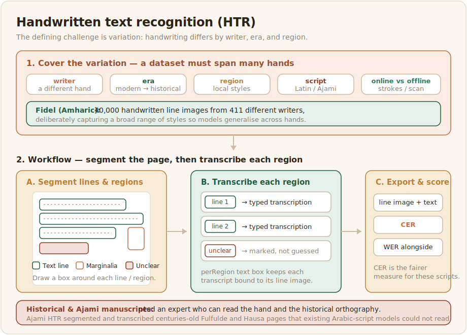

# Handwritten text recognition

Handwritten text recognition (HTR) reads handwriting rather than print. It is harder than OCR because no two hands are alike, and it is especially valuable in Africa, where a great deal of knowledge, from personal and administrative records to centuries of scholarly manuscripts, exists only in handwriting.



## What the data looks like

An HTR dataset pairs images of handwritten lines or pages with their transcriptions. Offline recognition works from a scanned image, while online recognition also captures the pen strokes as they are written, which needs a digitiser but makes the task easier. The defining challenge is variation, since handwriting differs by writer, era, and region, so a dataset has to cover many hands to generalise. Fidel did this for Amharic by collecting 40,000 handwritten line images from 411 different writers, deliberately capturing a broad range of styles ([Fidel, 2025](../references.md#fidel-2025)). The manuscript tradition adds historical depth and difficulty: a handwritten dataset for Ajami manuscripts in Fulfulde and Hausa had to segment and transcribe centuries-old pages that existing Arabic-script models could not read ([Ajami HTR, 2025](../references.md#ajami-htr-2025)).

## Annotation and evaluation

HTR annotation is transcription plus segmentation, since the lines and regions of a handwritten page must be marked before they are transcribed, and historical manuscripts often need an expert who can read both the hand and the historical orthography. Settle conventions for unclear characters, abbreviations, and scribal marks before starting. Like OCR, HTR is evaluated with Character Error Rate as the main metric and Word Error Rate alongside it, with CER again the fairer measure for these scripts.

Because the page must be segmented before it is transcribed, the config does both at once: the annotator draws a box around each line and types its transcription right there, using a per-region text box so each transcript stays attached to the line it belongs to:

```xml
<View>
  <Image name="page" value="$image"/>
  <RectangleLabels name="region" toName="page">
    <Label value="Text line"  background="#1F5B3F"/>
    <Label value="Marginalia" background="#C66A3D"/>
    <Label value="Unclear"    background="#9C4F2B"/>
  </RectangleLabels>
  <TextArea name="transcription" toName="page" perRegion="true"
            editable="true" rows="2"
            placeholder="Transcribe this line, following the manuscript conventions"/>
</View>
```

The `perRegion="true"` attribute is what binds a transcription to its box, so the export gives you each line image region together with its text, ready to score with the same CER tooling as OCR. The `Unclear` label gives an expert reading a faded or damaged manuscript an honest way to mark what cannot be read with confidence, rather than guessing.
