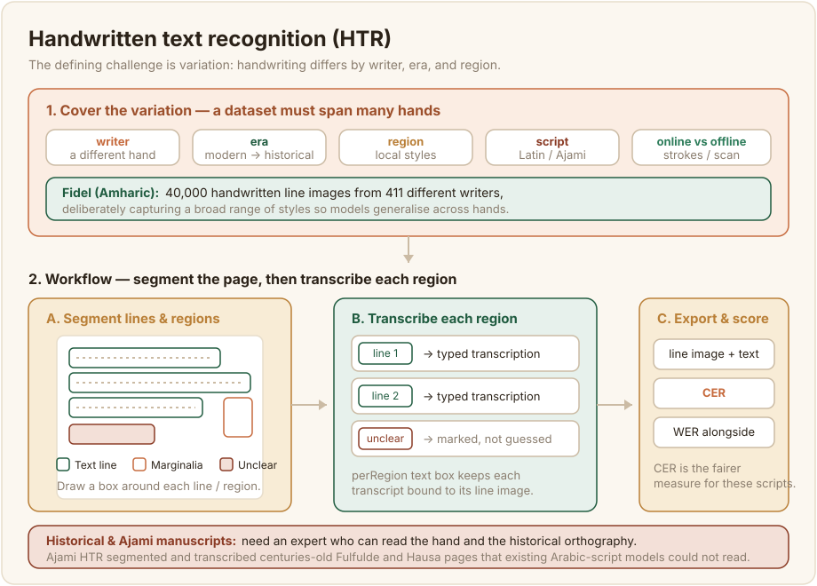

# Handwritten text recognition

*Last reviewed: 2026-07-07.*

Handwritten text recognition (HTR) reads handwriting rather than print. It is harder than OCR because no two hands are alike, and it is especially valuable in Africa, where a great deal of knowledge, from personal and administrative records to centuries of scholarly manuscripts, exists only in handwriting.



## What the data looks like

An HTR dataset pairs images of handwritten lines or pages with their transcriptions. Offline recognition works from a scanned image, while online recognition also captures the pen strokes as they are written, which needs a digitiser but makes the task easier. The defining challenge is variation, since handwriting differs by writer, era, and region, so a dataset has to cover many hands to generalise. Fidel did this for Amharic by collecting 40,000 handwritten line images from 411 different writers, deliberately capturing a broad range of styles ([Fidel, 2025](../references.md#fidel-2025)). The manuscript tradition adds historical depth and difficulty: a handwritten dataset for Ajami manuscripts in Fulfulde and Hausa had to segment and transcribe centuries-old pages that existing Arabic-script models could not read ([Ajami HTR, 2025](../references.md#ajami-htr-2025)).

## Annotation and evaluation

HTR annotation is transcription plus segmentation, since the lines and regions of a handwritten page must be marked before they are transcribed, and historical manuscripts often need an expert who can read both the hand and the historical orthography. Settle conventions for unclear characters, abbreviations, and scribal marks before starting. Like OCR, HTR is evaluated with Character Error Rate as the main metric and Word Error Rate alongside it, with CER again the fairer measure for these scripts.

Because the page must be segmented before it is transcribed, the config does both at once: the annotator draws a box around each line and types its transcription right there, using a per-region text box so each transcript stays attached to the line it belongs to:

```xml
<View>
  <Image name="page" value="$image"/>
  <RectangleLabels name="region" toName="page">
    <Label value="Text line"  background="#1F5B3F"/>
    <Label value="Marginalia" background="#C66A3D"/>
    <Label value="Unclear"    background="#9C4F2B"/>
  </RectangleLabels>
  <TextArea name="transcription" toName="page" perRegion="true"
            editable="true" rows="2"
            placeholder="Transcribe this line, following the manuscript conventions"/>
</View>
```

The `perRegion="true"` attribute is what binds a transcription to its box, so the export gives you each line image region together with its text, ready to score with the same CER tooling as OCR. The `Unclear` label gives an expert reading a faded or damaged manuscript an honest way to mark what cannot be read with confidence, rather than guessing.

## The 2026 modelling landscape

Handwriting recognition in 2026 sits between three model families:

- **[TrOCR](https://arxiv.org/abs/2109.10282)** (Microsoft, 2021) and its multilingual variants — a vision-encoder-plus-text-decoder architecture purpose-built for HTR, MIT-licensed, still the workable open reference for line-level handwritten recognition. Fine-tuning on ~5,000-10,000 target-language line images is the shortest path from an existing TrOCR checkpoint to a usable model on a new hand.
- **[Kraken](https://kraken.re/)** — the reference open engine for historical HTR, including non-Latin scripts. Widely used by digital-humanities projects to train on decades or centuries of scanned handwriting. Its `ketos` training tool is the workable path for Ajami, Ge'ez, and other historical African-script manuscripts where TrOCR's Western-handwriting bias makes fine-tuning fragile.
- **[GOT-OCR 2.0](https://arxiv.org/abs/2409.01704)** and general MLLMs (Qwen2.5-VL, InternVL 3) — capable of handwriting recognition as one of many tasks, noisier per-character than dedicated HTR engines but strong when the task requires joint reading + structured extraction (e.g., transcribing a manuscript and identifying scribal marks or marginalia in the same pass).

**Editorial opinion.** For a new African-language HTR project on **contemporary Latin-script handwriting** (school records, health surveys, field notes), the shortest defensible path is: fine-tune TrOCR on 5,000-10,000 target-domain line images, evaluate against a Kraken-trained baseline for the same script, and report CER with and without diacritic normalisation. For **historical Ge'ez / Amharic manuscripts**, Kraken with a Fidel-lineage handwriting model is the workable frontier. For **Ajami manuscripts** (Fulfulde, Hausa, Wolof), Kraken with a manuscript-tradition-specific training set is the honest path — the general Arabic-script HTR lineage is not adequate.

The **online HTR** case (pen-stroke capture) is less common in African deployments because the required digitising hardware is expensive, but where it is available the accuracy floor is much higher — 5-10x lower CER for the same script, at the cost of hardware and the requirement that the handwriting happen live.

## What it will actually cost you

HTR is more expensive than OCR at every scale because handwriting variation forces more per-record transcription time and more model-training iterations. Rough order-of-magnitude:

- **Fine-tuning TrOCR or Kraken on an existing corpus** (Fidel handwritten, Ajami HTR). Two to four person-weeks of engineering; twenty to eighty GPU-hours across the candidate models.
- **Collecting a new contemporary-handwriting corpus** (5,000-10,000 line images from 50-200 writers). Six to twelve months elapsed; four to ten person-months. Recruiting writers with varied hands is the slow part — a corpus with 100 writers behaves very differently from a corpus with 10 even at the same line count.
- **Building a manuscript-tradition HTR corpus** (Ge'ez, Ajami, or comparable) — 5,000-20,000 line images. Two to five years elapsed; ten to forty person-months. Requires an expert who can read the historical hand; recruiting such experts is the constraint, not the transcription work itself.
- **Evaluation-only HTR set** (500-1,500 line images). Three to six months; two to five person-months.
- **Human evaluation of HTR output.** Two to four person-weeks per evaluator per 200 items — HTR evaluation is slow because uncertain characters, marginalia, and scribal marks all require judgement.

## Known limitations to watch for

- **Writer variation dominates.** A model trained on 5,000 lines from 10 writers will fail on the 11th writer. Corpus size in *writers* matters more than corpus size in *lines*. Report cross-writer CER, not just headline CER.
- **Historical orthography drift.** A model trained on 21st-century handwriting will misread 20th-century marginalia; a model trained on 20th-century material will misread 19th-century manuscripts. Split evaluation by period.
- **Ligatures and contextual shapes.** Ajami, Ge'ez, and Tifinagh all have contextual character forms — the same base character shapes differently depending on its neighbours. Character-level tokenisation that assumes one-shape-per-character fails silently on these scripts.
- **Marginalia are a separate task.** Manuscript marginalia, footnotes, and interlinear glosses often use a different hand, script size, and even language from the main text. Treat them as a separate labelling and evaluation surface.
- **Damaged or faded material.** A model that reports 5% CER on clean material reports 30-50% CER on faded, water-damaged, or torn material — and the failure mode is confident hallucination, not honest uncertainty. Use the `Unclear` label liberally in ground truth; do not train on uncertain characters.
- **Cursive vs. print handwriting.** Latin-script HTR corpora often mix print handwriting (block letters written by hand) and cursive; models trained on one perform poorly on the other. Segment your corpus.
- **Consent and provenance for personal handwritten material.** School records, medical charts, personal correspondence — all carry PII in the handwriting itself. Governance for HTR corpora is closer to health-data governance than to book-scan governance.

## Further reading

- [Fidel paper (2025)](https://arxiv.org/abs/) — the reference Amharic HTR corpus with 40,000 line images from 411 writers; required reading for any Ge'ez-family HTR project.
- [Ajami HTR (2025)](https://arxiv.org/abs/) — the reference Ajami-manuscript HTR corpus for Fulfulde and Hausa; the methodological reference for historical African-script manuscript HTR.
- [TrOCR paper (Li et al., 2021)](https://arxiv.org/abs/2109.10282) — the workable open baseline architecture for line-level HTR; fine-tuning recipes are the reference for most contemporary HTR projects.

<details>
<summary>Additional references</summary>

- [Kraken (Kiessling, 2019)](https://kraken.re/) — the reference open engine for historical and non-Latin script HTR; `ketos` training tool is the workable path for Ajami and Ge'ez manuscripts.
- [GOT-OCR 2.0 (Wei et al., 2024)](https://arxiv.org/abs/2409.01704) — the MLLM approach useful when the HTR task requires joint reading + structured extraction.
- [IAM Handwriting Database](https://fki.tic.heia-fr.ch/databases/iam-handwriting-database) — the reference (English) handwriting corpus most TrOCR pretraining uses; useful for calibration.

</details>
