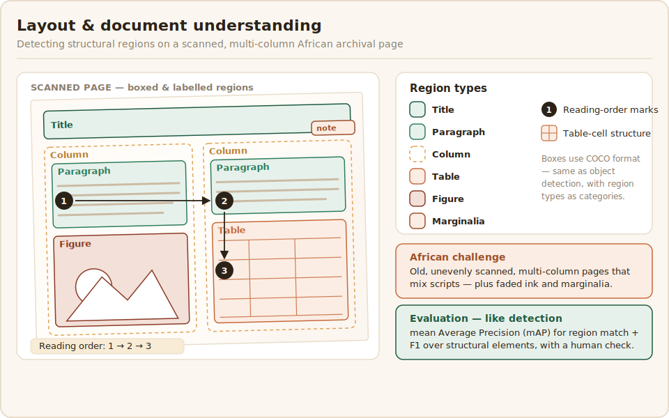

# Layout & document understanding

Layout and document understanding recovers the structure of a document, not just its text: which parts are titles, paragraphs, columns, tables, and figures, and how they relate. It is what turns a flat OCR transcript into something usable, and it matters most for the complex documents African digitisation actually deals with, such as multi-column newspapers, government forms, and archival records.



## What the data looks like

A layout dataset is document images annotated with labelled regions, boxes or polygons marking each structural element, and often the reading order and table structure on top. The African challenge is less about script than about source: many target documents are old, scanned unevenly, multi-column, and mix languages and scripts on a single page, which defeats models trained on clean modern business documents. Archival material in particular, with its faded ink, marginalia, and irregular layouts, needs data collected from the real archives rather than borrowed from elsewhere.

## Annotation and evaluation

Annotating layout means drawing and labelling regions, the same skill as object detection but with a document-specific label set, plus marking reading order and table cells where the task needs them. The guidelines must define each region type and how to handle overlap and nesting. Layout analysis is evaluated like detection, with [mean Average Precision](https://lightning.ai/docs/torchmetrics/stable/detection/mean_average_precision.html) for how well predicted regions match the true ones and with [F1](https://en.wikipedia.org/wiki/F-score) over structural elements, supported as always by a human check on a sample.

The config is object detection with a document-specific label set: the annotator boxes each region and labels what it is:

```xml
<View>
  <Image name="page" value="$image"/>
  <RectangleLabels name="layout" toName="page">
    <Label value="Title"      background="#1F5B3F"/>
    <Label value="Paragraph"  background="#2E7D5B"/>
    <Label value="Column"     background="#E0A458"/>
    <Label value="Table"      background="#C66A3D"/>
    <Label value="Figure"     background="#945ECF"/>
    <Label value="Marginalia" background="#9C4F2B"/>
  </RectangleLabels>
</View>
```

Because the regions are boxes, the data uses the same COCO format and the same mAP scoring as [object detection](../image-data/object-detection.md), only with these document region types as the categories. Where the task also needs reading order or table-cell structure, capture those as added fields rather than trying to encode them in the boxes alone.
