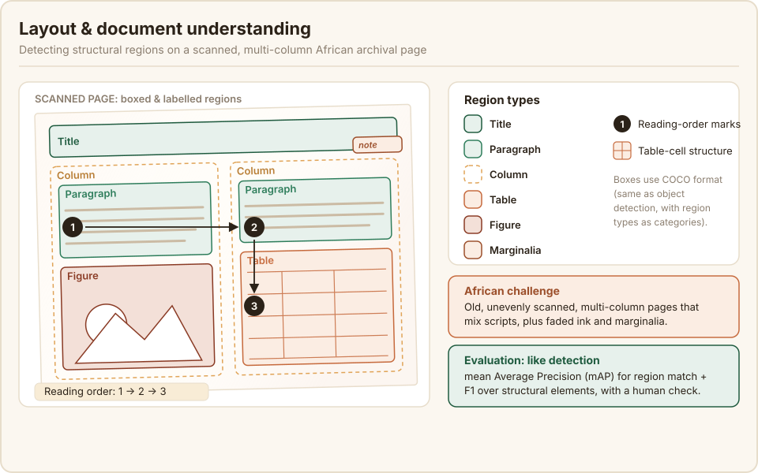

# Layout & document understanding

*Last reviewed: 2026-07-07.*

Layout and document understanding recovers the structure of a document, not just its text: which parts are titles, paragraphs, columns, tables, and figures, and how they relate. It is what turns a flat OCR transcript into something usable, and it matters most for the complex documents African digitisation actually deals with, such as multi-column newspapers, government forms, and archival records.



## What the data looks like

A layout dataset is document images annotated with labelled regions, boxes or polygons marking each structural element, and often the reading order and table structure on top. The African challenge is less about script than about source: many target documents are old, scanned unevenly, multi-column, and mix languages and scripts on a single page, which defeats models trained on clean modern business documents. Archival material in particular, with its faded ink, marginalia, and irregular layouts, needs data collected from the real archives rather than borrowed from elsewhere.

## Annotation and evaluation

Annotating layout means drawing and labelling regions, the same skill as object detection but with a document-specific label set, plus marking reading order and table cells where the task needs them. The guidelines must define each region type and how to handle overlap and nesting. Layout analysis is evaluated like detection, with [mean Average Precision](https://lightning.ai/docs/torchmetrics/stable/detection/mean_average_precision.html) for how well predicted regions match the true ones and with [F1](https://en.wikipedia.org/wiki/F-score) over structural elements, supported as always by a human check on a sample.

The config is object detection with a document-specific label set: the annotator boxes each region and labels what it is:

```xml
<View>
  <Image name="page" value="$image"/>
  <RectangleLabels name="layout" toName="page">
    <Label value="Title"      background="#1F5B3F"/>
    <Label value="Paragraph"  background="#2E7D5B"/>
    <Label value="Column"     background="#E0A458"/>
    <Label value="Table"      background="#C66A3D"/>
    <Label value="Figure"     background="#945ECF"/>
    <Label value="Marginalia" background="#9C4F2B"/>
  </RectangleLabels>
</View>
```

Because the regions are boxes, the data uses the same COCO format and the same mAP scoring as [object detection](../image-data/object-detection.md), only with these document region types as the categories. Where the task also needs reading order or table-cell structure, capture those as added fields rather than trying to encode them in the boxes alone.

## The 2026 modelling landscape

Layout analysis in 2026 sits between three model families:

- **Purpose-built layout models.** **[LayoutLMv3](https://arxiv.org/abs/2204.08387)** (Microsoft, 2022) is the widely-used open reference for document understanding, jointly modelling text + layout + image, MIT-licensed. **[DiT (Document Image Transformer)](https://arxiv.org/abs/2203.02378)** provides the image backbone for layout tasks specifically. Both fine-tune well on 500-2,000 target-domain pages for a new document class.
- **End-to-end document parsers.** **[Donut](https://arxiv.org/abs/2111.15664)** (NAVER, 2022) is an OCR-free document understanding transformer — reads the page image directly and produces structured output, MIT-licensed. **[Nougat](https://arxiv.org/abs/2308.13418)** (Meta, 2023) targets scientific and technical documents specifically, useful for the academic and historical-scholarly African material where equations and tables are common. **[Surya](https://github.com/VikParuchuri/surya)** produces layout regions and reading order as part of its OCR pipeline, GPL-3.0 licensed.
- **General MLLMs.** **[GOT-OCR 2.0](https://arxiv.org/abs/2409.01704)**, **[Qwen2.5-VL](https://qwenlm.github.io/blog/qwen2.5-vl/)**, and **[InternVL 3](https://github.com/OpenGVLab/InternVL)** all produce structured outputs (tables, forms, marginalia) as part of general document reading. Noisier than dedicated models for pure layout detection, but superior when the downstream task is instruction-following ("extract the header row of every table on this page").

**Editorial opinion.** For a new African-language layout project on **contemporary printed material** (newspapers, government forms, health surveys), the shortest defensible path is: measure Surya's layout output and DiT/LayoutLMv3 baselines on 200-500 target-domain pages, and fine-tune LayoutLMv3 on 500-2,000 annotated pages if the out-of-box mAP is below 0.6 for your target region types. For **historical archival material**, dedicated fine-tuning on archive-representative pages is required — general models trained on modern business documents systematically mishandle marginalia, faded regions, and mixed-script pages. For **multi-column newspapers**, Surya's reading-order output is the honest baseline; measure it before treating reading-order as a separate task.

**Closed-API baselines.** **Azure Document Intelligence**, **Google Document AI**, and **Amazon Textract** all provide layout + table extraction with varying African-material coverage. They handle clean modern business documents well; they fail systematically on archival material, multi-column newspapers, and mixed-script pages. Use as ceiling reference for research, not deployment surface unless the target document class has been validated in advance.

## What it will actually cost you

Layout annotation is faster per-region than transcription but slower per-page than pure classification because every region is a bounding box plus a label. Rough order-of-magnitude:

- **Fine-tuning LayoutLMv3 on an existing layout corpus.** One to three person-weeks of engineering; twenty to sixty GPU-hours.
- **Annotating a new layout corpus** for a new document class (500-2,000 pages). Four to nine months elapsed; three to seven person-months. Throughput is ~15-30 pages per annotator per day for a moderate label set.
- **Adding reading-order annotation** on top of layout regions. 30-50% additional annotation time per page.
- **Adding table-cell structure** on top of layout regions. 100-200% additional annotation time per page containing tables — table structure is genuinely slow.
- **Evaluation-only layout set** (300-1,000 pages). Two to five months; two to four person-months.
- **Human evaluation of layout output.** One to two person-weeks per evaluator per 200 pages — layout evaluation is fast because the correctness of each region is visually obvious.

## Known limitations to watch for

- **Business documents ≠ African archival material.** LayoutLMv3 is trained on FUNSD, CORD, and modern receipt / form corpora. Its priors do not transfer to 1970s government gazettes or church records.
- **Multi-column reading order is not solved.** Even 2026 models get column-order wrong on unusual layouts — three-column newspapers with a half-page advertisement in the middle produce systematic reading-order failures. Report reading-order accuracy separately from region mAP.
- **Mixed-script pages break most models.** A page that mixes Latin and Ge'ez, or Latin and Ajami, or Latin and Tifinagh, produces region-detection failures on the script the model was not trained on. Segment training data by script mix.
- **Marginalia are their own task.** Marginalia interact with layout at every level — position (edge of page, in the gutter), reading order (before or after the main text?), and content (glosses, corrections, ownership marks). Do not treat them as regular text regions.
- **Table extraction is a separate benchmark.** Layout region detection tells you *where* the table is; table structure recognition tells you *what* is in each cell. Do not conflate the two in evaluation.
- **Historical documents drift orthographically and typographically.** Layout models trained on a corpus that spans the 20th century must be evaluated split by decade — a model that scores mAP 0.8 overall may score 0.4 on the earliest decade and hide the failure in the average.
- **Downstream OCR quality dominates.** A perfect layout model feeding a mediocre OCR model produces mediocre document output. Report end-to-end document quality (OCR-in-region CER) alongside layout mAP.

## Further reading

- [LayoutLMv3 paper (Huang et al., 2022)](https://arxiv.org/abs/2204.08387) — the widely-used open document-understanding model; the reference fine-tuning recipe for African-language layout projects.
- [Donut paper (Kim et al., 2022)](https://arxiv.org/abs/2111.15664) — the OCR-free document parsing approach; useful when the downstream task is instruction-following on document images.
- [Surya (Paruchuri, 2024-2026)](https://github.com/VikParuchuri/surya) — the strongest current open OCR + layout + reading-order release; the workable modern baseline for African-language document processing.

<details>
<summary>Additional references</summary>

- [Nougat (Blecher et al., 2023)](https://arxiv.org/abs/2308.13418) — the scientific-document parser; useful for African academic and scholarly material with equations and tables.
- [DiT (Li et al., 2022)](https://arxiv.org/abs/2203.02378) — the document-image backbone used by many layout models.
- [FUNSD dataset](https://guillaumejaume.github.io/FUNSD/) — the reference form-understanding benchmark most layout models are trained on; useful for calibration.
- [PubLayNet (Zhong et al., 2019)](https://arxiv.org/abs/1908.07836) — the large-scale reference document-layout benchmark; useful for calibration and cross-corpus comparison.

</details>
