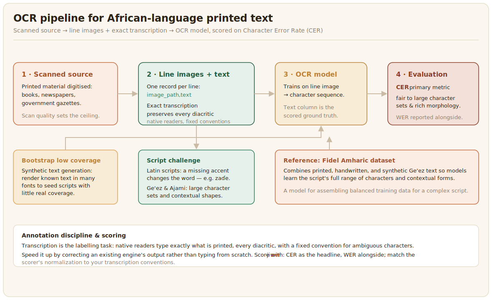

# OCR

Optical character recognition (OCR) converts images of printed text into machine-readable characters. For African languages it is the cheapest way to turn the large stock of printed material, books, newspapers, and government gazettes, into usable text data, which makes it a multiplier for every text task downstream.



## What the data looks like

An OCR dataset pairs images of text, usually at the line or page level, with their exact transcriptions. The images come from scanning printed sources, and the quality of the scan sets the ceiling on the result. The hard part for African languages is the script. Latin-based African languages need every diacritic transcribed faithfully, since a missing accent changes the word, while syllabic and Arabic-derived scripts like Ge'ez and Ajami have large character sets and contextual shapes that general OCR engines never learned. The Fidel dataset addressed this for Amharic by collecting printed, handwritten, and synthetic text together so models could learn the script's full range ([Fidel, 2025](../references.md#fidel-2025)). Synthetic text generation, rendering known text in many fonts, is a useful way to bootstrap data for a script with little real coverage.

The data is usually organised as line images paired with their exact transcription, one record per line:

```text
image_path,text
lines/gazette_0001.png,Hukumar zaɓe ta sanar da sakamakon zaɓe.
lines/gazette_0002.png,An gudanar da zaɓen cikin lumana.
```

The transcription must preserve every diacritic and special character exactly as printed, since for OCR the text column is the ground truth the model is scored against, and a dropped accent there teaches and then rewards the wrong spelling.

## Annotation and evaluation

For OCR the annotation is transcription, the same discipline as in [speech](../asr/index.md): native readers, exact diacritics, and a fixed convention for ambiguous characters. The work can be sped up by correcting an existing OCR engine's output rather than typing from scratch, as long as the corrections are careful. OCR is evaluated by error rate against the reference, with Character Error Rate (CER) the primary measure because it is fair to the large character sets and rich morphology of African scripts, and Word Error Rate (WER) reported alongside it.

The transcription config shows a line image and a text box, with the guideline to type exactly what is printed:

```xml
<View>
  <Image name="page" value="$image"/>
  <TextArea name="transcript" toName="page" rows="3"
            editable="true" required="true"
            placeholder="Transcribe the text exactly, including every diacritic"/>
</View>
```

Scoring is identical to the ASR case: feed the reference and predicted transcripts to `jiwer` and read CER as the headline, WER alongside. The worked snippet and the caution about matching the scorer's normalization to your transcription conventions are on the [ASR](../asr/index.md) page and apply here unchanged.

Drawing a text region on a page and transcribing it, in the AfriAnnotate editor:


