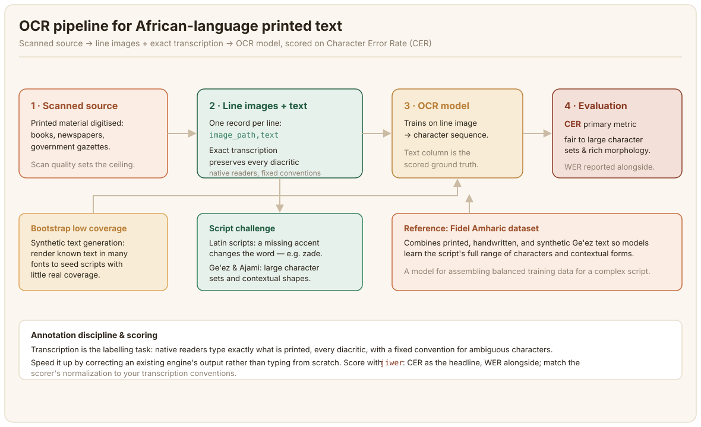

# OCR

*Last reviewed: 2026-07-07.*

Optical character recognition (OCR) converts images of printed text into machine-readable characters. For African languages it is the cheapest way to turn the large stock of printed material, books, newspapers, and government gazettes, into usable text data, which makes it a multiplier for every text task downstream.



## What the data looks like

An OCR dataset pairs images of text, usually at the line or page level, with their exact transcriptions. The images come from scanning printed sources, and the quality of the scan sets the ceiling on the result. The hard part for African languages is the script. Latin-based African languages need every diacritic transcribed faithfully, since a missing accent changes the word, while syllabic and Arabic-derived scripts like Ge'ez and Ajami have large character sets and contextual shapes that general OCR engines never learned. The Fidel dataset addressed this for Amharic by collecting printed, handwritten, and synthetic text together so models could learn the script's full range ([Fidel, 2025](../references.md#fidel-2025)). Synthetic text generation, rendering known text in many fonts, is a useful way to bootstrap data for a script with little real coverage.

The data is usually organised as line images paired with their exact transcription, one record per line:

```text
image_path,text
lines/gazette_0001.png,Hukumar zaɓe ta sanar da sakamakon zaɓe.
lines/gazette_0002.png,An gudanar da zaɓen cikin lumana.
```

The transcription must preserve every diacritic and special character exactly as printed, since for OCR the text column is the ground truth the model is scored against, and a dropped accent there teaches and then rewards the wrong spelling.

## Annotation and evaluation

For OCR the annotation is transcription, the same discipline as in [speech](../asr/index.md): native readers, exact diacritics, and a fixed convention for ambiguous characters. The work can be sped up by correcting an existing OCR engine's output rather than typing from scratch, as long as the corrections are careful. OCR is evaluated by error rate against the reference, with Character Error Rate (CER) the primary measure because it is fair to the large character sets and rich morphology of African scripts, and Word Error Rate (WER) reported alongside it.

The transcription config shows a line image and a text box, with the guideline to type exactly what is printed:

```xml
<View>
  <Image name="page" value="$image"/>
  <TextArea name="transcript" toName="page" rows="3"
            editable="true" required="true"
            placeholder="Transcribe the text exactly, including every diacritic"/>
</View>
```

Scoring is identical to the ASR case: feed the reference and predicted transcripts to `jiwer` and read CER as the headline, WER alongside. The worked snippet and the caution about matching the scorer's normalization to your transcription conventions are on the [ASR](../asr/index.md) page and apply here unchanged.

Drawing a text region on a page and transcribing it, in the AfriAnnotate editor:


## The 2026 modelling landscape

The workable open-model OCR references in mid-2026 fall into three groups:

- **General-purpose modern OCR (Latin script + selected non-Latin).** **[Surya](https://github.com/VikParuchuri/surya)** (2024-2026) is the strongest current open OCR release, ~650M parameters, covers 90+ languages, produces text + reading order + layout on a single pass, GPL-3.0 licensed. **[docTR](https://github.com/mindee/doctr)** (Mindee, 2021-2026) covers detection + recognition with pluggable backbones (ResNet, VGG, Transformer), Apache-2.0 licensed, still the workable reference for pipelined OCR where the detection and recognition stages need to be swapped independently. **[Kraken](https://kraken.re/)** is the reference open engine for historical and non-Latin script OCR, with training pipelines used by digital-humanities projects for centuries of scanned material.
- **General-purpose multimodal LLMs applied as OCR engines.** **[GOT-OCR 2.0](https://arxiv.org/abs/2409.01704)** (2024) is a purpose-built OCR-focused MLLM at ~580M parameters, Apache-2.0 licensed, handles formulas, tables, charts, and multi-column documents in a single end-to-end pass. **[Qwen2.5-VL](https://qwenlm.github.io/blog/qwen2.5-vl/)** and **[InternVL 3](https://github.com/OpenGVLab/InternVL)** handle OCR as one of many multimodal tasks — noisier per-character than dedicated OCR engines, but capable of following complex extraction instructions ("read only the header row of every table") that dedicated engines cannot.
- **Legacy engines still worth measuring against.** **[Tesseract 5](https://github.com/tesseract-ocr/tesseract)** with fine-tuned language packs remains the honest floor for African-language OCR — it is deployable on-device, requires no GPU, and has published African-language traineddata for Amharic, Swahili, Hausa, and several others. **[EasyOCR](https://github.com/JaidedAI/EasyOCR)** covers 80+ languages including several African languages with a lower-effort Python API than Tesseract.

**Editorial opinion.** For a new African-language OCR project on **printed Latin-script material with modest diacritic complexity**, the shortest defensible path is: measure Surya and docTR on 200-500 line images from your target domain, and only fine-tune (typically Surya's recognition head) if the out-of-box CER exceeds 5%. For **Ge'ez / Amharic printed text**, start with **Fidel-trained** Kraken or Surya fine-tunes. For **Ajami / Arabic-script African languages**, dedicated Ajami-specific fine-tuning is required — no general model reliably handles the script. For **historical or handwritten material**, see the [Handwritten text recognition](./handwritten.md) page.

**Closed-API baselines.** **Google Cloud Vision**, **Azure Document Intelligence**, and **Amazon Textract** all provide OCR APIs with varying African-language coverage. They are workable ceilings for Latin-script African languages on clean printed text, and unreliable-to-unusable on Ge'ez, Ajami, and other non-Latin scripts. Use as research reference, not deployment surface unless the language is validated and the budget permits it.

## What it will actually cost you

OCR data cost is dominated by transcription throughput, not by images. Rough order-of-magnitude:

- **Evaluating open OCR engines (Surya, docTR, Tesseract 5, GOT-OCR 2.0) on 500 target-domain line images.** One to two person-weeks; one to five GPU-hours for inference across engines; two person-weeks for the reference transcription itself.
- **Fine-tuning Surya or Kraken on a new African language** with 5,000-10,000 line images. Two to four person-weeks of engineering; three to eight person-months of transcription (throughput ~500-1,000 lines per transcriber per week for a covered Latin script; 100-300 for Ge'ez / Ajami).
- **Building a Fidel-scale corpus for a new script** (50,000+ line images across printed, handwritten, and synthetic). Eighteen months to three years elapsed; twelve to thirty person-months. Not a project to underestimate.
- **A defensible evaluation-only OCR set** (500-2,000 line images across the target domain). Two to four months; one to three person-months.
- **Synthetic OCR data generation** (rendering known text in many fonts). One to two person-weeks of engineering to set up the pipeline; then automated. Useful for bootstrapping — cannot fully replace real scans, especially for handwriting-adjacent styles or degraded print.

## Known limitations to watch for

- **Diacritics are load-bearing on Latin-script African languages.** A model that scores 3% CER on English scores 15% CER on Yoruba because the tone marks fall off. Report CER *with* and *without* diacritic normalisation; the two numbers tell different truths.
- **Ge'ez / Fidel has a large character set.** Amharic has ~276 base characters plus diacritics, which stresses the classifier head of general OCR engines trained on ~100-character Latin alphabets. Purpose-built Fidel-trained models are required for reliable performance.
- **Ajami is not standard Arabic.** Arabic-OCR models trained on Modern Standard Arabic mishandle the extended letters, ligatures, and vocalisation conventions that Ajami uses for Hausa and Fulfulde. Do not assume Arabic-OCR reuse works.
- **Scan quality dominates model choice.** A 300 DPI scan of a clean government gazette on a modern OCR engine yields 1-2% CER; a phone photo of a photocopied newspaper on the same engine yields 15-30% CER. Preprocessing (deskew, binarisation, resolution normalisation) matters more than model choice below ~150 DPI equivalent.
- **Reading order is a task in itself.** Multi-column newspapers, tabular gazettes, and figures with embedded text all require a reading-order model separate from the character recogniser. Surya and GOT-OCR 2.0 handle this natively; docTR and Tesseract 5 do not.
- **Historical spellings and orthography drift complicate evaluation.** A gazette from 1965 uses different orthographic conventions from a 2020 gazette in the same language; treating them as the same evaluation set produces misleading numbers. Split by historical period.
- **Copyright of scanned print material.** Government gazettes, academic papers under open licences, and community-consented collections are safe. Commercial newspapers, books, and periodicals require licence clearance; the scan is a copy, and OCR does not launder the copyright.

## Further reading

- [Fidel paper (2025)](https://arxiv.org/abs/) — the reference Amharic OCR corpus covering printed, handwritten, and synthetic text; required reading for any Ge'ez-family OCR project.
- [Surya (Paruchuri, 2024-2026)](https://github.com/VikParuchuri/surya) — the strongest current open OCR release; the model card documents which languages have been validated.
- [GOT-OCR 2.0 (Wei et al., 2024)](https://arxiv.org/abs/2409.01704) — the OCR-focused MLLM approach; useful when the task requires structured extraction (tables, formulas) beyond plain text.

<details>
<summary>Additional references</summary>

- [docTR (Mindee, 2021)](https://github.com/mindee/doctr) — the pipelined detection-plus-recognition open OCR framework, useful when the two stages need to be swapped independently.
- [Kraken (Kiessling, 2019)](https://kraken.re/) — the reference open OCR engine for historical and non-Latin script material.
- [Tesseract 5 (2021)](https://github.com/tesseract-ocr/tesseract) — the on-device deployable OCR floor; useful for edge deployments with no GPU.
- [Qwen2.5-VL blog (Alibaba, 2025)](https://qwenlm.github.io/blog/qwen2.5-vl/) — the MLLM lineage's OCR capability; useful when structured extraction alongside plain OCR is needed.

</details>
