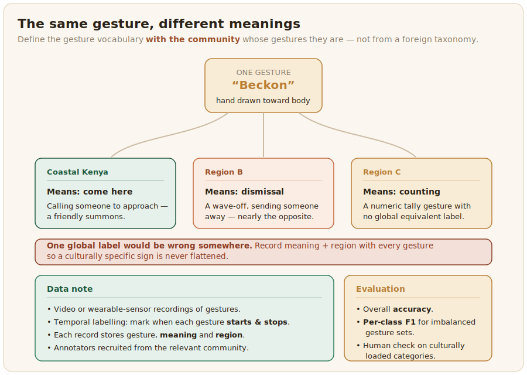

# Gesture

Gesture recognition reads the hand and body movements that accompany or replace speech. It overlaps with sign language but is broader and looser: a gesture is usually a single meaningful movement, such as a wave, a count on the fingers, or a culturally specific sign, rather than a full grammatical language.



## What the data looks like

Gesture data is video or sensor recordings of gestures, labelled with what each one means. The labels can come from cameras or from wearable sensors that capture motion directly. The African-specific point is that gesture is cultural: the same movement can mean different things in different places, and many meaningful gestures in African communities have no equivalent in datasets built elsewhere. A gesture vocabulary has to be defined with the community whose gestures they are, rather than assumed from a foreign taxonomy, or the dataset will encode the wrong meanings.

A record names the gesture and, importantly, the meaning and region it was defined in, since the same movement can mean different things in different places:

```json
{
  "video": "clips/gesture_0007.mp4",
  "gesture": "beckon",
  "meaning": "calling someone to approach",
  "region": "coastal Kenya",
  "annotator": "community_member_03"
}
```

Recording the region alongside the meaning is what keeps a culturally specific gesture from being flattened into a single global label that would be wrong somewhere else.

## Annotation and evaluation

Annotating gesture is marking which gesture occurs and, in continuous video, when it starts and stops, which makes it a temporal labelling task with the same boundary-ambiguity issues as audio events. Define the gesture set and its cultural meanings clearly, recruit annotators from the relevant community, and measure agreement on shared clips. The config marks which gesture occurs and, on the timeline, when it starts and stops:

```xml
<View>
  <Video name="video" value="$video"/>
  <Labels name="gesture" toName="video">
    <Label value="Beckon" background="#1F5B3F"/>
    <Label value="Refuse" background="#C66A3D"/>
    <Label value="Count"  background="#E0A458"/>
  </Labels>
</View>
```

Gesture recognition is evaluated with accuracy and [F1](https://en.wikipedia.org/wiki/F-score), with per-class reporting where the gesture set is imbalanced, and a human check for the culturally loaded categories that automatic scores cannot judge.
