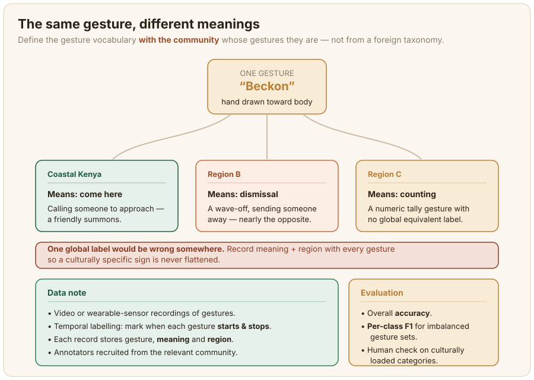

# Gesture

*Last reviewed: 2026-07-07.*

Gesture recognition reads the hand and body movements that accompany or replace speech. It overlaps with sign language but is broader and looser: a gesture is usually a single meaningful movement, such as a wave, a count on the fingers, or a culturally specific sign, rather than a full grammatical language.



## What the data looks like

Gesture data is video or sensor recordings of gestures, labelled with what each one means. The labels can come from cameras or from wearable sensors that capture motion directly. The African-specific point is that gesture is cultural: the same movement can mean different things in different places, and many meaningful gestures in African communities have no equivalent in datasets built elsewhere. A gesture vocabulary has to be defined with the community whose gestures they are, rather than assumed from a foreign taxonomy, or the dataset will encode the wrong meanings.

A record names the gesture and, importantly, the meaning and region it was defined in, since the same movement can mean different things in different places:

```json
{
  "video": "clips/gesture_0007.mp4",
  "gesture": "beckon",
  "meaning": "calling someone to approach",
  "region": "coastal Kenya",
  "annotator": "community_member_03"
}
```

Recording the region alongside the meaning is what keeps a culturally specific gesture from being flattened into a single global label that would be wrong somewhere else.

## Annotation and evaluation

Annotating gesture is marking which gesture occurs and, in continuous video, when it starts and stops, which makes it a temporal labelling task with the same boundary-ambiguity issues as audio events. Define the gesture set and its cultural meanings clearly, recruit annotators from the relevant community, and measure agreement on shared clips. The config marks which gesture occurs and, on the timeline, when it starts and stops:

```xml
<View>
  <Video name="video" value="$video"/>
  <Labels name="gesture" toName="video">
    <Label value="Beckon" background="#1F5B3F"/>
    <Label value="Refuse" background="#C66A3D"/>
    <Label value="Count"  background="#E0A458"/>
  </Labels>
</View>
```

Gesture recognition is evaluated with accuracy and [F1](https://en.wikipedia.org/wiki/F-score), with per-class reporting where the gesture set is imbalanced, and a human check for the culturally loaded categories that automatic scores cannot judge.

## The 2026 modelling landscape

Gesture recognition in 2026 sits at a genuinely different scale from sign language — the tasks are looser, the label sets smaller, and the throughput per corpus much higher. The workable open-model references:

- **Video-classification backbones.** **[VideoMAE v2](https://arxiv.org/abs/2303.16727)** (2023), **[TimeSformer](https://arxiv.org/abs/2102.05095)** (Meta, 2021), **[SlowFast](https://github.com/facebookresearch/SlowFast)** (Meta, 2019) — the workable open backbones for video classification tasks including gesture. Fine-tune on 1,000-5,000 target-vocabulary clips.
- **Pose-based recognition.** **[MediaPipe Holistic](https://google.github.io/mediapipe/solutions/holistic.html)** and **[OpenPose](https://github.com/CMU-Perceptual-Computing-Lab/openpose)** extract body and hand keypoints from video; classification on the extracted keypoints is often more compute-efficient and more robust to camera / lighting variation than end-to-end video classification. Purpose-built for edge deployment.
- **General MLLMs.** **[Qwen2.5-VL](https://qwenlm.github.io/blog/qwen2.5-vl/)**, **[InternVL 3](https://github.com/OpenGVLab/InternVL)** — capable of open-vocabulary gesture recognition from natural-language descriptions, useful when the deployment surface requires labelling a gesture the training set did not cover.

**Editorial opinion.** For a new African-context gesture project, the shortest defensible path is: extract MediaPipe Holistic keypoints from the target corpus, train a lightweight classifier (LSTM, temporal convolutional network, or small transformer) on the keypoints, and evaluate on per-region splits — because the failure mode of gesture recognition is systematically regional. Do not skip community definition of the gesture vocabulary. A gesture that is polite in one community is offensive in another; a taxonomy borrowed from a foreign gesture corpus will encode the wrong labels.

## What it will actually cost you

Gesture corpora are cheaper per-record than sign-language corpora because the label set is smaller, the videos are shorter, and annotation is faster. Rough order-of-magnitude:

- **Fine-tuning VideoMAE v2 or SlowFast on an existing gesture corpus.** One to two person-weeks; ten to forty GPU-hours.
- **Building a new gesture corpus for a specific community** (20-100 gestures × 30-100 clips each). Three to six months elapsed; two to five person-months. Recruiting demonstrators from the target community is the constraint; a corpus with 20 demonstrators behaves very differently from a corpus with 3 at the same clip count.
- **Adding continuous-video temporal annotation** (start/stop times per gesture in longer clips). Two to three months additional; adds ~50% to the annotation effort per clip.
- **Evaluation-only gesture sets** (200-500 clips across 10-30 demonstrators). One to three months; one to three person-months.
- **Human evaluation of gesture output.** One to two person-weeks per evaluator per 200 items — evaluation is fast because most gestures are unambiguous at the clip level.

## Known limitations to watch for

- **Regional variation is the rule.** A "beckon" gesture in coastal Kenya differs from a "beckon" gesture in Lagos, differs from a "beckon" gesture in Cape Town. Per-region evaluation is mandatory; a headline number that hides regional performance is misleading.
- **Cultural meaning is not physical shape.** Two videos of the same hand movement can encode different meanings in different communities. Labels tied only to the physical shape misrepresent the task.
- **The same gesture can be sign-language or non-sign-language.** A pointing gesture in a Deaf community may be a linguistic sign; in a hearing community it is a deictic gesture. A model that treats them the same misses both linguistic and cultural distinctions.
- **Demonstrator variation dominates.** A model trained on 5 demonstrators fails on the 6th. Corpus size in *demonstrators* matters more than corpus size in *clips*. Report cross-demonstrator accuracy.
- **Video PII on people-full-frame data.** A gesture corpus with faces visible is PII. Blurring faces during preprocessing degrades the model's ability to use gaze and facial cues, but blurring during release is often required. Design for both training and release from the start.
- **Continuous vs. isolated gesture recognition.** Isolated recognition (one clip = one gesture) is the easy case; continuous recognition (streaming video, model must decide when a gesture starts and stops) is substantially harder. Report the two separately.
- **Consent for identifiable demonstrators.** Video is fully identifiable; blurring compromises the model. Consent frameworks must be built around the demonstrator being visible in every clip, and remuneration must be at rates comparable to filming, not clip-labelling.

## Further reading

- [MediaPipe Holistic](https://google.github.io/mediapipe/solutions/holistic.html) — the reference pose-extraction stack for gesture recognition; the workable path for compute-efficient gesture pipelines.
- [VideoMAE v2 (Wang et al., 2023)](https://arxiv.org/abs/2303.16727) — the workable video-classification backbone for gesture recognition from raw video.
- [State of CV in Africa (2024)](https://arxiv.org/abs/) — the reference survey of computer-vision research on the continent; useful for understanding where gesture recognition sits in the broader African CV landscape.

<details>
<summary>Additional references</summary>

- [TimeSformer (Bertasius et al., 2021)](https://arxiv.org/abs/2102.05095) — transformer-based video backbone; useful comparison to VideoMAE.
- [SlowFast (Feichtenhofer et al., 2019)](https://github.com/facebookresearch/SlowFast) — the reference two-stream video backbone; still the workable pretrained baseline for many gesture tasks.
- [OpenPose (Cao et al., 2019)](https://github.com/CMU-Perceptual-Computing-Lab/openpose) — the reference pose-estimation stack; older than MediaPipe but with more granular hand-keypoint output for some use cases.
- [Jester dataset](https://developer.qualcomm.com/software/ai-datasets/jester) — the widely-used gesture-recognition benchmark; useful for calibration of methodology, not for African-context labels.

</details>
