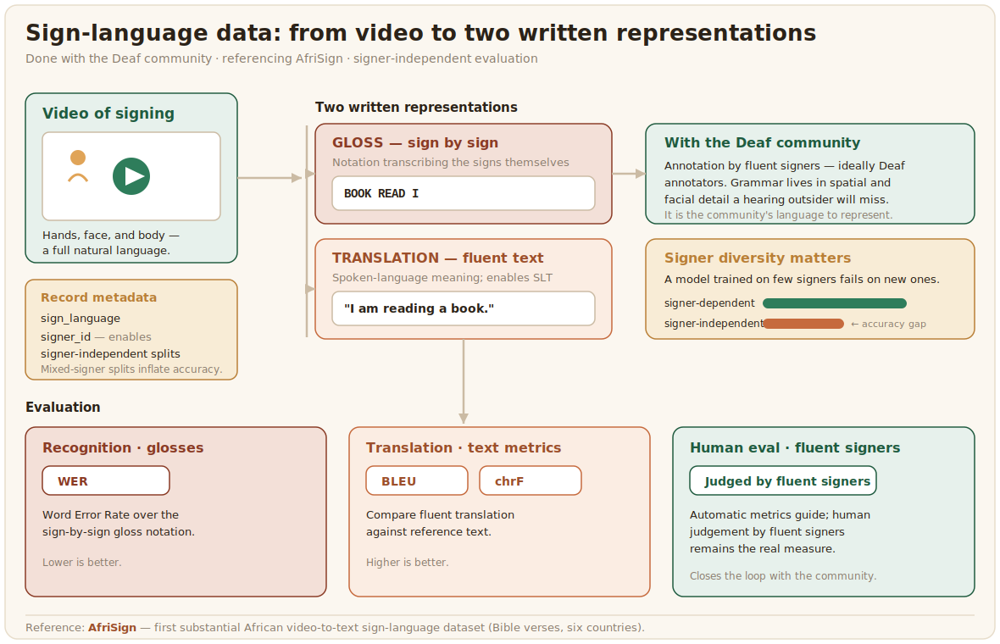

# Sign language

Sign languages are full natural languages expressed in the hands, face, and body, and they are the languages of Deaf communities across Africa. They have been almost entirely absent from language technology: while sign languages from high-income countries now have substantial datasets, African sign languages had next to none until recently, and the gap is one of the starkest in the whole field.



## What the data looks like

Sign-language data is video of signing, paired with a written representation of its meaning. That representation takes two forms, and the difference matters. Glossing transcribes the signs themselves, sign by sign, in a notation, while translation pairs the video with fluent text in a spoken language, which is what enables sign-language translation. AfriSign built the first substantial African resource of this kind, a video-to-text translation dataset of sign-language renderings of Bible verses across six African countries, and used it to test machine-translation and transfer-learning methods ([AfriSign, 2025](../references.md#afrisign-2025)). National efforts such as the South African and Kenyan Sign Language datasets add depth in single countries. Because filming is expensive, newer methods aim to gather and curate signing data from social media with model assistance ([Seeing, Signing, and Saying, 2025](../references.md#seeing-signing-2025)), though that raises its own consent questions.

A record pairs the video with both representations, the gloss and the translation, plus the signer metadata that signer-independent evaluation depends on:

```json
{
  "video": "clips/sasl_0001.mp4",
  "gloss": "BOOK READ I",
  "translation": "I am reading a book.",
  "sign_language": "South African Sign Language",
  "signer_id": "signer_07"
}
```

Keeping `signer_id` is what lets you split train and test by signer, so the reported accuracy reflects how the model does on people it has never seen, which is the number that matters and the one a signer-mixed split quietly inflates.

## Annotation, community, and evaluation

This is work that cannot be done without the Deaf community, full stop. Annotation, whether glossing or translation, must be done by fluent signers, ideally Deaf annotators, because the grammar of sign languages lives in spatial and facial detail that a hearing outsider will miss, and because it is the community's language to represent. Signer diversity is also essential, since a model trained on a few signers fails on new ones, with the gap between signer-dependent and signer-independent accuracy being large. The labeling config plays the video and gives the signer a box for the gloss and another for the translation, with the two kept separate because they are different representations:

```xml
<View>
  <Video name="video" value="$video"/>
  <Header value="Gloss (sign by sign)"/>
  <TextArea name="gloss" toName="video" rows="2" editable="true"
            placeholder="Transcribe the signs in gloss notation"/>
  <Header value="Translation (fluent spoken-language text)"/>
  <TextArea name="translation" toName="video" rows="2" editable="true"
            placeholder="Translate the meaning into fluent text"/>
</View>
```

Recognition is evaluated with error rates such as [Word Error Rate](https://en.wikipedia.org/wiki/Word_error_rate) over glosses, translation with text metrics like [BLEU](https://en.wikipedia.org/wiki/BLEU) and chrF, and both with human evaluation by fluent signers, which remains the real measure.
