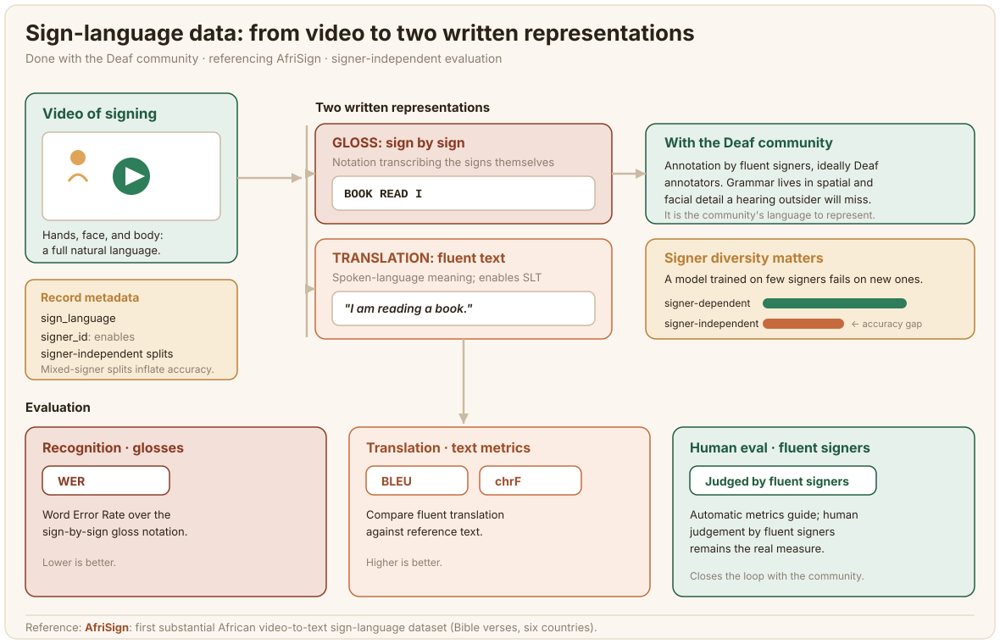

# Sign language

*Last reviewed: 2026-07-07.*

Sign languages are full natural languages expressed in the hands, face, and body, and they are the languages of Deaf communities across Africa. They have been almost entirely absent from language technology: while sign languages from high-income countries now have substantial datasets, African sign languages had next to none until recently, and the gap is one of the starkest in the whole field.



## What the data looks like

Sign-language data is video of signing, paired with a written representation of its meaning. That representation takes two forms, and the difference matters. Glossing transcribes the signs themselves, sign by sign, in a notation, while translation pairs the video with fluent text in a spoken language, which is what enables sign-language translation. AfriSign built the first substantial African resource of this kind, a video-to-text translation dataset of sign-language renderings of Bible verses across six African countries, and used it to test machine-translation and transfer-learning methods ([AfriSign, 2025](../references.md#afrisign-2025)). National efforts such as the South African and Kenyan Sign Language datasets add depth in single countries. Because filming is expensive, newer methods aim to gather and curate signing data from social media with model assistance ([Seeing, Signing, and Saying, 2025](../references.md#seeing-signing-2025)), though that raises its own consent questions.

A record pairs the video with both representations, the gloss and the translation, plus the signer metadata that signer-independent evaluation depends on:

```json
{
  "video": "clips/sasl_0001.mp4",
  "gloss": "BOOK READ I",
  "translation": "I am reading a book.",
  "sign_language": "South African Sign Language",
  "signer_id": "signer_07"
}
```

Keeping `signer_id` is what lets you split train and test by signer, so the reported accuracy reflects how the model does on people it has never seen, which is the number that matters and the one a signer-mixed split quietly inflates.

## Annotation, community, and evaluation

This is work that cannot be done without the Deaf community, full stop. Annotation, whether glossing or translation, must be done by fluent signers, ideally Deaf annotators, because the grammar of sign languages lives in spatial and facial detail that a hearing outsider will miss, and because it is the community's language to represent. Signer diversity is also essential, since a model trained on a few signers fails on new ones, with the gap between signer-dependent and signer-independent accuracy being large. The labeling config plays the video and gives the signer a box for the gloss and another for the translation, with the two kept separate because they are different representations:

```xml
<View>
  <Video name="video" value="$video"/>
  <Header value="Gloss (sign by sign)"/>
  <TextArea name="gloss" toName="video" rows="2" editable="true"
            placeholder="Transcribe the signs in gloss notation"/>
  <Header value="Translation (fluent spoken-language text)"/>
  <TextArea name="translation" toName="video" rows="2" editable="true"
            placeholder="Translate the meaning into fluent text"/>
</View>
```

Recognition is evaluated with error rates such as [Word Error Rate](https://en.wikipedia.org/wiki/Word_error_rate) over glosses, translation with text metrics like [BLEU](https://en.wikipedia.org/wiki/BLEU) and chrF, and both with human evaluation by fluent signers, which remains the real measure.

## The 2026 modelling landscape

Sign-language modelling in 2026 is a research-grade field for African sign languages — every deployment on the continent is a first-of-its-kind release. The workable open-model references:

- **[MMS](https://huggingface.co/docs/transformers/model_doc/mms)** and general video encoders (I3D, SlowFast, VideoMAE, TimeSformer) — the honest video-understanding baselines. Not purpose-built for sign, but the standard starting points for continuous-sign recognition (video-to-gloss) as a sequence-labelling problem.
- **[SignCLIP](https://arxiv.org/abs/2407.01264)** (2024) — a CLIP-lineage joint sign-and-text embedding model, useful for retrieval and cross-lingual sign-language work.
- **[Sign2GPT](https://arxiv.org/abs/2405.04164)** (2024) — a pipeline that feeds sign-language video features into an LLM for translation. The workable frontier for sign-language translation as opposed to recognition or gloss.
- **[GLoFE / TSPNet / SLT-Transformer](https://github.com/neccam/slt)** — the transformer-based sign-language translation lineage (Camgöz et al., 2020 onwards). The academic baseline against which newer models are measured on RWTH-PHOENIX-Weather-2014T (German Sign Language) — not an African-language benchmark, but the reference architecture.
- **General MLLMs (Qwen2.5-VL, InternVL 3, Gemini 2.5, GPT-4o with video)** — capable of sign-language recognition at low resolution and short duration, systematically weak on African sign languages given the absence of training data. Useful as ceiling reference, not workable as a deployment surface without fine-tuning on target-language data.

**Editorial opinion.** For a new African sign-language project, the shortest defensible path is: start with the AfriSign data if the target sign language is covered, fine-tune a SlowFast or VideoMAE backbone on the target-language subset, evaluate with signer-independent splits and native-signer human review. For an uncovered sign language, the project is data collection first, modelling second — and data collection must be led by the Deaf community, not extracted from it. **This is not a two-week task.** Realistic project scope is one to three years for a first deployable model on a new African sign language. Read the [long-tail language onboarding chapter](../long-tail-language/index.md) before scoping, and be prepared to have "no, we should not build this" as an honest answer to whether a specific sign language should be worked on at all if the community has not consented.

## What it will actually cost you

Sign-language corpora are the most expensive per-record of any modality in this playbook, because every record is filmed video, every record requires signer consent, and annotation requires expert fluent signers who are scarce. Rough order-of-magnitude:

- **Fine-tuning on the AfriSign corpus for a covered African sign language.** One to three person-months of engineering; forty to two hundred GPU-hours across the candidate models. Signer-independent evaluation is mandatory; the numbers reported without it are inflated.
- **Extending AfriSign with a national sign-language dataset** (SASL, KSL, or comparable) — 5,000-20,000 clips over 20-50 signers. Two to five years elapsed; twelve to forty person-months of community-led work. Filming costs, consent frameworks, and Deaf-community remuneration structures dominate.
- **Building a new corpus for a previously unrepresented African sign language.** Three to eight years elapsed. This is a research programme, not a project.
- **Signer honoraria** should be at rates comparable to professional linguistic informants, not annotator rates. Under-paying signers has been a recurring failure mode of sign-language corpora historically and must not be repeated.
- **Evaluation-only sign-language sets** (500-2,000 clips across 5-15 signers). Twelve to twenty-four months; six to fifteen person-months.
- **Human evaluation of sign-language output** must be done by fluent Deaf signers of the target sign language. Recruiting and remunerating them is the constraint.

## Known limitations to watch for

- **Signer-independent evaluation is mandatory.** A model that scores WER 10 on signer-dependent splits scores WER 40 on new signers. Report signer-independent numbers as the headline; signer-dependent numbers are for research comparison only.
- **Sign languages are not manual codes of spoken languages.** South African Sign Language is not signed English, Kenyan Sign Language is not signed Swahili. Grammar, syntax, and lexicon are fully independent. A model that treats sign-language translation as sign-plus-English-word-order fails predictably.
- **Facial expression is grammar.** In most sign languages, facial expression carries information equivalent to inflection, mood, or negation in spoken languages. A model that reads only hand-shape misses grammatical distinctions systematically.
- **Regional and generational variation.** Sign languages vary substantially by community, by school of origin, and by generation. A model trained on one age cohort or one school's lineage fails on others.
- **Bible-lineage corpora are not conversational corpora.** AfriSign is derived from Bible verse translations. It is a starting point, but a conversational deployment (health, education, civic services) requires conversational data. Do not assume the Bible-lineage model transfers.
- **Video PII is unavoidable.** A signer's face and body are the language itself; they cannot be anonymised the way a voice can be pitch-shifted or a photo can be blurred without destroying the linguistic content. Consent frameworks must be built around this reality — a signer is fully identifiable in every clip.
- **Social-media-scraped signing data has consent problems.** The recent trend of curating sign-language data from public social media ([Seeing, Signing, and Saying, 2025](../references.md#seeing-signing-2025)) is technically productive and ethically fraught. A signer who posted a video for their community did not consent to being training data. Community consultation before scraping is not optional.
- **Deaf-community-led vs. Deaf-community-informed is a real distinction.** A project designed by hearing researchers with Deaf annotators as workforce differs materially from a project designed and led by Deaf researchers with hearing engineers as workforce. The second produces better data and better outcomes. Structure the project accordingly.

## Further reading

- [AfriSign paper (2025)](https://arxiv.org/abs/) — the reference African sign-language translation corpus and its cross-country transfer methodology.
- [Camgöz et al., 2020 — SLT Transformer](https://arxiv.org/abs/2003.13830) — the reference transformer-based sign-language translation architecture; the baseline against which newer models are measured.
- [Sign2GPT (2024)](https://arxiv.org/abs/2405.04164) — the current workable frontier for sign-language translation, feeding video features into an LLM.

<details>
<summary>Additional references</summary>

- [SignCLIP (2024)](https://arxiv.org/abs/2407.01264) — CLIP-lineage joint sign-and-text embedding for retrieval and cross-lingual work.
- [Seeing, Signing, and Saying (2025)](https://arxiv.org/abs/) — the social-media-lineage sign-language data curation methodology, with the ethical caveats it raises.
- [WLASL (Word-Level American Sign Language)](https://github.com/dxli94/WLASL) — the reference isolated-sign benchmark for American Sign Language; useful for calibrating recognition (not translation) methodologies.
- [RWTH-PHOENIX-Weather-2014T](https://www-i6.informatik.rwth-aachen.de/~koller/RWTH-PHOENIX-2014-T/) — the German Sign Language reference for continuous-sign translation methodology; the most-used academic benchmark against which sign-language architectures are measured.

</details>
