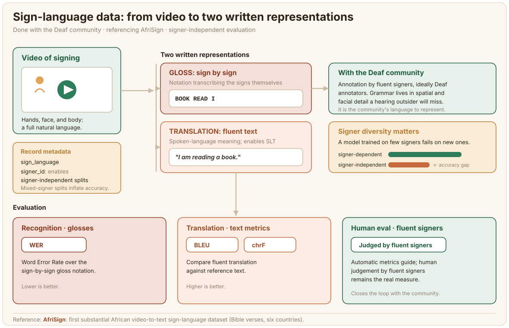
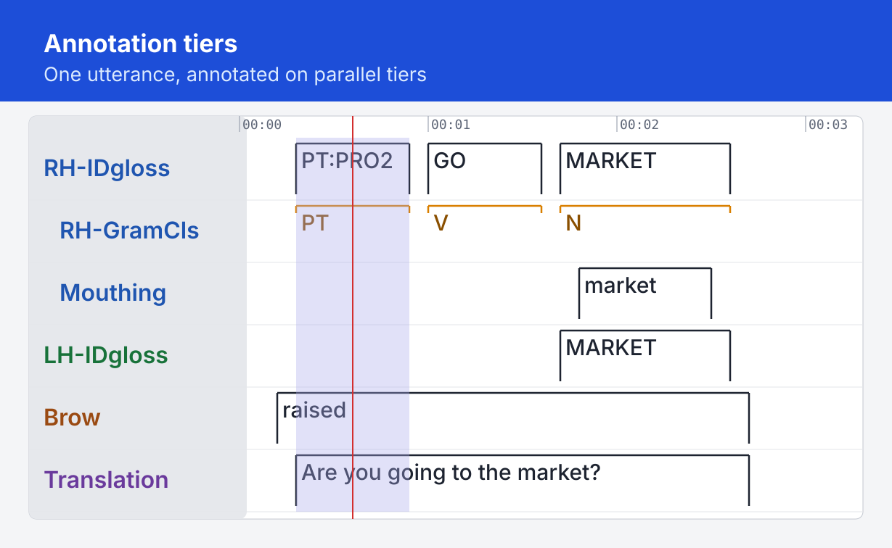

# Sign language

*Last reviewed: 2026-10-01.*

Sign languages are full natural languages expressed in the hands, face and body, and they are the languages of Deaf communities across Africa. They have been almost entirely absent from language technology: sign languages from high-income countries now have substantial datasets, African sign languages had next to none until recently, and the gap is one of the starkest in the field. This page is a practical guide to building a sign-language corpus: which languages are involved, how to work with Deaf communities, how to record, how to annotate the way established corpora do, how to check and release the data, and what modelling it supports.



:::danger[Minimum requirements]

- The project **must** be designed with the Deaf community whose language it records, and Deaf signers **must** have a say in what is collected and how it is used, not only produce it.
- Consent information **must** be available in the signer's sign language, and consent **must** cover the fact that every clip shows the signer's face and body. These cannot be blurred or masked without destroying the language, so a released clip identifies its signer.
- Annotation **must** be done or checked by fluent signers of the language, ideally Deaf annotators.
- Every clip **must** carry a signer identifier, so that train and test sets can be split by signer.
- ID-glosses **must** come from one shared lexicon, so that the same sign carries the same gloss everywhere in the corpus.
- The recording frame rate **must** be recorded with the data, because sign boundaries are set frame by frame.
- Signers and annotators **must** be paid at rates comparable to professional linguistic work.

:::

## African sign languages

Africa has several dozen sign languages; published counts differ and are incomplete. Broadly ([Nyst, 2020](../references.md#nyst-2020)):

- **National sign languages shaped by American Sign Language.** Andrew Foster, a Deaf African-American missionary, opened the first school for Deaf children in West Africa in Accra in 1957 and went on to found 31 schools in 13 African countries. ASL-based signing spread through these schools and is, in Nyst's words, beyond doubt the most widespread non-African sign language in Africa; Ghanaian Sign Language, for example, is ASL-based. In francophone countries a variety of ASL adapted to French is used, which Kamei called Langue des Signes Franco-Africaine (LSAF).
- **National sign languages of other origins.** Not every national sign language descends from ASL, and the histories of many are documented unevenly. Check what is known about a language's history with its Deaf community rather than assuming it.
- **Local and village sign languages** that arose in particular communities. Adamorobe Sign Language in Ghana is used in a village with hereditary deafness and is endangered as younger Deaf people learn ASL-based Ghanaian Sign Language at school. Hausa Sign Language (Maganar Hannu), used in Kano in northern Nigeria, has a published grammatical description ([Schmaling, 2000](../references.md#schmaling-2000)); Bura Sign Language in north-eastern Nigeria is a village sign language ([Blench & Warren, 2003](../references.md#blench-warren-2003)).

Several countries recognise their sign language in law ([WFD, legal recognition](../references.md#wfd-recognition)):

| Country | Recognition |
|---|---|
| South Africa | South African Sign Language became the 12th official language when the Constitution Eighteenth Amendment was signed on 19 July 2023. |
| Kenya | Constitution of 2010, Article 7(3)(b): the State shall promote Kenyan Sign Language; Article 54(1)(d) gives persons with disabilities the right to use sign language. |
| Uganda | Constitution of 1995, National Objective XXIV(d): the State shall promote the development of a sign language for the Deaf. |
| Zimbabwe | Constitution of 2013, section 6(1): sign language is an officially recognised language. |
| Lesotho | Tenth Amendment to the Constitution, 2025: sign language is an official language. |
| Namibia, Angola, Eswatini, Malawi | Recognition in disability legislation rather than the constitution. |

Two consequences for a project. First, name the language precisely ("Kenyan Sign Language", not "African Sign Language" or "sign"), because these are distinct languages. Second, expect variation inside one national language: by region, by the school a signer attended, and by generation.

## Existing African datasets

The verified resources as of 2026:

| Dataset | Language | What it contains |
|---|---|---|
| [AfriSign (2025)](../references.md#afrisign-2025) | Ghanaian, Nigerian, Kenyan, Zambian, Zimbabwean and South African Sign Language | Sign-language renderings of Bible verses paired with English text, for translation |
| [JWSign (2023)](../references.md#jwsign-2023) | 98 sign languages, including African ones | About 2,530 hours from more than 1,500 signers, from the same kind of source |
| [KSL Dataset (2024)](../references.md#ksl-dataset-2024) | Kenyan Sign Language | About 14,000 English sentences with KSL glosses, about 20,000 videos, 4,000 words in HamNoSys |
| [Kenyan word-level pose dataset (2025)](../references.md#ksl-pose-2025) | Kenyan Sign Language | About 30,000 word videos from 685 signers, released as pose keypoints |
| [SignTalk-Gh (2026)](../references.md#signtalk-gh-2026) | Ghanaian Sign Language | 9,879 videos of 4,031 healthcare sentences from 5 signers; about 60% of the sentences were generated with an LLM |
| [CASL-W60 (2025)](../references.md#casl-w60-2025) | Central African Sign Language | 60 words, 5,889 videos from 19 signers |
| [Nigerian Sign Language (2022)](../references.md#kolawole-2022) | Nigerian Sign Language | About 5,000 images of 137 signs, including the alphabet |

:::warning
AfriSign and JWSign come from Bible translations published online by Jehovah's Witnesses. Check the source's terms of use before training on or redistributing them, and note that they are religious-domain, formal signing: a model for health, education or civic services needs conversational data in that domain.
:::

## Working with the Deaf community

This is work that cannot be done without the Deaf community. Annotation, whether glossing or translation, **must** be done by fluent signers, ideally Deaf annotators, because the grammar of sign languages lives in spatial and facial detail that a hearing outsider misses, and because it is the community's language to represent.

- **Partner with the national Deaf association** and Deaf researchers from the start. A project designed by hearing researchers with Deaf annotators as workforce differs from one designed and led by Deaf researchers; the second produces better data and better outcomes.
- **Agree terms of reference.** Harris, Holmes and Mertens propose Sign Language Communities' Terms of Reference for research ethics with signing communities ([Harris et al., 2009](../references.md#harris-2009)): research is done with the community, in its language, to its benefit.
- **Give consent information in sign language.** The Sign Language Linguistics Society recommends offering informed consent either as a video in the relevant sign language or in writing in the surrounding spoken language. In the BSL Corpus, fieldworkers explained the information sheet and consent form to each participant in BSL ([Schembri et al., 2013](../references.md#schembri-2013)). A written form alone is not enough for signers whose first language is not written.
- **Use Deaf fieldworkers** to recruit and record where you can. Fieldworkers who are fluent members of the community can explain the project in its language, put signers at ease, and notice when signing is being adjusted for an outsider.
- **Be careful with synthesis.** The World Federation of the Deaf and the World Association of Sign Language Interpreters caution against signing avatars as a replacement for human signers, especially for live, complex or important information such as news or emergencies, and accept them for pre-recorded static content only when Deaf people have advised on the signing ([WFD & WASLI, 2018](../references.md#wfd-wasli-2018)). The European Union of the Deaf has published a wider position on sign language and AI ([EUD, 2025](../references.md#eud-2025)). A project that plans sign-language generation **should** discuss it with the community first.

## Plan the corpus before filming

Decide first what the corpus is for, because it decides what you film and which tiers you annotate:

| Goal | What to film | Tiers to annotate first |
|---|---|---|
| A lexicon or dictionary, isolated-sign recognition | One elicited sign per clip, citation form and variants | The sign's ID-gloss, its variant and handedness |
| Translation models | Continuous signing: narratives, retellings, prompted sentences | Utterance boundaries and free translation |
| Linguistic research, a reference corpus | Conversations, interviews, narratives | Both hands' ID-glosses, translation, then non-manuals |
| Fingerspelling recognition | Names, places and borrowed words | The fingerspelled word and its letters |

### Elicitation materials

Established corpora use a mix of tasks, so that the corpus covers both careful and natural signing:

- **Lexical elicitation.** Signers produce the sign for a picture or a concept. The BSL Corpus used 102 concepts chosen because they were likely to vary between regions ([Schembri et al., 2013](../references.md#schembri-2013)).
- **Narrative retellings.** The wordless picture book *Frog, where are you?* (Mayer, 1969) and the *Canary Row* cartoon were used in Corpus NGT; the Auslan Corpus includes retellings of *Frog, where are you?* and *The Boy Who Cried Wolf*. Retellings of the same story make signers comparable.
- **Conversation and interview.** The BSL Corpus recorded pairs of signers in about 30 minutes of free conversation and a 15-minute interview, which capture natural, spontaneous signing.

Stories and pictures **should** be adapted to the local context where needed, and checked with Deaf collaborators for anything that does not make sense locally.

### Staged annotation

No corpus annotates every tier in one pass, and none **should** try. Plan **staged passes**: a first pass marks utterances and translates them, which is useful on its own and can be done by fluent signers new to corpus work. A second pass glosses one hand. Later passes add the other hand, mouthing and non-manual features, done by trained annotators. Each pass builds on the boundaries the previous one set.

:::tip
Start the ID-gloss lexicon at the same time as the corpus, not before it. A new sign language rarely has a lexicon, and the two are built together: annotators propose a gloss for a sign they meet, and a lexicon curator confirms or merges it. Corpus NGT links its glosses to Global Signbank, a lexical database at Radboud University that also holds other sign languages ([Crasborn et al., 2020](../references.md#corpus-ngt-2020)).
:::

## Recording

Sign language is recorded on video, and the recording sets the ceiling on everything after it.

- **Frame rate.** 25 or 30 frames per second is the minimum; 50 or 60 is better, and fingerspelling **should** be filmed at 50 or more, because fast handshape changes fall between frames at lower rates. Record the actual frame rate with each file.
- **Encoding for annotation.** Stepping to an exact frame is only reliable when the video is encoded for it. The MPI guide for ELAN uses a keyframe interval of 25 frames (about one per second at 25 fps), and advises setting B-frames to 0 when accurate frame positioning is crucial, which it is for glossing. Video with only keyframes works best for frame-by-frame stepping, at the cost of larger files ([MPI, 2024](../references.md#mpi-video-guidelines)).
- **Framing.** Head to waist, with room for the hands above the head and out to the sides. The face **must** be clearly visible, since it carries grammar.
- **Light and background.** Even, front lighting without hard shadows; a plain background that contrasts with skin and clothing; plain clothing without patterns, and no jewellery that hides handshapes.
- **More than one camera.** For conversations, film each signer from the front, plus a wide view of both. A side view helps with movements towards and away from the body. Keep the cameras in sync (a clap or a light flash at the start gives an anchor), and record each camera's offset.
- **Signer metadata.** For every signer: an identifier, age range, region, whether they are Deaf or hearing, the age at which they acquired the sign language, their schooling, and their dominant hand.

Recording in the browser or on a phone works for elicitation: a contributor sees a written prompt or a picture and signs a response. AfriAnnotate's sign-collection templates do this with a recording tag.

## The annotation model

Corpus conventions differ in detail, but they share one model, and following it lets your corpus be compared with others and opened in ELAN, the annotation tool most sign-language corpora use ([Wittenburg et al., 2006](../references.md#wittenburg-2006); [Johnston, 2010](../references.md#johnston-2010)).

### What is annotated

Sign-language data is video of signing paired with a written representation of it, in two forms:

- **Glossing** labels the signs themselves, one by one, with an **ID-gloss**: a fixed identifier for a sign, conventionally in capitals (HOUSE, PT:PRO1). An ID-gloss names the sign, not its meaning in context. The same sign gets the same ID-gloss whether it is translated "house", "home" or "building" in a given sentence, which is what lets a corpus be searched by sign ([Johnston, 2010](../references.md#johnston-2010)).
- **Translation** pairs the video with fluent text in a spoken or written language. It is what translation models learn from.

A sign language is not one stream of signs. The two hands can do different things at once: one hand holds a sign in place (a *buoy*) while the other keeps signing. The face and head carry grammar: raised brows can mark a question or a condition, a headshake can negate, and mouthings borrow words from the surrounding spoken language. Corpora therefore annotate on **parallel tiers**, one per channel, each aligned to the video's timeline.



### Tiers and tier types

Each **tier** holds one kind of annotation (right-hand glosses, translation, brow). Each tier has a **tier type** that sets how its annotations relate to time. These are ELAN's stereotypes:

| Stereotype | Behaviour | Typical tiers |
|---|---|---|
| None (independent) | On the timeline, own begin and end, no overlaps | Hand glosses, translation, non-manuals |
| Included in | Inside a parent annotation, gaps allowed | Mouthing inside its sign, letters inside a fingerspelled word |
| Symbolic association | Exactly one value per parent annotation, with the parent's times | Grammatical class, handshape, variant |
| Time subdivision | Splits a parent into contiguous parts, no gaps | Phases of a sign |

A tier type can also carry a **controlled vocabulary**, a fixed list of allowed values (raised, furrowed, neutral for brows). Vocabularies **should** be used wherever values are categorical, because free text fragments into spellings that cannot be counted.

### Glossing conventions

- Use one ID-gloss per sign, in capitals, from the shared lexicon.
- Gloss a two-handed sign on both hand tiers, and a one-handed sign only on the hand that articulates it ([Johnston, 2013](../references.md#johnston-2013)). Decide whether the two hand tiers mean right and left or dominant and non-dominant, and record each signer's handedness either way.
- Use prefixes for sign categories so they can be found and counted: `PT:` for pointing signs (PT:PRO1 for "me"), `FS:` for fingerspelling (FS:ABUJA), `DS:` for depicting signs, `G:` for gestures. Agree the prefixes before glossing starts.
- Set boundaries consistently. The Auslan guidelines start a sign when the hands change direction after completing the previous sign, or start to change handshape, and end it just before the next such change or when the hands begin to return to rest ([Johnston, 2013](../references.md#johnston-2013)); the BSL conventions add changes of orientation ([Cormier et al., 2017](../references.md#bsl-corpus-2017)).
- Leave a gap between annotations on the same tier: at least one frame in the Auslan guidelines, two frames in the BSL Corpus. Signs that touch make searches for overlapping signs on other tiers return false matches.
- Mark mouthings (borrowed spoken words) and mouth gestures (native mouth actions) on separate tiers; they are different phenomena.

### Templates that follow published conventions

You do not need to design tiers from scratch. The BSL Corpus basic template has three tiers: right-hand ID-gloss, left-hand ID-gloss and free translation ([Cormier et al., 2017](../references.md#bsl-corpus-2017)); its full working template has 49. The Auslan Corpus adds a grammatical class under each gloss, mouthing, and free and literal translation ([Johnston, 2013](../references.md#johnston-2013)). Corpus NGT uses one gloss tier per signer per hand for conversations: GlossL S1, GlossR S1, GlossL S2, GlossR S2 ([Crasborn et al., 2020](../references.md#corpus-ngt-2020)). Start from the closest one and adapt it.

### Phonological notation

When a project records the form of signs (handshape, location, movement, orientation), it can use a notation system rather than prose labels:

- **Stokoe notation** (1960), the first, which established that signs have internal structure like the sounds of spoken words ([Stokoe, 1960](../references.md#stokoe-1960)).
- **HamNoSys**, from the University of Hamburg: first defined in 1984 and first published in 1987, with version 2.0 in 1989. A detailed phonetic transcription used in corpora and for animation ([Hanke, 2004](../references.md#hanke-2004)).
- **SignWriting**, developed by Valerie Sutton from 1974 out of her DanceWriting: a writing system for sign languages rather than a research transcription ([Sutton, SignWriting history](../references.md#signwriting)).

A simpler alternative for a recognition dataset is a controlled vocabulary of handshape names and locations; the KSL Dataset transcribes 4,000 words in HamNoSys ([Wanzare et al., 2024](../references.md#ksl-dataset-2024)).

## Annotating in AfriAnnotate

AfriAnnotate's sign-language projects open in a workspace laid out like ELAN's annotation mode, so annotators who know ELAN can start without retraining. The tier structure is declared in the project's labeling configuration, and every annotator of the project gets the same tiers:

```xml title="Labeling configuration: the basic corpus template"
<View>
  <VideoTiers name="tiers" value="$video" lexicon="3">
    <TierType value="gloss" stereotype="none" lexicon="true"/>
    <TierType value="free text" stereotype="none"/>
    <Tier value="RH-IDgloss" tierType="gloss" participant="A"/>
    <Tier value="LH-IDgloss" tierType="gloss" participant="A"/>
    <Tier value="Free Translation" tierType="free text" participant="A" lang="eng"/>
  </VideoTiers>
</View>
```

What this gives the project:

- **Shipped templates.** Ten sign-language templates cover the common cases: a first pass (utterances and translation), the basic corpus, full multi-tier annotation, grammatical class, two signers in conversation, non-manual features, phonology (handshape, location, movement, orientation), fingerspelling, isolated signs for a lexicon, and a single-timeline option. Each is a starting point to edit.
- **Existing ELAN templates.** A project can be created from an ELAN template (`.etf`) or annotation file: its tier types, vocabularies and tiers become the configuration.
- **A shared lexicon.** With `lexicon` set to a knowledge base of ID-glosses, gloss tiers suggest entries as the annotator types and store each entry's identifier. A sign not yet in the lexicon can be added as a provisional entry, for a curator to confirm or merge. A gloss typed without a lexicon entry is flagged, so the gaps are easy to find.
- **Locked project tiers, open personal tiers.** Annotators cannot rename or delete the project's tiers, which keeps the corpus consistent. They can add their own tiers of a declared type, for notes or a one-off feature; those are saved with their annotation and can be promoted into the project by a manager.
- **ELAN interchange.** Annotations export to ELAN's `.eaf` format with their tier types, vocabularies, participants and lexicon identifiers, and `.eaf` files can be imported.

The full reference is the [AfriAnnotate sign-language documentation](https://afriannotate.waraka.org/docs/sign-language/annotation).

:::info
The workspace measures the video's frame rate as it plays and snaps every boundary to a frame. Annotators step one frame at a time to find a sign's onset, as in ELAN.
:::

## Checking quality

Sign-language annotation is slow and expert, so quality checks **should** be planned into the budget rather than added afterwards.

- **Double-annotate a sample.** Have two annotators gloss the same 10 to 20 percent of clips independently. Compare labels (do they use the same ID-gloss?) and boundaries (how far apart are their onsets and offsets, in frames?). Agree the boundary tolerance in frames before comparing, and report it with the agreement figures.
- **Review the lexicon, not only the annotations.** Provisional lexicon entries and unmatched glosses **should** be reviewed regularly by a curator who merges duplicates (HOUSE and HOME-1 for the same sign) and confirms new signs.
- **Check timing logic.** Dependent annotations **must** sit inside their parent (a mouthing inside its sign). A check that lists every annotation outside its parent catches errors after boundaries are edited.
- **Watch for drift.** Annotators' boundary decisions shift over weeks. Re-annotating a few early clips later in the project shows whether the convention is still being applied the same way.

## Releasing the data

A released record pairs the video with its tiers and the signer metadata that signer-independent evaluation depends on:

```json title="One annotated clip"
{
  "video": "clips/sasl_0001.mp4",
  "frame_rate": 50,
  "sign_language": "South African Sign Language",
  "signer_id": "signer_07",
  "annotations": [
    {"tier": "RH-IDgloss", "start": 0.40, "end": 0.84, "value": "BOOK", "gloss_id": "book-1"},
    {"tier": "RH-IDgloss", "start": 0.96, "end": 1.52, "value": "READ", "gloss_id": "read-1"},
    {"tier": "Free Translation", "start": 0.40, "end": 2.10, "value": "I am reading a book."}
  ]
}
```

- **Split by signer.** Train, validation and test sets **must** be split by `signer_id`, so the reported accuracy reflects how a model does on people it has never seen. A split that mixes signers inflates results.
- **Release the lexicon with the corpus.** Glosses are only meaningful with the lexicon that defines them.
- **Ship ELAN files as well as JSON.** Linguists will open the corpus in ELAN; the `.eaf` export keeps the tier structure intact.
- **Consider releasing pose.** Pose keypoints (for example from MediaPipe Holistic, which gives 33 body, 468 face and 21 points per hand, and which Google now lists as a legacy solution) reduce video to movement, which is lighter to share and train on. The [pose-format](../references.md#pose-format-2021) library reads and writes them. Pose is not anonymous: a person's movement can still identify them to people who know them.
- **Control access to the video.** Because signers cannot be anonymised, video **should** be released under access terms the signers agreed to, which may mean registered access rather than open download. The annotations alone can often be released more openly. See [Data Governance](../data-governance/index.md).

## Tasks and how they are evaluated

| Task | Input to output | Usual metric |
|---|---|---|
| Isolated sign recognition | A clip of one sign to its gloss | Top-1 and top-5 accuracy |
| Continuous sign recognition | A clip of continuous signing to its gloss sequence | Word error rate over glosses |
| Sign language translation | Signing video to spoken-language text | BLEU-4, increasingly with chrF |
| Fingerspelling recognition | A fingerspelled stretch to its letters | Letter accuracy |
| Sign spotting, sign production | Finding a sign in continuous video; generating signing | Metrics vary between papers |

BLEU-4 is the usual translation metric because the field's reference work used it ([Camgöz et al., 2020](../references.md#camgoz-2020)), but it was never validated for sign-language translation; Müller and colleagues recommend chrF as an alternative and caution against treating glosses as a translation target ([Müller et al., 2023](../references.md#muller-2023)). Every automatic score **should** be paired with evaluation by fluent Deaf signers, which remains the real measure.

## The 2026 modelling landscape

Sign-language modelling for African sign languages is research-grade in 2026; every deployment on the continent is a first-of-its-kind release. The workable references:

- **General video encoders (I3D, SlowFast, VideoMAE, TimeSformer).** Not built for sign, but the standard starting points for continuous-sign recognition (video to gloss) as a sequence-labelling problem.
- **Pose-based models.** Pose keypoints reduce video to the hands, face and body, which cuts compute and is less sensitive to background and clothing. A common route for isolated-sign recognition with little data, and the form the Kenyan word-level dataset is released in.
- **[SignCLIP](https://arxiv.org/abs/2407.01264)** (EMNLP 2024). Connects signing video and text by contrastive learning; useful for retrieval and cross-lingual work.
- **[Sign2GPT](https://arxiv.org/abs/2405.04164)** (ICLR 2024). Uses a large language model for translation without glosses; the workable frontier for translation as opposed to recognition.
- **Sign Language Transformers** ([Camgöz et al., 2020](../references.md#camgoz-2020)). The academic baseline for joint recognition and translation, measured on RWTH-PHOENIX-Weather-2014T, German Sign Language weather forecasts with glosses and German translations ([Camgöz et al., 2018](../references.md#camgoz-2018)). Not an African benchmark, but the reference architecture.
- **General multimodal LLMs with video.** Weak on African sign languages given the lack of training data. Useful as a ceiling reference, not as a deployment surface without fine-tuning on the target language.

**Editorial opinion.** For a new African sign-language project, the shortest defensible path is: start from AfriSign or JWSign if the target language is covered and their terms allow your use, fine-tune a video or pose backbone on the target-language subset, and evaluate on signer-independent splits with review by native signers. For an uncovered sign language, the project is data collection first and modelling second, and collection **must** be led by the Deaf community, not extracted from it. This is not a two-week task: a first deployable model for a new African sign language is realistically a multi-year effort. Read the [long-tail language chapter](../long-tail-language/index.md) before scoping, and be prepared for "we should not build this" to be the honest answer if the community has not agreed to it.

## What it will actually cost you

Sign-language corpora are the most expensive per record of any modality in this playbook: every record is filmed video, every record needs signer consent, and annotation needs fluent signers, who are scarce.

- **Annotation time is the largest cost.** For How2Sign, a large American Sign Language corpus, gloss annotation took on average one hour per 90 seconds of video, about 40 minutes per minute ([Duarte et al., 2021](../references.md#how2sign-2021)), and that is glosses alone. Adding the second hand, mouthing and non-manual tiers multiplies it. Budget staged passes rather than one complete pass.
- **Recording.** Fieldwork with Deaf fieldworkers, travel to reach signers in different regions and age groups, studio or location costs, and multiple cameras.
- **Honoraria.** Signers and annotators **must** be paid at rates comparable to professional linguistic informants, not crowd-annotation rates. Under-paying signers has been a recurring failure of sign-language corpora.
- **Evaluation.** Human evaluation needs fluent Deaf signers of the target language; recruiting and paying them is the constraint, not compute.

The following are planning estimates from the editors, not measured figures. Fine-tuning on an existing dataset for a covered language is a matter of person-months of engineering. A national dataset of several thousand clips from dozens of signers takes years, most of it community-led recording and annotation. A first corpus for an unrepresented sign language is a research programme over several years, not a project.

## Known limitations to watch for

- **Signer-independent evaluation is mandatory.** A model that looks strong on signer-mixed splits can do far worse on new signers. Report signer-independent results as the headline.
- **Sign languages are not codes for spoken languages.** South African Sign Language is not signed English, and Kenyan Sign Language is not signed Swahili. Grammar, word order and lexicon are independent; a model that treats translation as word substitution fails.
- **Facial expression is grammar.** It carries information comparable to inflection, mood or negation. A model, or an annotation scheme, that reads only the hands misses it.
- **Variation is large.** Sign languages vary by region, by the school a signer attended, and by generation. A corpus from one cohort or one school does not represent the language.
- **Religious-domain corpora are not conversational corpora.** AfriSign and JWSign are starting points, but health, education or civic services need conversational data from those domains.
- **Generated source sentences shift the data.** When the spoken-language sentences that signers translate are generated by an LLM, as for much of SignTalk-Gh, the signing follows that text's phrasing. Check generated prompts with Deaf collaborators before filming.
- **Video cannot be anonymised.** The face and body are the language. Consent and access terms **must** be built around a signer being identifiable in every clip.
- **Scraped social-media signing has consent problems.** Methods now exist to curate signing from social media with model assistance ([Yazdani et al., 2025](../references.md#seeing-signing-2025)), but a signer who posted for their community did not agree to be training data. Consult the community before collecting it.

## Further reading

- [Nyst (2020)](../references.md#nyst-2020): an overview of sign languages in Africa and their histories.
- [Johnston (2010)](../references.md#johnston-2010): how a signed-language corpus moves from archive to annotated corpus, and why ID-glosses matter.
- [BSL Corpus conventions](../references.md#bsl-corpus-2017), [Auslan guidelines](../references.md#johnston-2013) and [Corpus NGT conventions](../references.md#corpus-ngt-2020): three complete, published annotation schemes to adapt.
- [Harris et al. (2009)](../references.md#harris-2009): research ethics with sign-language communities.
- [AfriSign (2025)](../references.md#afrisign-2025): the reference African sign-language translation dataset.

<details>
<summary>Additional references</summary>

- [ELAN](../references.md#wittenburg-2006): the annotation tool, and its `.eaf` format.
- [Schembri et al. (2013)](../references.md#schembri-2013): how the BSL Corpus was built, from recruitment and consent to elicitation tasks.
- [MPI video guidelines](../references.md#mpi-video-guidelines): encoding settings for frame-accurate annotation.
- [WFD & WASLI (2018)](../references.md#wfd-wasli-2018): the statement on signing avatars.
- [Camgöz et al. (2020)](../references.md#camgoz-2020): the reference recognition-and-translation architecture.
- [Müller et al. (2023)](../references.md#muller-2023): what gloss-based translation can and cannot show.
- [WLASL](../references.md#wlasl-2020): 2,000 American Sign Language words in 21,083 videos from 119 signers, the reference isolated-sign benchmark.
- [SignCLIP (2024)](https://arxiv.org/abs/2407.01264) and [Sign2GPT (2024)](https://arxiv.org/abs/2405.04164): retrieval and gloss-free translation.

</details>
