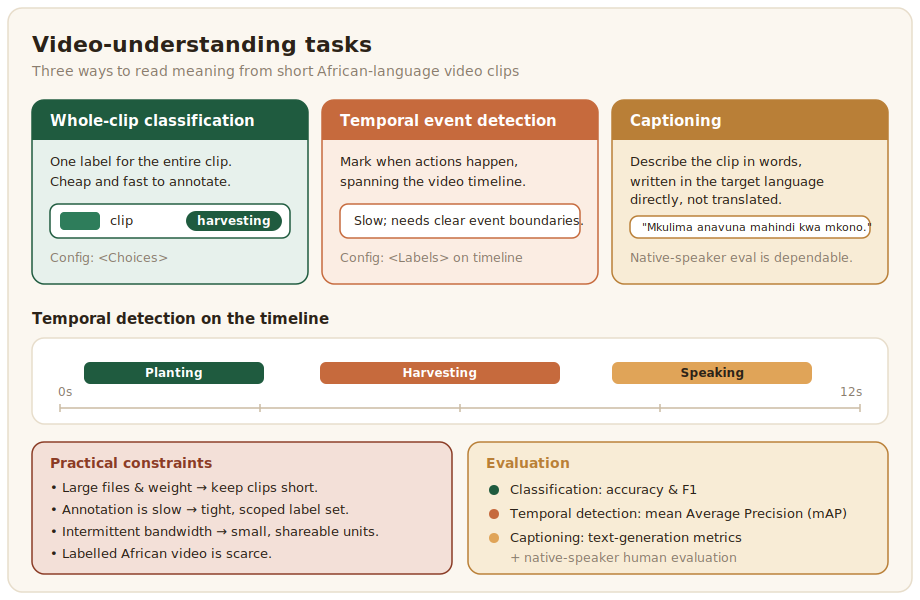

# Video

General video understanding covers the tasks that read meaning from ordinary moving images: classifying what a clip shows, detecting actions or events within it, and captioning it in words. For African contexts the uses are practical, from analysing agricultural or health video to making the continent's broadcast and community video searchable.



## What the data looks like

Video data is clips paired with labels, which can be a single class for the whole clip, time-stamped events within it, or a caption describing it. The raw material is plentiful in one sense, since African broadcast, social, and community video is abundant, but labelled African video is scarce, and captioning in particular needs descriptions written in the target language rather than translated from English. The cost and weight of video, large files, slow annotation, and intermittent bandwidth for distributed teams, shape every decision, so most projects work with short clips and a tightly scoped label set rather than long-form video.

A whole-clip record is one clip with its label or caption:

```json
{
  "video": "clips/farm_0042.mp4",
  "duration": 12.0,
  "label": "harvesting",
  "caption": "A farmer harvests maize by hand in a small field.",
  "language": "swa",
  "source": "agricultural extension video"
}
```

For captions, write them in the target language directly rather than translating from English, so the descriptions carry how the language actually describes a scene.

## Annotation and evaluation

Video annotation is labelling across time: a whole-clip label is cheap, but marking when actions happen, or captioning, is slow and needs clear rules on event boundaries and on the level of detail a caption should capture. Use tools built for timeline annotation, keep clips short, and measure agreement on a shared set. For marking when an action happens, the config places labels on the video timeline, and the annotator drags each label across the span where that action occurs:

```xml
<View>
  <Video name="video" value="$video"/>
  <Labels name="actions" toName="video">
    <Label value="Planting"   background="#1F5B3F"/>
    <Label value="Harvesting" background="#C66A3D"/>
    <Label value="Speaking"   background="#E0A458"/>
  </Labels>
</View>
```

For a single label per clip, swap `<Labels>` for `<Choices>`, exactly as in the [audio understanding](../audio-understanding) page. Evaluation depends on the task: accuracy and [F1](https://en.wikipedia.org/wiki/F-score) for classification, [mean Average Precision](https://lightning.ai/docs/torchmetrics/stable/detection/mean_average_precision.html) for temporal detection, and the text-generation metrics from the [Text Generation](../text-generation/index.md) chapter for captioning, where, as with all generation, native-speaker human evaluation is the dependable measure.

Marking events on the video timeline in the AfriAnnotate editor:


