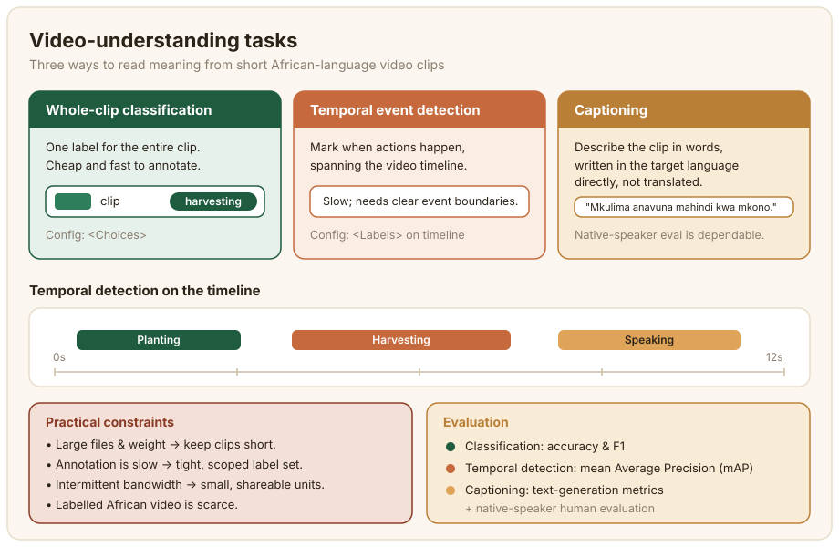

# Video

*Last reviewed: 2026-07-07.*

General video understanding covers the tasks that read meaning from ordinary moving images: classifying what a clip shows, detecting actions or events within it, and captioning it in words. For African contexts the uses are practical, from analysing agricultural or health video to making the continent's broadcast and community video searchable.



## What the data looks like

Video data is clips paired with labels, which can be a single class for the whole clip, time-stamped events within it, or a caption describing it. The raw material is plentiful in one sense, since African broadcast, social, and community video is abundant, but labelled African video is scarce, and captioning in particular needs descriptions written in the target language rather than translated from English. The cost and weight of video, large files, slow annotation, and intermittent bandwidth for distributed teams, shape every decision, so most projects work with short clips and a tightly scoped label set rather than long-form video.

A whole-clip record is one clip with its label or caption:

```json
{
  "video": "clips/farm_0042.mp4",
  "duration": 12.0,
  "label": "harvesting",
  "caption": "A farmer harvests maize by hand in a small field.",
  "language": "swa",
  "source": "agricultural extension video"
}
```

For captions, write them in the target language directly rather than translating from English, so the descriptions carry how the language actually describes a scene.

## Annotation and evaluation

Video annotation is labelling across time: a whole-clip label is cheap, but marking when actions happen, or captioning, is slow and needs clear rules on event boundaries and on the level of detail a caption should capture. Use tools built for timeline annotation, keep clips short, and measure agreement on a shared set. For marking when an action happens, the config places labels on the video timeline, and the annotator drags each label across the span where that action occurs:

```xml
<View>
  <Video name="video" value="$video"/>
  <Labels name="actions" toName="video">
    <Label value="Planting"   background="#1F5B3F"/>
    <Label value="Harvesting" background="#C66A3D"/>
    <Label value="Speaking"   background="#E0A458"/>
  </Labels>
</View>
```

For a single label per clip, swap `<Labels>` for `<Choices>`, exactly as in the [audio understanding](../audio-understanding) page. Evaluation depends on the task: accuracy and [F1](https://en.wikipedia.org/wiki/F-score) for classification, [mean Average Precision](https://lightning.ai/docs/torchmetrics/stable/detection/mean_average_precision.html) for temporal detection, and the text-generation metrics from the [Text Generation](../text-generation/index.md) chapter for captioning, where, as with all generation, native-speaker human evaluation is the dependable measure.

Marking events on the video timeline in the AfriAnnotate editor:


## The 2026 modelling landscape

Video understanding in 2026 is split between short-clip classification (dominated by video-transformer backbones), long-form video captioning and reasoning (dominated by multimodal LLMs), and temporal detection (a mix of both).

- **Short-clip classification and action detection.** **[VideoMAE v2](https://arxiv.org/abs/2303.16727)** (2023), **[TimeSformer](https://arxiv.org/abs/2102.05095)** (Meta, 2021), **[SlowFast](https://github.com/facebookresearch/SlowFast)** (Meta, 2019), **[X-CLIP](https://arxiv.org/abs/2208.02816)** — the workable open video-transformer backbones. Fine-tuning on 1,000-5,000 target-vocabulary clips is the standard path for a new classification task.
- **Long-form video reasoning and captioning.** **[Qwen2.5-VL](https://qwenlm.github.io/blog/qwen2.5-vl/)** and **[InternVL 3](https://github.com/OpenGVLab/InternVL)** — 2025-2026 MLLMs that handle multi-minute video with reasoning across scenes; the workable open frontier. Purpose-built video-LLM releases like **[LLaVA-Video](https://arxiv.org/abs/2410.02713)** and **[VideoLLaMA 3](https://github.com/DAMO-NLP-SG/VideoLLaMA3)** are competitive on the video-QA and captioning benchmarks specifically.
- **Temporal action detection.** **[ActionFormer](https://arxiv.org/abs/2202.07925)** (2022) and **[TriDet](https://arxiv.org/abs/2303.07347)** are the workable open baselines for start-and-stop temporal detection of action classes within continuous video.
- **Open-vocabulary retrieval and search.** **[VideoCLIP](https://arxiv.org/abs/2109.14084)** and **[InternVideo 2](https://arxiv.org/abs/2403.15377)** provide the joint-embedding models that make video corpora searchable by natural-language query — critical for African-context deployments where a labelled search interface is out of scope but retrieval by text description is workable.

**Editorial opinion.** For a new African-context video project, the shortest defensible path is: for classification and action detection, fine-tune VideoMAE v2 or SlowFast on 1,000-5,000 target-vocabulary clips; for captioning, prompt or LoRA-fine-tune Qwen2.5-VL on target-language captions (with the target-language-writing discipline of the [captioning page](../image-text/captioning.md)); for retrieval, use InternVideo 2 embeddings against a natural-language query. Skip end-to-end video captioning training in favour of MLLM fine-tuning; the training data required for competitive end-to-end results is out of reach for most African-language projects.

## What it will actually cost you

Video corpora are the most storage-and-annotation heavy of any modality in the playbook. Rough order-of-magnitude:

- **Fine-tuning VideoMAE v2 or SlowFast on an existing classification corpus.** One to two person-weeks; ten to fifty GPU-hours.
- **Building a new short-clip classification corpus** (1,000-5,000 clips × 10-30 second duration). Three to six months elapsed; three to seven person-months. Clip sourcing, consent for identifiable people, and storage are the constraints.
- **Adding temporal event annotation** (start/stop times) to a video corpus. Two to four months additional; adds ~100-200% to annotation effort per clip depending on event density.
- **Building a video captioning corpus** natively in the target language (500-2,000 clips × 3-5 captions each). Six to twelve months elapsed; five to twelve person-months. Native captioning throughput is slower than translation.
- **Evaluation-only video sets** (200-500 clips). Two to four months; two to four person-months.
- **Human evaluation of video-model output.** Two to three person-weeks per evaluator per 200 items — video evaluation is slow because the evaluator must watch every clip end-to-end.
- **Storage and bandwidth.** Non-trivial. A 5,000-clip corpus at 720p averaging 15 seconds is ~100-300 GB. Distributed teams with intermittent bandwidth cannot download the whole corpus for annotation — build a streaming annotation workflow from the start.

## Known limitations to watch for

- **Western action benchmarks over-transfer.** A model trained on Kinetics-700 knows how to recognise skiing and coffee-making; it does not know how to recognise cassava-processing, palm-wine tapping, or maize-shelling by hand. Domain-transfer from Western benchmarks is much weaker than the numbers suggest.
- **Storage and bandwidth constrain corpus size more than annotation cost.** A team that can afford to annotate 10,000 clips may not be able to store and stream them. Design for constrained infrastructure.
- **Frame-rate and resolution normalisation is load-bearing.** Broadcast video, phone-camera video, and drone video have different frame rates, aspect ratios, and resolutions. A model trained on a mixed corpus without normalisation learns to distinguish by source, not by content.
- **Consent is heavier for video than for photos.** A photo shows an identifiable person at one moment; a video shows the same person over time, revealing more about behaviour, movement, and context. Consent frameworks must be video-specific.
- **Face-visibility trade-off.** Blurring faces during preprocessing degrades most video-understanding models; blurring during release is often mandatory. Design for both from the start.
- **Copyright of broadcast and social media video.** Community-produced and consented material is safe; commercial broadcast, YouTube, and other social platforms have terms of service that constrain redistribution and often training use. Read the terms before scraping.
- **Temporal detection boundary annotation is subjective.** Where does "harvesting" begin and end? Two annotators produce systematically different boundaries. Report boundary agreement (temporal IoU at multiple thresholds), not just detection F1.
- **Long-form video reasoning is genuinely hard.** Even 2026 MLLMs handle 5-15 minute video reasoning shakily. Report video-length distribution in every evaluation; averaging across it hides where the model actually breaks.

## Further reading

- [VideoMAE v2 paper (Wang et al., 2023)](https://arxiv.org/abs/2303.16727) — the workable open video-transformer backbone; the reference fine-tuning starting point for short-clip classification and action detection.
- [Qwen2.5-VL blog (Alibaba, 2025)](https://qwenlm.github.io/blog/qwen2.5-vl/) — the current strongest open MLLM for long-form video reasoning and captioning; the workable frontier for African-context deployments.
- [InternVideo 2 (Wang et al., 2024)](https://arxiv.org/abs/2403.15377) — the joint video-text embedding model; the workable reference for open-vocabulary video retrieval.

<details>
<summary>Additional references</summary>

- [SlowFast (Feichtenhofer et al., 2019)](https://github.com/facebookresearch/SlowFast) — the reference two-stream video backbone.
- [TimeSformer (Bertasius et al., 2021)](https://arxiv.org/abs/2102.05095) — transformer-based video backbone; useful comparison to VideoMAE.
- [LLaVA-Video (Zhang et al., 2024)](https://arxiv.org/abs/2410.02713) — purpose-built video-LLM release; competitive on video QA benchmarks.
- [ActionFormer (Zhang et al., 2022)](https://arxiv.org/abs/2202.07925) — the workable temporal-action-detection baseline.
- [Kinetics-700](https://github.com/cvdfoundation/kinetics-dataset) — the reference action-classification benchmark; useful for calibration.

</details>
