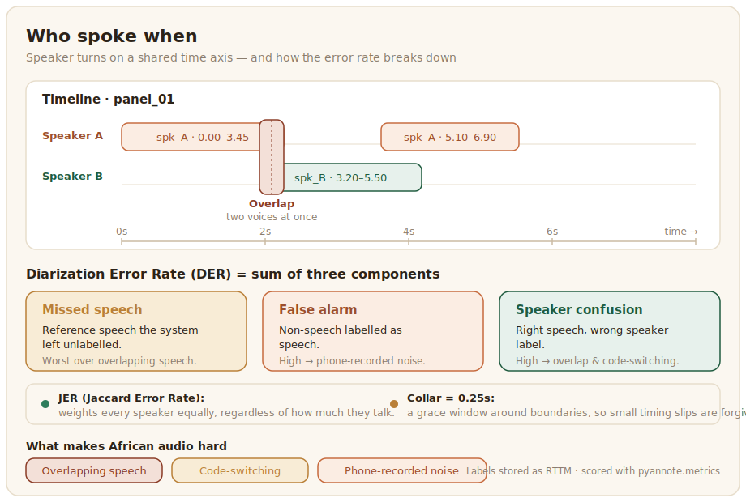

# Speaker Diarization

Speaker diarization answers "who spoke when", segmenting an audio recording by speaker. It is the task that makes multi-speaker audio usable, turning a recording of a conversation, meeting, radio panel, or interview into labelled turns that can be transcribed and analysed per speaker. For African languages it is both useful and under-resourced, and the conditions of real African audio make it harder than the benchmarks suggest.



## What the data looks like

Diarization data is multi-speaker audio annotated with speaker-turn boundaries, marking where each speaker starts and stops and which segments belong to the same person. The natural sources are exactly the kinds of recordings African projects already gather: radio broadcasts, community meetings, focus groups, and interviews. Three conditions make African diarization data distinctive and demanding. Overlapping speech is common in natural conversation and is the hardest case for any diarization system. Code-switching means a single speaker may move between languages mid-conversation, which can confuse models that lean on language cues. And recording conditions are variable, since much community audio is captured on phones in noisy settings rather than in studios. Building robust diarization data means embracing these conditions rather than filtering them out.

Diarization labels are stored in RTTM, the standard format the evaluation tools expect. Each line is one speaker segment: the recording id, the start time, the duration, and the speaker label, with the fixed `<NA>` placeholders the format requires:

```text
# type    file        chnl  start   dur    ortho spkr-type  speaker  conf slat
SPEAKER   panel_01    1     0.000   3.450  <NA>  <NA>       spk_A    <NA>  <NA>
SPEAKER   panel_01    1     3.450   2.100  <NA>  <NA>       spk_B    <NA>  <NA>
SPEAKER   panel_01    1     5.100   1.800  <NA>  <NA>       spk_A    <NA>  <NA>
```

Overlapping speech, the hardest case above, simply appears as two lines whose start and duration overlap in time. The speaker labels (`spk_A`, `spk_B`) only need to be consistent within a recording: there is no requirement to identify who the person actually is, only to tell the voices apart.

## Annotation and evaluation

Annotating diarization is a careful listening-and-marking task: the annotator marks each speaker change in time and assigns a consistent label to each distinct voice across the whole recording. The hard parts are overlapping speech, where two labels apply at once, and deciding whether a brief sound is a new speaker or just noise, so the guidelines must cover both. Standard audio-annotation tools support the timeline segmentation this needs. The config pairs an audio timeline with speaker labels the annotator drags across the regions where each voice is talking:

```xml
<View>
  <Labels name="speaker" toName="audio">
    <Label value="Speaker 1" background="#C66A3D"/>
    <Label value="Speaker 2" background="#1F5B3F"/>
    <Label value="Speaker 3" background="#E0A458"/>
    <Label value="Overlap"   background="#9C4F2B"/>
  </Labels>
  <Audio name="audio" value="$audio"/>
</View>
```

The `Overlap` label gives annotators an explicit way to mark the two-voices-at-once case rather than guessing which single speaker to assign. The exported regions, each with a start time, an end time, and a label, map directly onto the RTTM lines above. Diarization is evaluated with the [Diarization Error Rate (DER)](https://pyannote.github.io/pyannote-metrics/reference.html), which combines missed speech, false speech, and speaker-confusion errors into one figure, and the Jaccard Error Rate (JER), which weights every speaker equally regardless of how much they talk. As elsewhere, a human review of a sample catches systematic problems that a single aggregate number cannot.

Dragging a speaker segment across the audio timeline in AfriAnnotate:


`pyannote.metrics` reads RTTM files and computes DER directly, so scoring a system is a matter of loading the reference and the prediction:

```python
# pip install pyannote.metrics
from pyannote.metrics.diarization import DiarizationErrorRate
from pyannote.database.util import load_rttm

reference = load_rttm("reference.rttm")["panel_01"]
hypothesis = load_rttm("system_output.rttm")["panel_01"]

metric = DiarizationErrorRate(collar=0.25)  # 0.25s grace around boundaries
der = metric(reference, hypothesis)
print(f"DER: {der:.3f}")

# The components matter for African audio: break the score down to see
# whether errors come from overlap, noise, or genuine speaker confusion.
components = metric(reference, hypothesis, detailed=True)
print(f"  missed speech:    {components['missed detection']:.2f}s")
print(f"  false alarm:      {components['false alarm']:.2f}s")
print(f"  speaker confusion:{components['confusion']:.2f}s")
```

The `collar` forgives small timing differences at speaker boundaries, which are rarely what you care about. Reading the breakdown is the useful part: in noisy phone-recorded community audio, a high false-alarm component usually points at background noise being mistaken for speech, while high confusion points at the overlap and code-switching that make African conversational audio hard, telling you which collection or annotation problem to fix next.
