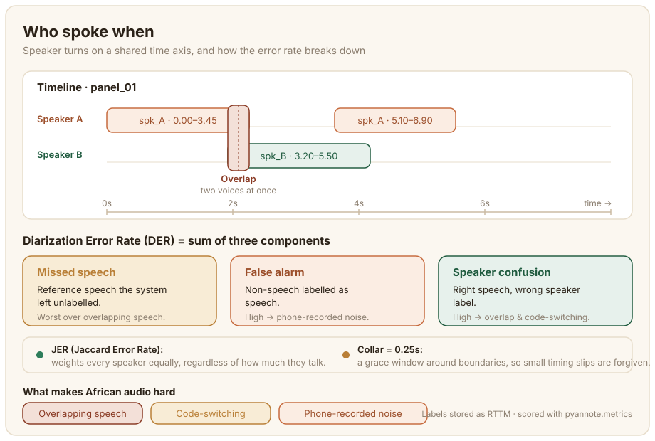

# Speaker Diarization

Speaker diarization answers "who spoke when", segmenting an audio recording by speaker. It is the task that makes multi-speaker audio usable, turning a recording of a conversation, meeting, radio panel, or interview into labelled turns that can be transcribed and analysed per speaker. For African languages it is both useful and under-resourced, and the conditions of real African audio make it harder than the benchmarks suggest.

This page is the practical guide to building diarization data and evaluation for African contexts: what the data actually looks like, the collection sources that yield useful diarization ground truth, the annotation conventions that determine whether the corpus is trainable, the evaluation choices that surface where a model fails, and the deployment realities. For transcription-based tasks see [ASR](../asr/index.md); for audio classification and event detection see [Audio Understanding](../audio-understanding/index.md).



## Why diarization is hard for African audio

Three conditions of real African audio put pressure on diarization models in ways benchmark suites like AMI or CALLHOME do not fully anticipate.

- **Overlapping speech is common in natural conversation** and is the hardest single case for any diarization system. In African-language broadcast panels, community meetings, and market conversations, overlaps are frequent and often extended (several seconds of two or three voices simultaneously). Models trained on Western meeting data with rare, brief overlaps degrade sharply.
- **Code-switching within a single speaker** confuses models that lean on acoustic language cues to distinguish voices. A single speaker who alternates Kiswahili and English mid-conversation should be one speaker to the diarizer, but voice-embedding models that latch onto language-conditioned acoustic features can split them.
- **Recording conditions are variable**, since much community audio is captured on phones in noisy settings rather than in studios. Reverberant rooms, background music from radios, market noise, and the acoustic-quality gap between speaker positions in a panel all challenge voice-activity detection and embedding stability.

Robust African-language diarization data embraces these conditions rather than filtering them out. A corpus of studio-clean interview audio produces a model that fails on the phone-recorded community-radio panel it was built to serve.

## What the data looks like

Diarization data is multi-speaker audio annotated with speaker-turn boundaries, marking where each speaker starts and stops and which segments belong to the same person. The natural sources are exactly the kinds of recordings African projects already gather: radio broadcasts, community meetings, focus groups, and interviews.

Diarization labels are stored in RTTM, the standard format the evaluation tools expect. Each line is one speaker segment: the recording id, the start time, the duration, and the speaker label, with the fixed `<NA>` placeholders the format requires:

```text
# type    file        chnl  start   dur    ortho spkr-type  speaker  conf slat
SPEAKER   panel_01    1     0.000   3.450  <NA>  <NA>       spk_A    <NA>  <NA>
SPEAKER   panel_01    1     3.450   2.100  <NA>  <NA>       spk_B    <NA>  <NA>
SPEAKER   panel_01    1     5.100   1.800  <NA>  <NA>       spk_A    <NA>  <NA>
```

Overlapping speech, the hardest case above, simply appears as two lines whose start and duration overlap in time. The speaker labels (`spk_A`, `spk_B`) only need to be consistent within a recording: there is no requirement to identify who the person actually is, only to tell the voices apart.

## Data collection: choosing the source

The right diarization corpus depends on the downstream deployment.

- **Broadcast radio panels and podcasts.** Multiple speakers, clean-ish microphones (each participant often on their own mic), predictable acoustic environment. Easy to annotate; easy for models. The reference source when the deployment target is broadcast content transcription and speaker attribution.
- **Community meetings and focus groups.** Multiple speakers, single-microphone or table-microphone setup, natural overlaps, background noise. Hard to annotate; hard for models. The reference source when the deployment target is community-work transcription, oral-history archival, or civic-tech feedback processing.
- **Phone-recorded field interviews.** Two speakers typically, phone-quality audio, variable acoustics between interviewer and interviewee, sometimes recorded on speakerphone. The reference source when the deployment is journalism, health-worker debriefs, or NGO field research.
- **Call-centre and helpline audio.** Two speakers (agent + caller) typically, telephony-band audio, well-defined turn structure. Easier for models than community meetings; harder than broadcast because of the audio-quality ceiling. Consent framework is the load-bearing decision — see the [audio-understanding chapter's call-centre note](../audio-understanding/index.md#data-collection-specifics-for-african-contexts).

Match the training corpus's acoustic-and-turn-taking profile to the deployment target. A diarizer trained on broadcast panels and deployed on community-meeting audio will halve its accuracy in production; a diarizer trained on community meetings and deployed on broadcast will over-fragment turns because the model has learned to expect noise where there isn't any.

## Annotation

Annotating diarization is a careful listening-and-marking task: the annotator marks each speaker change in time and assigns a consistent label to each distinct voice across the whole recording. The hard parts are overlapping speech, where two labels apply at once, and deciding whether a brief sound is a new speaker or just noise, so the guidelines must cover both.

The Label Studio config pairs an audio timeline with speaker labels the annotator drags across the regions where each voice is talking:

```xml
<View>
  <Labels name="speaker" toName="audio">
    <Label value="Speaker 1" background="#C66A3D"/>
    <Label value="Speaker 2" background="#1F5B3F"/>
    <Label value="Speaker 3" background="#E0A458"/>
    <Label value="Overlap"   background="#9C4F2B"/>
  </Labels>
  <Audio name="audio" value="$audio"/>
</View>
```

The `Overlap` label gives annotators an explicit way to mark the two-voices-at-once case rather than guessing which single speaker to assign. The exported regions, each with a start time, an end time, and a label, map directly onto the RTTM lines above.

**Six annotation conventions to fix in writing before starting:**

- **Minimum turn length.** How brief can a "speaker turn" be before it counts as noise or a backchannel (`mhm`, `yeah`) rather than a genuine turn? Sub-500ms utterances are the grey zone. Fix a threshold and apply it consistently.
- **Backchannel handling.** A listener saying `mhm` while another speaker holds the floor — is that a separate turn (creating an overlap) or discarded (keeping the main speaker's turn intact)? Both conventions are defensible; document which and apply consistently.
- **Overlap onset and offset precision.** Annotators disagree on where overlap starts and ends by 100–300 ms routinely. Decide on a precision tolerance and reflect it in the collar during evaluation.
- **Speaker-count uncertainty.** In community-meeting audio, distinguishing a fourth speaker from a re-appearance of an earlier speaker is genuinely hard. Guidelines should document how to flag uncertain speaker-count decisions for adjudication rather than forcing annotators to commit.
- **Non-speech marking.** Music, silence, background noise, laughter — mark as distinct labels or as absence of any speaker label? Absence is simpler but loses the information that "there is nothing happening" is different from "there is background noise here"; a formal `Music` or `Noise` label is often worth the extra annotation work.
- **Named speakers vs anonymous labels.** In broadcast panels with public figures, are speakers labelled by name or by anonymous ID? Publishing a corpus with named speakers has consent implications; the safer default is anonymous IDs and a separate mapping table that only the project team holds.

Dragging a speaker segment across the audio timeline in AfriAnnotate:


## Quality assurance during annotation

- **Per-batch second-pass review.** A second annotator, independent of the first, re-diarises a random 5–10% sample of each batch. Compute per-file Diarization Error Rate between the two annotations; anything above a threshold (typically DER > 0.10 with reasonable collar) is flagged for adjudication. This is the cheapest quality signal for diarization corpora.
- **Overlap-region focused review.** Overlap regions are where annotator disagreement is highest. Sample-audit overlap regions separately from clean-turn regions; the disagreement rate in overlaps sets the effective ceiling on downstream model performance.
- **Speaker-consistency checks.** Verify that the same speaker gets the same label across the entire recording — a speaker who is re-labelled halfway through as a "new" voice invalidates the recording. Automated voice-embedding similarity across annotator-labelled turns is a cheap catch for this.
- **Per-condition inter-annotator agreement.** Track IAA separately for broadcast, community-meeting, and phone-recorded segments. A corpus whose IAA is 0.85 overall but 0.55 on community-meeting audio has a systematic weakness that aggregate IAA hides.

## Evaluation

Diarization is evaluated with the [Diarization Error Rate (DER)](https://pyannote.github.io/pyannote-metrics/reference.html), which combines missed speech, false speech, and speaker-confusion errors into one figure, and the Jaccard Error Rate (JER), which weights every speaker equally regardless of how much they talk. As elsewhere, a human review of a sample catches systematic problems that a single aggregate number cannot.

`pyannote.metrics` reads RTTM files and computes DER directly, so scoring a system is a matter of loading the reference and the prediction:

```python
# pip install pyannote.metrics
from pyannote.metrics.diarization import DiarizationErrorRate
from pyannote.database.util import load_rttm

reference = load_rttm("reference.rttm")["panel_01"]
hypothesis = load_rttm("system_output.rttm")["panel_01"]

metric = DiarizationErrorRate(collar=0.25)  # 0.25s grace around boundaries
der = metric(reference, hypothesis)
print(f"DER: {der:.3f}")

# The components matter for African audio: break the score down to see
# whether errors come from overlap, noise, or genuine speaker confusion.
components = metric(reference, hypothesis, detailed=True)
print(f"  missed speech:    {components['missed detection']:.2f}s")
print(f"  false alarm:      {components['false alarm']:.2f}s")
print(f"  speaker confusion:{components['confusion']:.2f}s")
```

The `collar` forgives small timing differences at speaker boundaries, which are rarely what you care about. Reading the breakdown is the useful part: in noisy phone-recorded community audio, a high false-alarm component usually points at background noise being mistaken for speech, while high confusion points at the overlap and code-switching that make African conversational audio hard, telling you which collection or annotation problem to fix next.

**Beyond aggregate DER.** DER is single-number-summarising in the same way ASR CER is; the aggregate hides where the model fails. Additional reporting to include:

- **Per-source DER.** Split evaluation by source (broadcast / community meeting / phone / call-centre) and report separately. A model whose overall DER is 15% and whose community-meeting DER is 40% has a source-specific problem the aggregate hides.
- **Per-condition DER.** Split by acoustic condition (studio / phone / outdoor) and report separately. Same reasoning — the aggregate flatters models that fail on the condition you actually deploy in.
- **Overlap-region DER.** Compute DER on the subset of the audio where two or more speakers are talking. This is where most model failure lives in real conversation; the metric on overlap regions specifically is what predicts production performance.
- **Speaker-count accuracy.** Did the model estimate the right number of distinct speakers in each recording? Over-splitting a two-speaker interview into five apparent speakers is a common failure mode DER partly captures but does not fully expose.

## Deployment realities

- **Streaming vs offline.** Real-time diarization for live captioning is a different engineering problem from offline diarization for post-hoc transcription. Streaming diarization must commit to speaker assignments as they occur; offline can revise earlier decisions when the whole recording is seen. Choose at scoping; streaming diarization is materially harder.
- **Diarization-then-ASR vs joint modelling.** Traditional pipelines diarise first, then ASR each speaker's segments. Newer joint models (streaming ASR with speaker attribution) do both at once. For African languages the pipeline approach reuses existing ASR and diarization work; joint models are more research-forward.
- **Diarization as a privacy tool** — a diarised recording where speakers are anonymised (`Speaker 1`, `Speaker 2`) is safer to share for research than raw multi-speaker audio where speaker identity is inferrable. Consider whether the released artefact should be diarised-with-anonymous-labels rather than raw audio.
- **On-device diarization** is unusual as a deployment target but relevant for privacy-preserving voice assistants and edge health-triage. The compute cost is higher than on-device ASR because voice embedding + clustering is a distinct workload; expect a larger model footprint.

## What breaks — common failure modes

- **Studio-training / community-deployment collapse.** DER on clean training data looks acceptable; deployment on noisy community meetings triples DER. Fix: train on data whose acoustic conditions match deployment.
- **Overlap invisible in aggregate DER.** Overall DER is 15%; overlap-region DER is 45%. Fix: report overlap DER separately and treat it as the load-bearing number for conversational deployment.
- **Code-switching splits one speaker into two.** Voice-embedding model latches onto language-conditioned acoustic features and treats a code-switching speaker as multiple speakers. Fix: include code-switched training data and evaluate on code-switched subsets.
- **Speaker-count over-estimation on short turns.** Model treats every backchannel or brief sound as a new speaker. Fix: enforce minimum turn length in inference post-processing; audit annotation guidelines for backchannel handling.
- **Boundary sloppiness at high collar.** DER measured at `collar=0.5` looks acceptable; measured at `collar=0.1` reveals boundaries are consistently 300 ms off. Fix: measure at the collar the deployment actually tolerates.
- **Consent gap on multi-speaker archives.** Broadcast panel audio consented for broadcast; downstream ML release without new consent breaches the original agreement. Fix: consent must be re-negotiated for each speaker in a multi-speaker recording.
- **Named-speaker leak.** Corpus intended to be anonymous but downstream metadata reveals speaker identity through timestamps + broadcast schedules + context. Fix: anonymisation of speaker labels is not enough — audit the full metadata for identity leakage.
