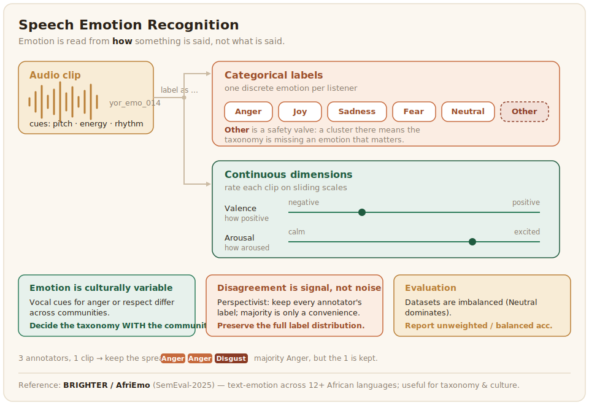

# Speech Emotion Recognition

Speech emotion recognition (SER) reads emotion from how something is said rather than what is said, from pitch, energy, and rhythm. It is one of the most subjective and culturally variable tasks in the playbook, and dedicated African speech-emotion data is still scarce, which makes how you design the annotation more important than the size of the dataset.



## What the data looks like, and why it is hard

SER data is audio clips labelled with an emotion, either as categories such as anger, joy, or sadness, or along continuous dimensions such as how positive and how aroused the speaker sounds. The shortage of African speech-emotion corpora means most work starts from scratch or borrows from related text-emotion efforts: the BRIGHTER and AfriEmo datasets behind SemEval-2025's emotion task cover emotion in text across more than a dozen African languages and are a useful reference for taxonomy and culture, even though they are text rather than speech ([BRIGHTER, 2025](../references.md#brighter-2025)). The deeper difficulty is that emotional expression is cultural. The vocal cues that read as anger or as respect vary across communities, and an emotion taxonomy built for English speakers may not fit how a given African language and culture expresses feeling. Decide the taxonomy with the community, not for it.

Because disagreement is meaningful here, the data format should keep every annotator's label rather than collapsing to one. Storing the full set, with a majority only as a convenience field, lets later work train against the distribution:

```json
{
  "audio_filepath": "clips/yor_emo_014.wav",
  "language": "yor",
  "duration": 2.7,
  "labels": [
    {"annotator": "ann_01", "emotion": "Anger"},
    {"annotator": "ann_02", "emotion": "Disgust"},
    {"annotator": "ann_03", "emotion": "Anger"}
  ],
  "majority": "Anger"
}
```

The two-out-of-three split here is not noise to be cleaned away: it records that the clip genuinely sounds angry to most listeners and disgusted to one, which is exactly the kind of variation the next section treats as signal.

## Annotation: disagreement is part of the signal

Because emotion is subjective, SER is the clearest case for the perspectivist approach from [Annotation Design](../3_annotation-design/workflow-adjudication.md). Several annotators from the relevant community should label each clip, and when they disagree, that disagreement often reflects genuine variation in how people hear emotion rather than error. Recruit annotators across the dialects and backgrounds of the speaker community, record their context where consented, and consider preserving the spread of labels rather than collapsing it to a single emotion. Annotator wellbeing matters here too, since some emotional audio is distressing to label.

The labeling config is deliberately simple, one emotion per listener, so that several annotators each contribute one label per clip and the spread is preserved across their submissions rather than within one:

```xml
<View>
  <Audio name="audio" value="$audio"/>
  <Header value="Which emotion best fits how this is said?"/>
  <Choices name="emotion" toName="audio" choice="single" required="true">
    <Choice value="Anger"   hotkey="1"/>
    <Choice value="Joy"     hotkey="2"/>
    <Choice value="Sadness" hotkey="3"/>
    <Choice value="Fear"    hotkey="4"/>
    <Choice value="Neutral" hotkey="5"/>
    <Choice value="Other, not listed" hotkey="9"/>
  </Choices>
</View>
```

The `Other, not listed` choice is a safety valve while the taxonomy is still being settled with the community: a cluster of clips landing there is a sign the label set is missing an emotion that matters in this language.

## Evaluation

SER is evaluated with accuracy and [F1](https://scikit-learn.org/stable/modules/generated/sklearn.metrics.f1_score.html), but because emotion datasets are usually imbalanced, with neutral clips far outnumbering strong emotions, report unweighted ([balanced](https://scikit-learn.org/stable/modules/model_evaluation.html#balanced-accuracy-score)) accuracy alongside weighted accuracy so that good performance on the common classes cannot hide poor performance on the rare ones. Where the data preserves multiple annotators, evaluating against the distribution of human labels is more honest than forcing a single answer.

The gap between the two accuracy figures is what reveals a model coasting on the majority class:

```python
from sklearn.metrics import accuracy_score, balanced_accuracy_score, f1_score

y_true = ["Neutral", "Neutral", "Anger", "Joy", "Neutral", "Sadness"]
y_pred = ["Neutral", "Neutral", "Neutral", "Joy", "Neutral", "Neutral"]

# Weighted: rewards getting the common 'Neutral' class right.
print(f"weighted accuracy:   {accuracy_score(y_true, y_pred):.3f}")
# Unweighted: averages per-class, so failing rare emotions shows up.
print(f"balanced accuracy:   {balanced_accuracy_score(y_true, y_pred):.3f}")
print(f"macro F1:            {f1_score(y_true, y_pred, average='macro'):.3f}")
```

Here plain accuracy looks respectable while balanced accuracy and macro F1 fall sharply, because the model labels almost everything neutral and is right only on the class that dominates the data. Reporting the unweighted number alongside the weighted one keeps that failure visible, which matters most for the strong but rare emotions a useful SER system actually needs to catch.
